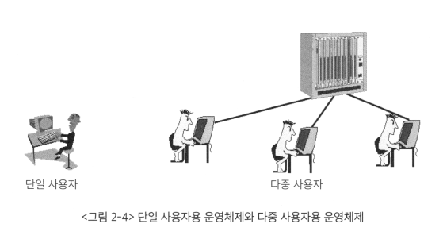
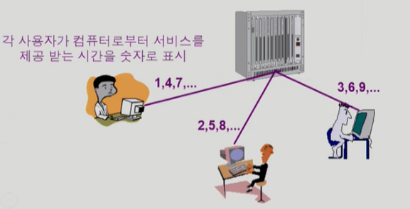

# <a href = "../README.md" target="_blank">운영체제와 정보기술의 원리</a>
## Chapter 02. 운영체제 개요
### 2.3 운영체제의 분류
1) 동시 작업 가능 여부
2) 사용자의 수
3) 처리 방식

---

# 2.3 운영체제의 분류

---

## 1) 동시 작업 가능 여부

### 1.1 단일 작업용 운영체제(single tasking)
- 한 번에 하나의 작업만 처리
- 일부 특수 목적으로 제작된 운영체제들에서는 아직 일부 사용되긴 함.
- 예) MS-DOS : 프롬프트 상에서 명령 하나를 끝내기 전까지, 다른 명령을 수행시킬 수 없음

### 1.2 다중 작업용 운영체제(multi tasking)
- 동시에 2개 이상의 작업 처리
- 현대의 운영체제들은 대부분 다중 작업 지원
- 특징
  - 시분할 시스템(time sharing system) : CPU의 작업시간을 여러 프로그램들이 조금씩 나누어 사용
  - 다중 프로그래밍 시스템(multi-programming system) : 메모리 공간을 분할해 여러 프로그램들을 동시에 메모리에 올려놓고 처리
  - 대화형 시스템(interactive system) : 사용자 개개인 관점에서는 사용자에 입력에 대해 곧바로 응답됨.
    - 서버 : 서버 컴퓨터에 사용자 입력 전달시, 서버가 응답하여 각 사용자 입장에서는 그 서버를 혼자 사용하는 것처럼 느껴짐.
- 예) UNIX, MS-Windows : 명령의 수행이 끝나기 전에, 다른 명령이나 프로그램을 수행할 수 있음

### (cf) 다중처리기 시스템(multi-processor system)
- 하나의 컴퓨터 안에 물리적으로 CPU가 여러 개 설치된 경우
- 서로 다른 CPU에서 프로그램이 동시에 실행될 수 있어서, 더욱 빠르다.
- 하지만 운영체제 입장에서는 CPU를 관리하기 위해 더욱 복잡한 메커니즘을 필요로 함.
- 이 책에서는 멀티 프로세서 시스템을 고려하지 않음

---

## 2) 사용자의 수

### 2.1 단일 사용자용 운영 체제
- 한 번에 한 명의 사용자만 사용
- 예1) DOS : 혼자 사용, 한 번에 한 작업만 가능.
- 예2) MS Windows : 혼자 사용, 한번에 여러 작업 가능
  - 다만 최근 들어서는 서버 기능을 지원해서 다중 사용자용 운영체제로 쓰이는 경우가 많음.

### 2.2 다중 사용자용 운영 체제
- 여러 사용자 동시 접속
- 흔히 '서버'라고 불리는 컴퓨터들(이메일 서버, 웹서버, ...)이 이에 해당

---

## 3) 처리 방식

### 3.1 일괄처리(batch processing) 방식

- 요청된 작업을 일정량씩 모아서 한꺼번에 처리
- 작업이 완전 종료될 때까지 기다려야 함.
- 사용자 입장에서는 응답시간이 길어지는 단점이 있음
- 현대의 운영체제에서는 잘 안 쓰이는 방식.
- 예) 펀치 카드(punch card), OMR 카드, ...

### 3.2 시분할(time sharing) 방식

- 여러 작업을 수행할 때, 컴퓨터의 처리 능력을 일정한 시간 단위로 분할
- 일괄처리 방식에 비해 **짧은 응답 시간**을 가짐
- 일반적인 범용 컴퓨터에서 사용되는 방식
- 처리 시간이 엄격하게 정해져 있지 않고, 동시 요청 부하의 증감에 따라 작업 각각의 처리 시간이 달라짐.
- 대화형 시스템(interactive system) : 사용자의 요청에 대한 결과를 곧바로 얻을 수 있음

### 3.3 실시간(real time) 방식
- **정해진 시간 안에** 어떤 일이 **반드시 처리됨을 보장해야하는** 시스템을 위한 OS
- 정교함이 매우 중요시됨
  - 예) 원자로/공장제어, 미사일 제어, 반도체 장비, 로봇 제어, ..
  - 참고자료: [[재계톡톡] 불과 1분 정전에 수십억 날린 삼성전자 화성 반도체 공장](https://www.mk.co.kr/economy/view/2020/15426)
- 범용 운영체제(시분할 방식)에서도 최근에는 실시간 처리가 중요한 작업들이 늘어나고 있으며 이를 어떻게 처리할 지에 대해 연구가 진행 중.
  - 예) 자동차 블랙박스, 내비게이션, ...
- 실시간 방식의 세분화된 분류 (시간 제약의 중요성)
  - 경성 실시간 시스템(hard realtime system)
    - 주어진 시간을 지키지 못 할 경우 매우 위험한 결과를 초래할 가능성이 있는 경우. 
    - 예) 원자로/공장제어, 미사일 제어, 반도체 장비, 로봇 제어, ..
  - 연성 실시간 시스템(soft realtime system)
    - 주어진 시간은 정해져 있지만, 위험한 결과를 초래하지 않는 시스템
    - 예) 멀티미디어 스트리밍 시스템, ...
