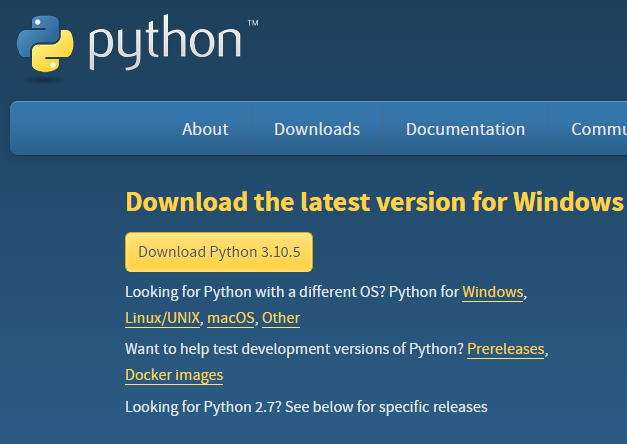
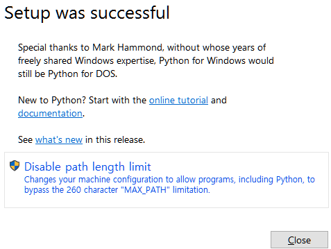

# <a href = "../README.md" target="_blank">혼자 공부하는 파이썬</a>
## Chapter 01. 파이썬 시작하기
### 1.2 파이썬을 배우기 위해 준비해야 할 것들
1) Python 다운로드
2) Python 설치
3) PyCharm 다운

---

# 1.2 파이썬을 배우기 위해 준비해야할 것들

---

## 1) Python 다운로드

- 파이썬 공식 홈페이지(https://www.python.org/downloads/) 에서 다운

---

## 2) Python 설치

- 파이썬 공식 홈페이지에서 설치
- 환경변수 등록
- disable path length limit 클릭

---

## 3) PyCharm 다운

- 알고리즘 스터디 목적이면 커뮤니티 에디션으로도 충분히 사용 가능
- toolbox를 통해 설치해도 됨. (추천)

---
