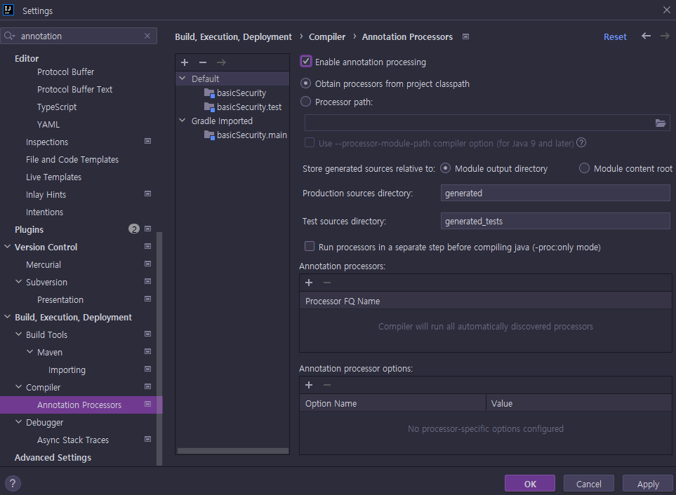
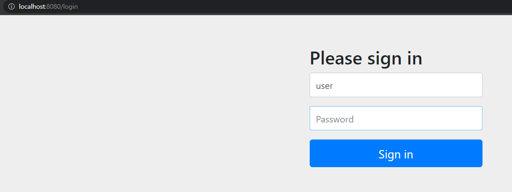

# <a href = "../README.md" target="_blank">Core Spring Security</a>
## Chapter 01. 스프링 시큐리티 기본 API 및 Filter 이해
### 1.01 프로젝트 구성 및 의존성 추가
1) 프로젝트 생성
2) IDE 설정(IntelliJ)
3) Gradle 설정
4) 테스트 컨트롤러 생성
5) 스프링 시큐리티 의존성 추가 시 일어나는 일들
6) 스프링 시큐리티 기본 제공 기능의 한계
---

# 1.01 프로젝트 구성 및 의존성 추가

---

## 1) 프로젝트 생성
- 스프링 부트 스타터(https://start.spring.io/)
- 사용 기능 : web, security, lombok
  - SpringBootVersion : 2.7.2 (2022.07.27 기준)
  - groupId : com.ttasjwi
  - artifactId: basicSecurity

---

## 2) IDE 설정(IntelliJ)

### Gradle 기반 실행


### 롬복 적용

- Preference > plugin > lombok 검색, 실행(재시작)
- Preference > Annotation Processors 검색 > Enable annotation processing 체크 (재시작)
- 임의의 클래스 생성, `@Getter` `@Setter` 확인

### 파일 인코딩


---

## 3) Gradle 설정
```groovy
plugins {
	id 'org.springframework.boot' version '2.7.2'
	id 'io.spring.dependency-management' version '1.0.12.RELEASE'
	id 'java'
}

group = 'com.ttasjwi'
version = '0.0.1-SNAPSHOT'
sourceCompatibility = '11'

configurations {
	compileOnly {
		extendsFrom annotationProcessor
	}
}

repositories {
	mavenCentral()
}

dependencies {
	implementation 'org.springframework.boot:spring-boot-starter-security'
	implementation 'org.springframework.boot:spring-boot-starter-web'
	compileOnly 'org.projectlombok:lombok'
	annotationProcessor 'org.projectlombok:lombok'
	testImplementation 'org.springframework.boot:spring-boot-starter-test'
	testImplementation 'org.springframework.security:spring-security-test'
}

tasks.named('test') {
	useJUnitPlatform()
}

```
- 강의에서는 maven을 사용하고 있으나, 개인적으로 maven을 좋아하지 않고 요즘 추세는 gradle을 많이 사용하다보니 gradle을 사용하기로 결정


---

## 4) 테스트 컨트롤러 생성
```java
@Slf4j
@RestController
public class SecurityController {

    @GetMapping("/")
    public String index() {
        log.info("index!!!");
        return "home";
    }
}
```


- 루트 경로로 접속하면 `/login`으로 이동됨.
  - 기본 id : user
  - 기본 패스워드 : 애플리케이션 구동시점에 로그로 찍히는 랜덤 security password
- 로그인 성공 시 원래 접근하려던 자원에 접근 가능

---

## 5) 스프링 시큐리티 의존성 추가 시 일어나는 일들
- 서버가 기동되면 스프링 시큐리티의 초기화 작업 및 보안설정이 이루어진다.
- 별도의 설정이나 구현을 하지 않아도 기본적인 웹 보안기능이 현재 시스템에 연동되어 작동한다.

### 기본 제공 기능들
1. 모든 요청은 인증이 되어야, 자원에 접근이 가능
   - 로그인 되어있지 않을 경우 `/login`으로 리다이렉트 됨
2. 두 가지 인증 방식을 제공함
   - 폼 로그인 방식
   - httpBasic 로그인 방식
3. 기본 로그인 페이지를 제공함 : (`/login`)
4. 기본 계정을 한 개 제공한다.
   - 기본 id : user
   - 기본 패스워드 : 애플리케이션 구동시점에 로그로 찍히는 랜덤 security password

---

## 6) 스프링 시큐리티 기본 제공 기능의 한계
- 계정 추가, 권한 추가, DB 연동 등에 대한 로직을 별도로 구현해야 함
- 기본적인 보안 기능 외에 시스템에서 필요로 하는 더 세부적이고 추가적인 보안 기능이 필요하다.

---