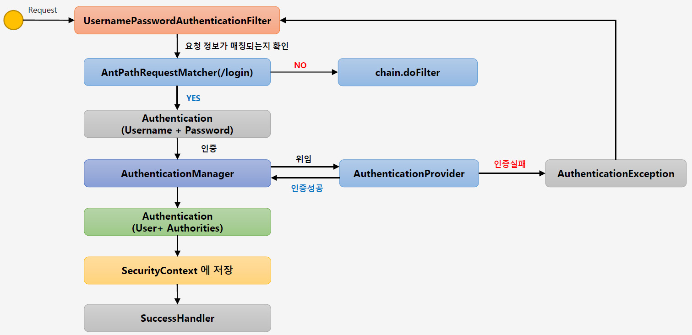

# <a href = "../README.md" target="_blank">Core Spring Security</a>
## Chapter 01. 스프링 시큐리티 기본 API 및 Filter 이해
### 1.04 Form Login 인증 필터 - UsernamePasswordAuthenticationFilter
1) Form Login 인증 - 필터 흐름

---

# 1.04 Form Login 인증 필터 - UsernamePasswordAuthenticationFilter

---

## 1) Form Login 인증 - 필터 흐름



모든 과정이 다 설명되어 있진 않고, 일부 큰 흐름만 다룰 것

### 1.1 UsernamePasswordAuthenticationFilter는 사용자 요청을 읽는다
- UsernamePasswordAuthenicationFilter는 우선 사용자 요청을 확인한다.
- 요청정보가 맞는자 확인하기 위해 AntPathRequestMatcher를 통해, 이 요청이 로그인 엔드포인트로의 요청인지 확인한다.
  - 로그인 요청이 아니라면, `chain.doFilter(...)`을 호출하여 다음 필터로 체이닝한다.

### 1.2 사용자 인증 요청을 Authentication 객체에 저장한다.
- 로그인 요청이라 판단되면, 사용자 요청을 Authentication 인터페이스의 인스턴스로 저장한다.
- 여기서는 Authentication의 하위 클래스인 UsernamePasswordAuthenticationToken으로 저장된다.

### 1.3 인증을 AuthenticationManager에게 위임한다.
```java
return this.getAuthenticationManager().authenticate(authRequest);
```
- `AuthenticationManager`의 `authenticate`를 호출하여, 인증 처리를 위임한다.
  - 이 인증이 나중에 성공하게 되면 결과 인증 정보를 `Authentication`로 받아오게 된다.

### 1.4 AuthenticationManager는 인증을 처리할 AuthenticationProvider를 찾는다.
```java
for (AuthenticationProvider provider : getProviders()) {
    if (!provider.supports(toTest)) {
        continue;
    }
    // ... 생략
}
```
- AuthenticationManager는 내부적으로 인증을 처리할 AuthenticationProvider들을 알고 있다.
- 각각의 provider들을 호출하여 이들이 현재 Authentication을 처리할 수 있는 지 확인한다.

### 1.5 AuthenticationProvider는 인증을 처리한다.
```java
try {
    result = provider.authenticate(authentication);
    if (result != null) {
        copyDetails(authentication, result);
        break;
    }
}
// 생략
```
- AuthenticationProvider를 찾았으면, 해당 Provider가 인증 로직을 수행한 뒤
사용자 정보(principal, credentials), 권한 정보(authorities) 등을 Authentication에 담아 반환한다.
  - principal : 아이디
  - credentials : 패스워드
  - authorities : 권한 정보
  - ...
- 인증에 실패하면 AuthenticationException이 발생하고 전파된다.

### 1.6 UsernamePasswordAuthenticationFilter는 인증 정보를 SecurityContextHolder에 저장한다.
```java
SecurityContext context = SecurityContextHolder.createEmptyContext();
context.setAuthentication(authResult);
SecurityContextHolder.setContext(context);
```
- SecurityContext는 Authentication 객체를 저장한다.
- SecurityContext 관리는 SecurityContextHolder를 통해 수행된다.
  - 주 전략으로 ThreadLocal을 활용하는 방법(동기, 기본), 다음 스레드에 복사하는 방법(비동기), ... 등이 있음.
  - 개발자가 이 전략을 별도로 설정할 수 있다.

### 1.7 인증에 성공하면 성공 로직을 SuccessHandler가 받아 수행한다.
```java
this.successHandler.onAuthenticationSuccess(request, response, authResult);
```
- 인증에 성공하였을 경우 처리할 로직을 successHandler에게 위임한다.

---
