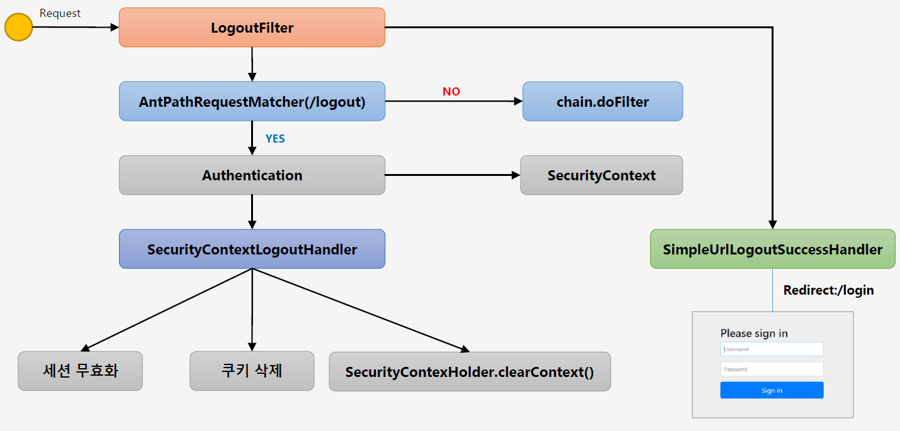
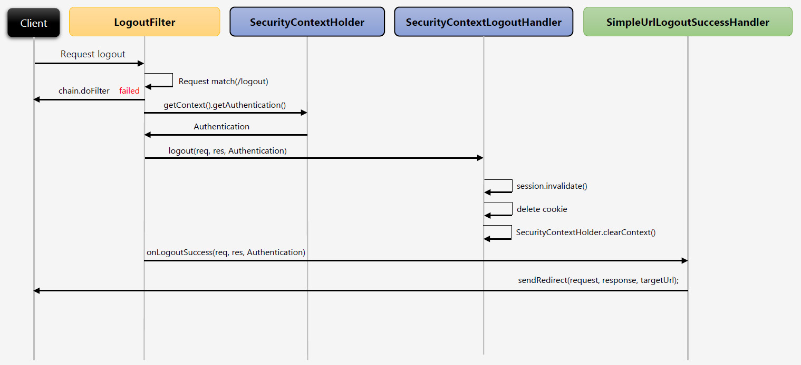

# <a href = "../README.md" target="_blank">Core Spring Security</a>
## Chapter 01. 스프링 시큐리티 기본 API 및 Filter 이해
### 1.05 Logout 처리, LogoutFilter
1) Logout 흐름
2) Logout 관련 스프링 시큐리티 API
3) LogoutFilter 흐름

---

# 1.05 Logout 처리, LogoutFilter

---

## 1) Logout 흐름


- 사용자가 로그아웃 요청을 한다.
- 서버에서 하는 주 로직
  - 세션 무효화
  - 인증 토큰 제거 : Authentication, SecurityContext
  - 쿠키 정보 삭제
  - 로그인 페이지로 리다이렉트

---

## 2) Logout 관련 스프링 시큐리티 API

### 2.1 로그아웃 API
```java
http.logout()
    .logoutUrl("/logout")
    .logoutSuccessUrl("/login")
    .deleteCookies("JSESSIONID", "remember-me")
    .addLogoutHandler(logoutHandler())
    .logoutSuccessHandler(logoutSuccessHandler());
```
- `http.logout()` : 로그아웃 처리
- `http.logoutUrl(...)` : 로그아웃을 수행할 URL
  - 기본적으로는 `/logout`이며, POST 요청을 해야한다.
- `http.logoutSuccessUrl(...)` : 로그아웃 성공 후 이동할 페이지
- `http.deleteCookies(...)` : 제거할 쿠키명들을 지정하면 됨(가변 인자)
- `http.addLogoutHanlder(...)` : 로그아웃을 실제 수행하는 핸들러를 지정
- `http.logoutSuccessHandler(...)` : 로그아웃 성공 후 핸들러

### 2.2 LogoutHandler
```java
    private LogoutHandler logoutHandler() {
        return ((request, response, authentication) -> {
            HttpSession session = request.getSession();
            session.invalidate(); // 세션 무효화
        });
    }
```
- 커스텀하게 로그아웃 핸들러를 구현했다.
- 물론 여기서 별도로 설정을 안 하면 스프링 시큐리티가 제공하는 기본 로그아웃 핸들러를 사용한다.

### 2.3 LogoutSuccessHandler
```java
    private LogoutSuccessHandler logoutSuccessHandler() {
        return ((request, response, authentication) -> {
            response.sendRedirect("/login");
        });
    }
```
- 기본적으로 스프링 시큐리티가 처리해주는 로그아웃 성공 로직 외에 별도로 추가적인 로직을 작성하고 싶을 때 사용
- 로그아웃 성공 후 처리할 커스텀 로직을 구현할 수 있다.

---

## 3) LogoutFilter 흐름




1. 사용자는 로그아웃 요청을 하고, LogoutFilter가 요청을 가로챈다.
2. AntPathRequestMatcher를 통해, 사용자 요청이 로그아웃 요청인지 확인하고 아닐 경우 다음 필터로 체이닝한다.
3. 로그아웃 요청일 경우, SecurityContextHolder로부터 SecurityContext(Authentication을 가짐)을 얻어옴
4. SecurityContextLogoutHandler에게 로그아웃 처리를 위임한다.
   - 세션 무효화
   - 쿠키 삭제
   - `SecurityContextHodler.clearContext()`
5. 로그아웃 성공 후 처리할 로직을 SimpleUrlLogoutSuccessHandler에게 위임
   - 우리가 로그아웃 성공 핸들러를 만들어 등록했다면 그쪽을 실행한다.
   - 기본적으로는 로그인 페이지(`/login`)로 리다이렉트한다.

---
