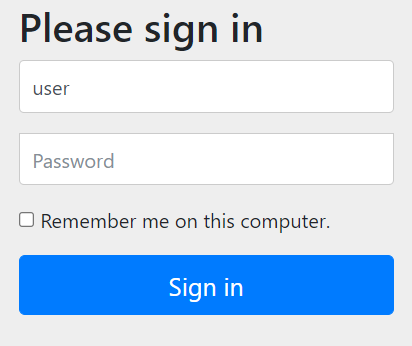
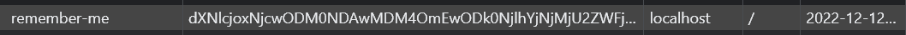
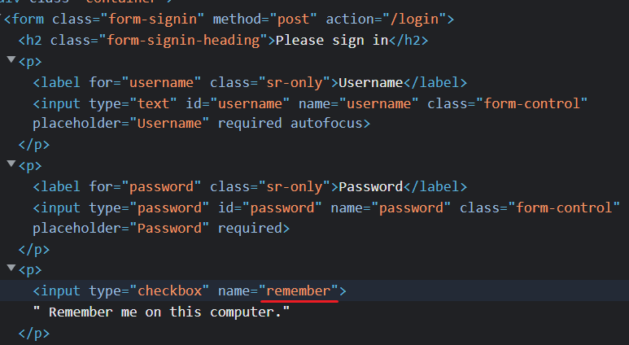

# <a href = "../README.md" target="_blank">Core Spring Security</a>
## Chapter 01. 스프링 시큐리티 기본 API 및 Filter 이해
### 1.06 Remember Me 인증
1) Remember Me 인증
2) Remember Me 인증 관련 스프링 시큐리티 API

---

# 1.06 Remember Me 인증

---

## 1) Remember Me 인증


### 1.1 Remember Me 인증 기능이란?
- 세션이 만료되고 웹 브라우저가 종료된 후에도 애플리케이션이 사용자를 기억하는 기능
- 최초 로그인 시, JSessionId 토큰과 Remember-Me 쿠키가 생성된다.
- 이후 Remember-Me 쿠키에 대한 Http 요청을 확인한 후 토큰 기반 인증을 사용해 유효성을 검사하고 토큰이 검증되면 사용자는 로그인 된다.
- 사용자 Remember Me 인증 라이프 사이클 
  - 미인증 상태
    - 인증 성공 시 : Remember-Me 쿠키 설정
    - 인증 실패 시 : 쿠키가 존재하면 쿠키 무효화
  - 이후 인증 : 만약 JSessionId 쿠키가 사라지더라도, Remember Me 토큰이 유효하다면 내부적으로 토큰 기반 인증을 거쳐 JSessionId 쿠키를
  다시 발급한다.
  - 로그아웃 : 쿠키가 존재하면 쿠키 무효화

### 1.2 Remember Me 쿠키


- Spring Security에서 사용자 Id, Password를 암호화해서 전달
- 서버에서 지정한 만료시간이 지나면 Remember Me 쿠키가 만료되고, 다시 수동으로 로그인을 해야 함.

---

## 2) Remember Me 인증 관련 스프링 시큐리티 API

### 2.1 Remember Me 인증 활성화
```java
http.rememberMe(); // Remember Me 기능 작동
```
- `http.rememberMe()`를 통해 Remember Me 인증 기능을 활성화할 수 있다.

### 2.2 Rembmer Me 인증 API


```java

@Slf4j
@RequiredArgsConstructor // 추가
@Configuration
@EnableWebSecurity
public class SecurityConfig extends WebSecurityConfigurerAdapter {

    private final UserDetailsService userDetailsService; // 추가

    @Override
    protected void configure(HttpSecurity http) throws Exception {
        // 추가
            .and()
                .rememberMe()
                .rememberMeParameter("remember")
                .tokenValiditySeconds(3600)
                .userDetailsService(userDetailsService);
    }

    // 생략
}

```

- `.rememberMe()` : Remember Me 인증 기능 활성화
- `.rememberMeParameter("remember")` : 로그인을 할 때, 전달해야 하는 remember me 파라미터명을 지정한다.
  - 디폴트 값은 "remember-me"로 되어 있다.
- `.tokenValiditySeconds(3600)` : 초 단위로, 만료 시간을 지정한다. 기본 값은 14일이다.
- `.alwaysRemember(true)` : 리멤버 미 기능을 명시적으로 활성화하지 않아도 자동으로 항상 리멤버미 기능이 동작하도록 한다.
  - 기본은 false로 되어 있다.
- `.userDetailsService(userDetailsService)` : 리멤버미 인증을 사용하기 위해 사용하는 userDetailsService를 지정한다.
  - 여기서는 스프링이 기본으로 제공하는 UserDetailsService 구현체를 사용했다.


### 2.3 HTML Post form 로그인 시 Remember Me 파라미터


- HTML Post form 로그인 시, 위에서 지정한 remember 파라미터를 통해 리멤버미 여부를 전달하도록 설정된다.

---
