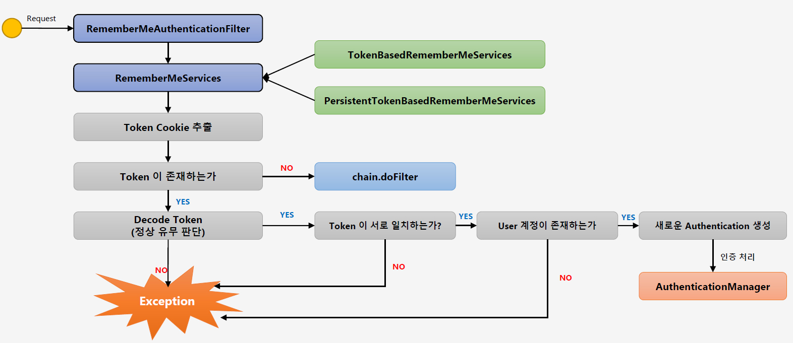
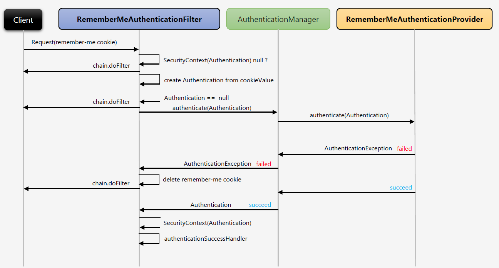

# <a href = "../README.md" target="_blank">Core Spring Security</a>
## Chapter 01. 스프링 시큐리티 기본 API 및 Filter 이해
### 1.07 Remember Me 인증 필터 - RememberMeAuthenticationFilter
1) Remember Me 인증 필터 통작 방식

---

# 1.07 Remember Me 인증 필터 - RememberMeAuthenticationFilter

---

### 1) Remember Me 인증 필터 통작 방식

### 1.1 RememberMeAuthenticationFilter의 동작 조건
아래의 조건을 만족해야 함

- 세션에 SecurityContext가 Null일 때(인증 객체가 없음.)
- 사용자의 Request http header에 remember me 쿠키가 있는 경우

### 1.2 RememberServices에 인증 처리를 위임한다.
'RememberMeServices' 는 인터페이스이고, 구현체로 `TokenBasedRememberMeServices`와 `PersistentTokenBasedRememberMeServices`
가 있다.  
이 구현체들이 실제로 remember-me 인증 처리를 수행한다. 
- `TokenBasedRememberMeServices` : 메모리에 있는 토큰과 사용자가 요청 헤더에 담아서 보낸 토큰을 비교하여 인증을 한다.
(기본적으로 14일만 토큰을 유지) 
- `PersistentTokenBasedRememberMeServices` : DB에 저장된 토큰과 사용자가 요청 헤더에 담아서 보낸 토큰을 비교하여 인증을 한다.
(영구적인 방법)

### 1.3 remember-me 토큰 확인 및 인증 처리
- 사용자 요청 remember-me 쿠키에서 토큰을 추출한다.
- Token이 존재하는지 확인 후 토큰이 없다면 다음 filter로 넘어간다. 
- 토큰이 올바른 형태이며 해당 토큰 값과 서버의 값의 일치하며 사용자의 정보가 일치하는지 확인 후 Authentication을 생성하고
AuthenticationManager를 통해 인증처리를 한다.

---
