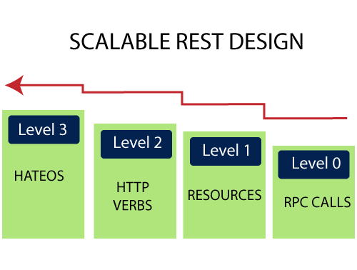

# <a href = "../README.md" target="_blank">Spring Cloud로 개발하는 마이크로서비스 애플리케이션(MSA)</a>
## Chapter 01. Microservice와 Spring Cloud의 소개
### 1.7 SOA vs MSA
1) SOA(Service Oriented Architecture)
2) MSA (MicroService Architecture)
3) REST 제약조건
4) REST API 설계 시 고려할 사항

---

# 1.7 SOA vs MSA

애플리케이션 내에서 서비스의 공유를 어느 정도로 하느냐에 따라 SOA, MSA로 구분할 수 있다.

---

## 1) SOA(Service Oriented Architecture)
- 서비스 지향 아키텍쳐
- 서비스들을 ESB(Enterprise Service Bus)에 모아, 사업 측면에서 공통 서비스 형식으로 서비스 제공
- 하나의 애플리케이션 내에 여러 서비스들이 유기젹으로 연결하여, 서비스 공유를 최대화
- 재사용을 통한 비용 절감

---

## 2) MSA (MicroService Architecture)
- 서비스 공유를 최소화
- 서비스 간의 결합도를 낮추어, 변화에 능동적으로 대응
- 각각의 독립된 서비스가 노출된 REST API를 사용하여 리소스를 제공하고 서로 API를 통해 통신
- 의존하고 있는 서비스에 문제가 생기더라도, 직접 영향을 끼치지 않고 우회할 수 있는
서비스로 대체 제공

---

## 3) REST 제약조건

> "A way to grade your API according to the constraints of REST." (Leonard Richardson)
> REST의 제약 조건에 따라 API를 등급 지정하는 방법

### 3.1 Level 0
Expose soap web services in rest style(soap 방식)

- `http://server/getPosts`
- `http://server/deletePosts`
- `http://server/doThis`

### 3.2 Level 1
Expose resources with proper uri (리소스를 uri에 노출하기만 한 상태)
- http 메서드에 따라 서비스를 구분하고 있지 않음
- 서비스의 형태와 종류에 따라 메서드를 적절히 지정하고 있지 않은 상태
- 예시
  - `http://server/accounts`
  - `http://server/accounts/10`
 
### 3.3 Level 2
Level 1 + HTTP Methods
- 우리가 제공하려는 리소스를 용도, 상태에 따라 HTTP메서드에 맞게 설계, 서비스
- HTTP 메서드 설명
  - GET : 리소스를 요청만 함
  - POST : 리소스를 추가
  - PUT : 리소스의 상태 변경
  - DELETE : 리소스 삭제

### 3.4 Level 3
Level 2 + HATEOAS
- DATA + NEXT POSSIBLE ACTIONS
- HATEOAS : 데이터를 가지고 다음에 어떤 작업을 할 수 있는 지 등을 넘겨줌

---

## 4) REST API 설계 시 고려할 사항

### 4.1 개발자 중심이 아니라, 사용자 중심의 간단 명료하고 직관적인 API를 설계해야함.
end-user 뿐 아니라, 이 api를 사용하는 또 다른 개발자 등

### 4.2 HTTP의 장점을 최대한 살려서 개발
- 최소한 Level 2 이상의 특징
- 리소스의 위치를 uri로 표현 + 적절한 HTTP 메서드

### 4.3 적절한 Response Code
- 200 : 정상 처리
- 400 : 클라이언트 오류
- 404 : 리소스를 찾지 못 함(Not Found)
- 500 : 서버 오류
- 201 : 요청이 정상 처리됐고, 리소스 생성됨
- 401 : 인증 실패
- 상태만 보내는 것이 아니라, 왜 성공했는 지, 왜 실패했는 지 같이 반하는 것이 좋음

### 4.4 uri에 인증에 관련된 정보를 전달해선 안 됨
- 예) `?jsessionId=...`

### 4.5 단수형태의 uri를 사용하기보다, 복수형태의 uri를 사용할 것
- `/user` -> `/users`
- `/user/1` -> `/users/1`

### 4.6 리소스를 명사 형태로 표시해서 전달
- 사용자에게 이것이 무슨 리소스인지 간단 명료하게 전달할 수 있도록 해야함

### 4.7 일관된 접근방식 정의
- `put` `/gist/{id}/star`
- `delete` `/gists/{id}/star`

---
