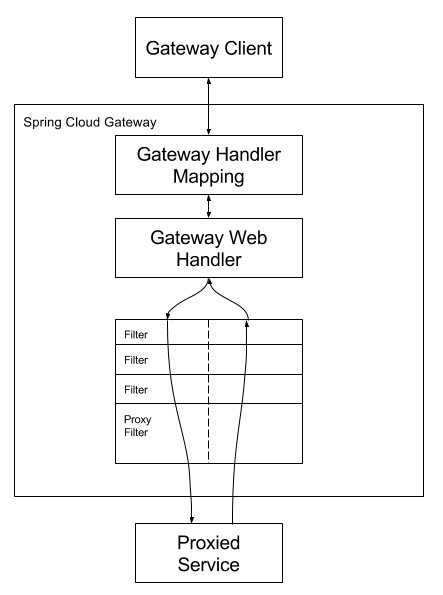

# <a href = "../README.md" target="_blank">Spring Cloud로 개발하는 마이크로서비스 애플리케이션(MSA)</a>
## Chapter 03. API Gateway Service
### 3.5 Spring Cloud Gateway - Filter 적용
1) Route / Predicate / Filter
2) Spring Cloud Gateway의 구성 요소
3) java 코드로 필터 적용 : RouteLocator 빈 등록
4) yml 파일로 필터 적용

---

# 3.5 Spring Cloud Gateway - Filter 적용

---

## 1) Route / Predicate / Filter

### 1.1 Route
- 고유 Id, 목적 URI, Predicate(조건), Filter로 구성
- Predicate에서 지정한 조건에 매칭되면 해당 Route에 매칭된다.

### 1.2 Predicate
- Route에서 걸어둔 조건
- 헤더, 파라미터, path 등 하나 이상의 조건을 정의할 수 있음

### 1.3 Filter
- GATEWAY 기준으로 들어오는 요청 및 나가는 응답에 대하여 수정을 가능하게 해주는 구성요소
- downstream(다음에 호출되는 계층)로 넘어가기 전후 요청/응답을 조작할 수 있다. (사전 필터 / 사후 필터)
- java 코드 또는 yaml 파일을 통해 작성할 수 있음

---

## 2) Spring Cloud Gateway의 구성 요소


### 2.1 Gateway Mapping
- 요청이 Route에 걸어둔 조건(Predicate)에 부합하는 지 확인하고, Gateway Web Handler로 전송

### 2.2 Gateway Web Handler
- 요청과 관련된 필터 체인을 통해 요청을 실행
- 실제 서비스에 요청을 보내기 전 '사전' 필터 로직을 수행
- 클라이언트에 응답을 보내기 전 '사후' 필터 로직을 수행

---

## 3) java 코드로 필터 적용 : RouteLocator 빈 등록

### 3.1 자바 코드로 필터 적용
```yaml
#  cloud:
#    gateway:
#      routes:
#        - id: first-service
#          uri: http://localhost:8081/ # 어디로 포워딩
#          predicates: # 조건
#            - Path=/first-service/** # 주의 : uri 뒤에 붙어서 포워딩 됨. (예: http://localhost:8081/firstservice/** )
#        - id: second-service
#          uri: http://localhost:8082/
#          predicates:
#            - Path=/second-service/**
```
- 우선 자바 코드를 작성해서 필터를 적용해보자.
- 기존에 작성했던 `application.yml`을 주석 처리하자.

### 3.2 RouteLocator 빈 등록
```java
@Configuration
public class FilterConfig {

    @Bean
    public RouteLocator gatewayRoutes(RouteLocatorBuilder builder) {
        return builder.routes()
                .route("first-service",
                        request -> request.path("/first-service/**")
                                        .filters(filters -> filters.addRequestHeader("first-request", "first-request-header-value")
                                                                    .addResponseHeader("first-response", "first-response-header-value"))
                                        .uri("http://localhost:8081"))
                .route("second-service",
                        request -> request.path("/second-service/**")
                                        .filters(filters -> filters.addRequestHeader("second-request", "second-request-header-value")
                                                                    .addResponseHeader("second-response", "second-response-header-value"))
                                        .uri("http://localhost:8082"))
                .build();
    }
}
```
- routes : Route 들을 여러개 선언할 수 있다.
  - route(...) : 각각의 Route들을 정의
    - 첫번째 인자로 Route의 id를 지정
    - 두번째 인자로, 요청에 대해서 어떻게 처리할 지 람다식의 형태로 지정한다.
      - path : 매핑 조건
      - filters : 사전 필터, 사후 필터 등 필터에 관한 것은 여기서 정의
      - uri : 어디로 보낼 것인지
- 여기서는 사전 필터에서 `xxx-request` 이름의 헤더에 value로 `xxx-request-header`를 추가했고,
사후 필터에서 `xxx-response` 이름의 헤더에 value로 `xxx-response-header`를 추가했다.

### 3.3 First-Service, Second-Service에 확인 api 추가
```java
    @GetMapping("/message")
    public String message(@RequestHeader("first-request") String headerValue) {
        log.info("first-request-header : {}", headerValue);
        return "Hello world in First Service.";
    }
```
```java
    @GetMapping("/message")
    public String message(@RequestHeader("second-request") String headerValue) {
        log.info("second-request-header : {}", headerValue);
        return "Hello world in Second Service.";
    }
```
- `/first-service/message`로 요청하면, 헤더를 읽어 출력하고 first Service가 호출됨을 확인할 수 있도록 문자열을 반환하도록 했다.
- `/second-service/message`로 요청하면, 헤더를 읽어 출력하고 second Service가 호출됨을 확인할 수 있도록 문자열을 반환하도록 했다.

### 3.4 실행 결과 - 요청 헤더 조작 확인
```shell
# http://localhost:8000/first-service/message 호출
first-request-header : first-request-header-value

# http://localhost:8000/second-service/message 호출
second-request-header : second-request-header-value
```
- first-service, second-service의 서버에서 로그를 확인해보면 각각 사전 필터를 거쳐 헤더가 추가됨을 확인할 수 있다.


### 3.5 실행 결과 - 응답 헤더 조작 확인
```shell
# first-service Response Headers
first-response: first-response-header-value

# second-service Response Headers
second-response: second-response-header-value
```
- first-service, second-service의 브라우저 응답 HTTP 메시지를 확인해보면, 사후 필터를 거쳐 헤더가 추가됨을 확인할 수 있다.

---

## 4) yml 파일로 필터 적용

### 4.1 기존 자바 코드 주석처리
```java
//@Configuration
public class FilterConfig {

    //@Bean
    public RouteLocator gatewayRoutes(RouteLocatorBuilder builder) {
```
- yml 파일로 RouteLocator 설정을 할 것이므로, 기존 설정 코드를 주석처리한다.

### 4.2 yml 파일 작성
```yaml

spring:
  application:
    name: apigateway-service
  cloud:
    gateway:
      routes:
        - id: first-service
          uri: http://localhost:8081/ # 어디로 포워딩
          predicates: # 조건
            - Path=/first-service/** # 주의 : uri 뒤에 붙어서 포워딩 됨. (예: http://localhost:8081/firstservice/** )
          filters: # 조건에 부합한다면, 적용할 부가 로직
            - AddRequestHeader=first-request, first-request-header-value2
            - AddResponseHeader=first-response, first-response-header-value2
        - id: second-service
          uri: http://localhost:8082/
          predicates:
            - Path=/second-service/**
          filters: # 조건에 부합한다면, 적용할 부가 로직
            - AddRequestHeader=second-request, second-request-header-value2
            - AddResponseHeader=second-response, second-response-header-value2

```
- yaml 파일의 routes 설정에서, filters 부분에 filter를 추가한다.
- 사전 필터에서는 요청 헤더 조작을, 사후 필터에서는 응답 헤더 조작을 하도록 했다.

### 4.3 실행 결과
- 이전과 마찬가지로 정상적으로 동작하는 것을 확인할 수 있다.

---
