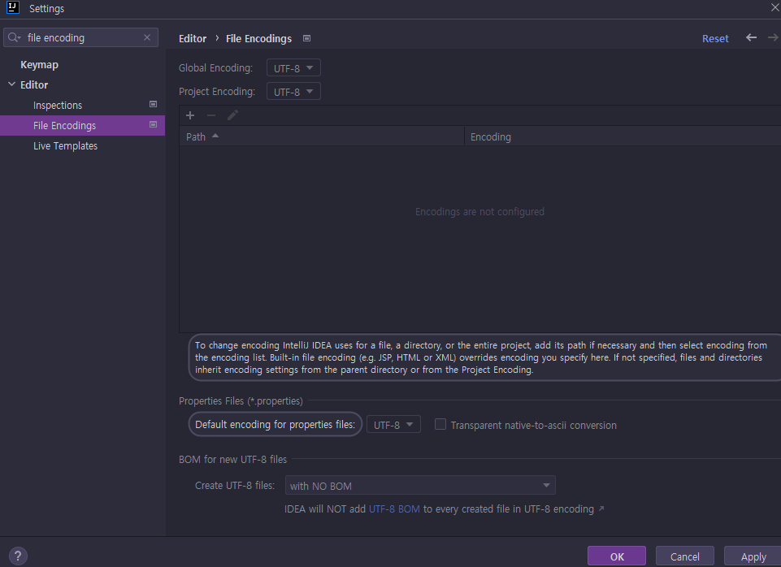

# <a href = "../README.md" target="_blank">스프링 DB 1편 - 데이터 접근 핵심 원리</a>
## Chapter 01. JDBC 이해
### 1.1 프로젝트 생성
1) 개발 환경
2) 프로젝트 생성
3) build.gradle 설정
4) IDE 설정 (IntelliJ)
5) 동작 확인

---

# 1.1 프로젝트 생성

---

## 1) 개발 환경
- JDK 11
- IDE : IntelliJ 또는 Eclipse 설치

---

## 2) 프로젝트 생성

- 스프링 부트 스타터(https://start.spring.io/)
- 프로젝트 선택
  - Project: Gradle Project
  - Language: Java
  - Spring Boot: 괄호가 붙지 않은 것 중 최신 버전 (2022.07.27 기준 2.7.2)
- Project Metadata 
  - Group: com.ttasjwi (보통 도메인 주소 거꾸로. 아무렇게)
  - Artifact: jdbc
  - Name: jdbc
  - Package name: com.ttasjwi.jdbc
  - Packaging: Jar
  - Java: 11
- Dependencies: JDBC API, H2 Database, Lombok

---

## 3) build.gradle 설정
```groovy
dependencies {
  
    // ... 생략
  
	//테스트에서 lombok 사용
	testCompileOnly 'org.projectlombok:lombok'
	testAnnotationProcessor 'org.projectlombok:lombok'
}

```

- 테스트에서도 `lombok`을 사용하기 위해 위 코드를 추가해야한다.
- 이 설정을 추가해야 테스트 코드에서 `@Slfj4` 같은 롬복 어노테이션을 사용할 수 있다.

---

## 4) IDE 설정 (IntelliJ)

### Gradle 기반 실행


### 롬복 적용

- Preference > plugin > lombok 검색, 실행(재시작)
- Preference > Annotation Processors 검색 > Enable annotation processing 체크 (재시작)
- 임의의 클래스 생성, `@Getter` `@Setter` 확인

### 파일 인코딩


---

## 5) 동작 확인
```java
@SpringBootApplication
public class JdbcApplication {

	public static void main(String[] args) {
		SpringApplication.run(JdbcApplication.class, args);
	}

}
```


- 기본 메인 클래스 실행( JdbcApplication.main() )
- 콘솔에 Started JdbcApplication 로그가 보이면 성공이다.

---
