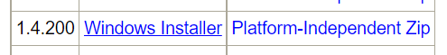
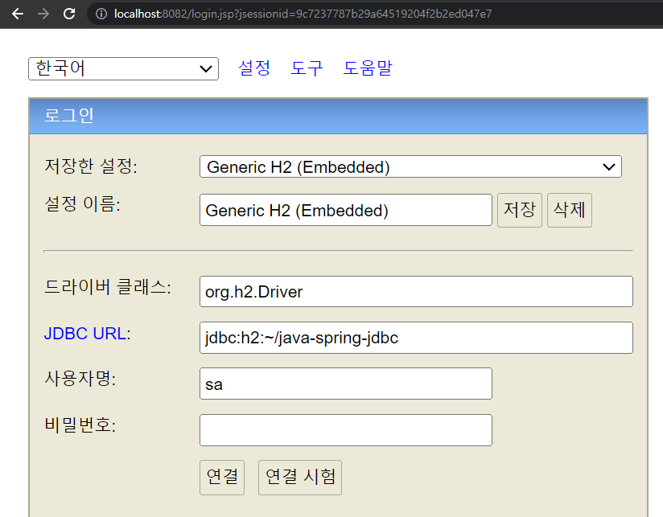
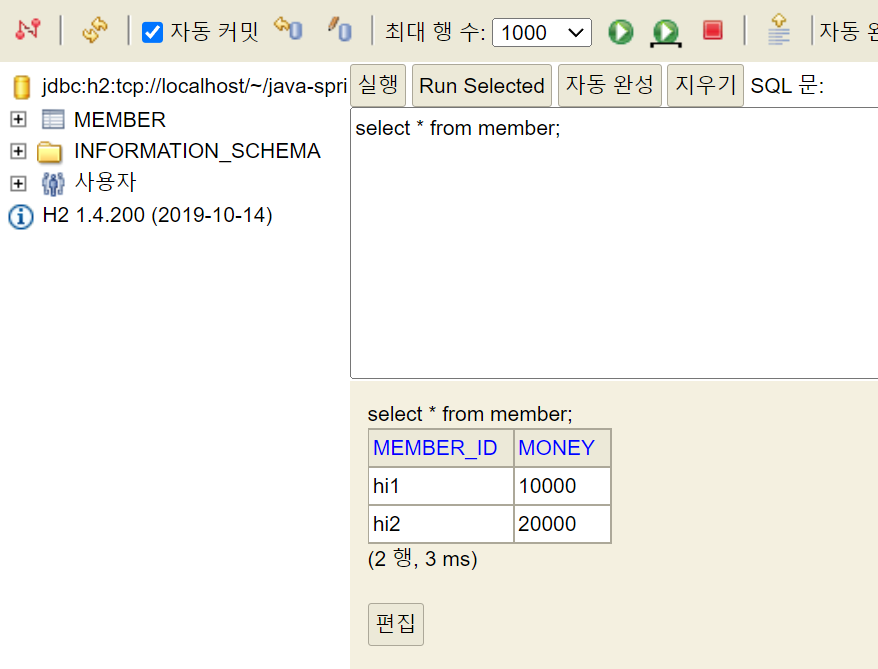

# <a href = "../README.md" target="_blank">스프링 DB 1편 - 데이터 접근 핵심 원리</a>
## Chapter 01. JDBC 이해
### 1.2 H2 데이터베이스 설정
1) H2 데이터베이스는?
2) H2 데이터베이스 설치
3) H2 데이터베이스 실행
4) DB 파일 생성
5) 기본 테이블 생성하기

---

# 1.2 H2 데이터베이스 설정

---

## 1) H2 데이터베이스는?

- 개발이나 테스트 용도로 가볍고 편리한 DB
- 웹 화면으로 제공됨(`http://localhost:8082`)

---

## 2) H2 데이터베이스 설치

- h2 데이터베이스 버전은 스프링 부트 버전에 맞춘다. (현재 1.4.200이 기준 버전)
    - 1.4.200 버전을 압축파일로 다운 : [링크](https://www.h2database.com/html/download-archive.html)
    - 스프링 부트에서 지원하는 H2 데이터베이스 버전 확인 : [링크](https://docs.spring.io/spring-boot/docs/current/reference/html/dependency-versions.html#appendix.dependency-versions)
- 편의를 위해 home 경로(terminal 기준 home 경로는 `'~'`)에 압축파일 해제

---

## 3) H2 데이터베이스 실행

- h2 설치 폴더의 bin 경로로 이동 (cd `~/h2/bin`)
- (mac 기준) 실행 권한 설정: `chmod 755 h2.sh`
- 실행
    - windows : `.\h2.bat`
    - mac : `.\h2.sh`
- 주소창에서 `http://localhost:8082` 입력 후 엔터 -> 접속
  - 엔터 이후 파라미터가 붙는데 이 부분은 절대 변경하면 안된다.
  - 주의! 특히 뒤에 jsessionid 부분이 변경되면 안된다.

---

## 4) DB 파일 생성

- `jdbc:h2:~/java-spring-jdbc` (최소 한번)
- `~/datajpa.mv.db` 파일 생성 확인
- 이후 부터는 `jdbc:h2:tcp://localhost/~/java-spring-jdbc` 이렇게 접속

---

## 5) 기본 테이블 생성하기
테이블 관리를 위해 프로젝트 루트에 `sql/schema.sql` 파일을 생성
```sql
DROP TABLE member if exists cascade;

CREATE TABLE member (
    member_id varchar(10),
    money integer not null default 0,
    primary key (member_id)
);

insert into member(member_id, money) values('hi1', 10000);
insert into member(member_id, money) values('hi2', 20000);
```
```sql
select * from member;
```

- 잘 작동되는지, H2 데이터베이스 웹 콘솔에서 실행 후 member 테이블 생성
- SELECT 쿼리를 돌려서, 저장한 데이터가 잘 나오는지 결과 확인

---
