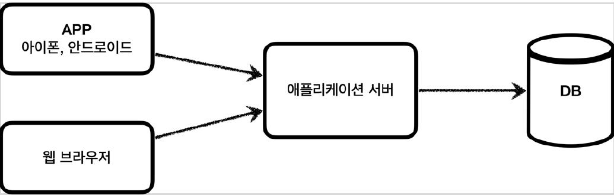
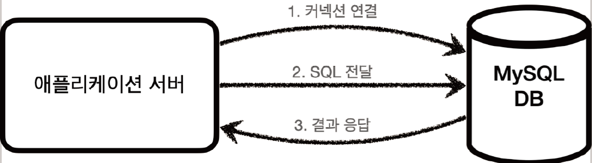
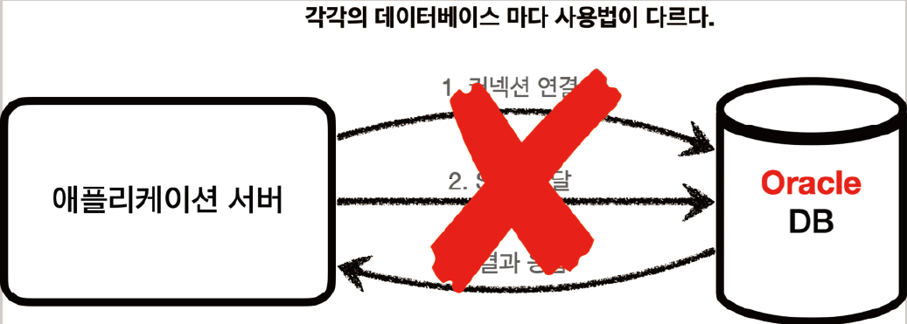
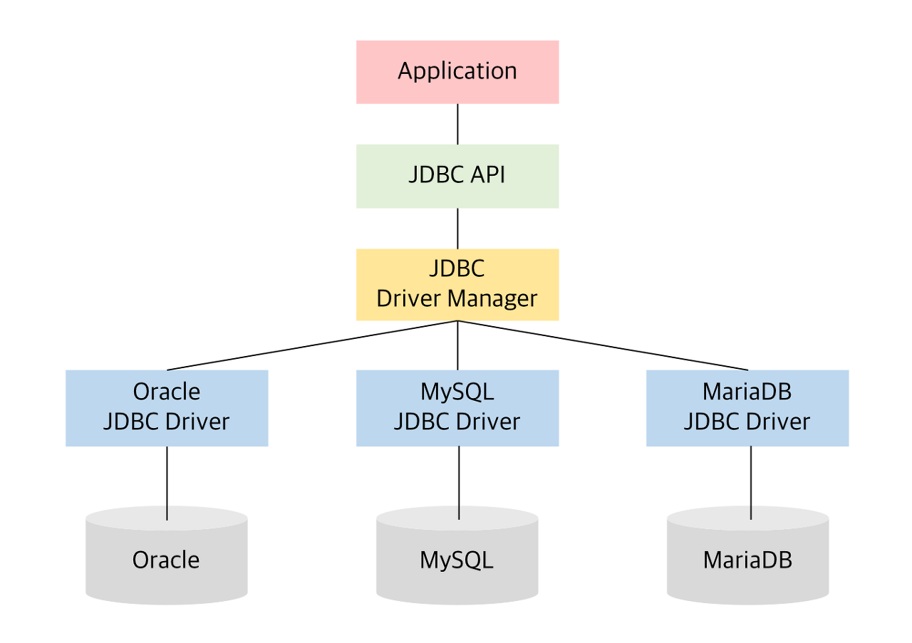
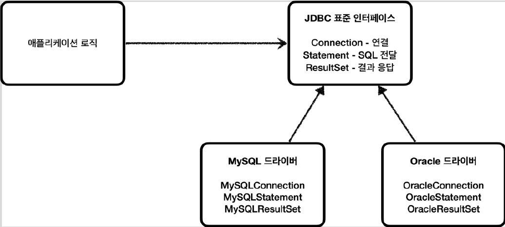
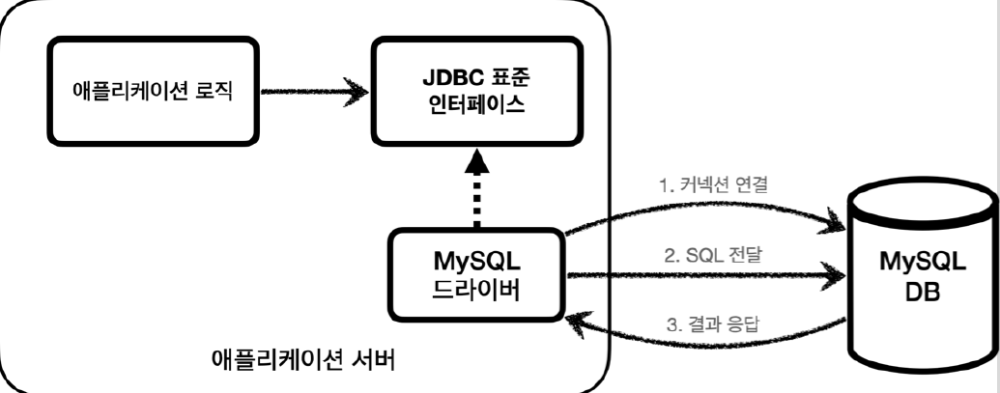
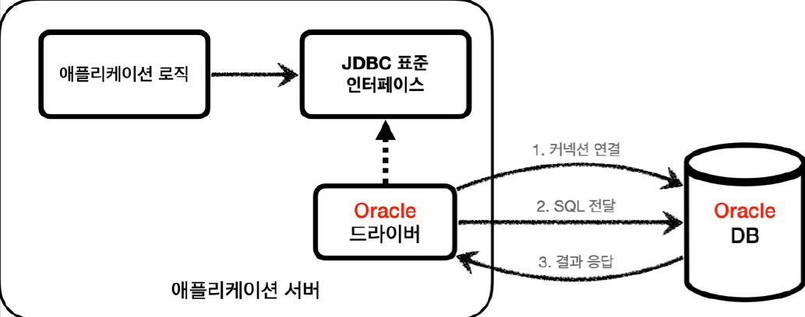

# <a href = "../README.md" target="_blank">스프링 DB 1편 - 데이터 접근 핵심 원리</a>
## Chapter 01. JDBC 이해
### 1.3 JDBC 이해
1) 도입 배경 : 표준화되지 않은 데이터베이스 접근 방법
2) JDBC(Java Database Connectivity)
3) JDBC 표준 인터페이스와 JDBC Driver
4) JDBC 도입을 통해 얻어낸 것
5) 순수 JDBC의 한계

---

# 1.3 JDBC 이해

---

## 1) 도입 배경 : 표준화되지 않은 데이터베이스 접근 방법

### 1.1 클라이언트 - 애플리케이션 서버 - DB 구조

- 여러 클라이언트 계층에서, 애플리케이션 서버(WAS)를 통해 DB의 데이터를 조회, 조작한다.
- 여기서 클라이언트 - WAS 사이의 요청/응답 로직에 관한 부분은 Spring Web 관련 지식이므로 이 강의에서는 다루지 않고 있다.

### 1.2 애플리케이션 서버와 DB - 일반적인 사용법

클라이언트가 애플리케이션 서버를 통해 데이터를 저장하거나 조회할 때, 애플리케이션 서버는 다음 과정을 통해서 데이터베이스를 사용한다.
1. 커넥션 연결: 주로 TCP/IP를 사용해서 커넥션을 연결한다.
2. SQL 전달: 애플리케이션 서버는 DB가 이해할 수 있는 SQL을 연결된 커넥션을 통해 DB에 전달한다.
3. 결과 응답: DB는 전달된 SQL을 수행하고 그 결과를 응답한다. 애플리케이션 서버는 응답 결과를 활용한다.

### 1.3 애플리케이션 서버와 DB - DB가 변경될 때

문제는 각각의 데이터베이스마다 커넥션을 연결하는 방법, SQL을 전달하는 방법, 그리고 결과를 응답 받는 방법이 모두 다르는 점(심지어 한 두개도 아니고 수 십개)이다.
이 말이 의미하는 것은...

1. 데이터베이스를 다른 종류의 데이터베이스로 변경하면 애플리케이션 서버에 개발된 데이터베이스 사용 코드도 함께 변경해야 한다.
2. 개발자가 각각의 데이터베이스마다 커넥션 연결, SQL 전달, 그리고 그 결과를 응답 받는 방법을 새로 학습해야 한다.

그 삽질을 개발자가 다 할 수도 없고, 이런 문제를 해결하기 위해 JDBC라는 자바 표준이 등장한다.

---

## 2) JDBC(Java Database Connectivity)

> JDBC(Java Database Connectivity)는 자바에서 데이터베이스에 접속할 수 있도록 하는 자바 API다.
> 
> JDBC는 데이터베이스에서 자료를 쿼리하거나 업데이트하는 방법을 제공한다. - 위키백과

- DBMS 종류에 관계 없이
- Java에서 표준화된 사용방법으로
- DBMS에 접속할 수 있도록 하는 Java API

---

## 3) JDBC 표준 인터페이스와 JDBC Driver

### 3.1 JDBC 표준 인터페이스
java는 개발자들이 편리하게 데이터베이스에 접근할 수 있도록 아래의 표준 인터페이스(API)들을 정의함.
개발자들은 아래의 인터페이스들을 의존하여 사용하면 됨.
- `java.sql.Connection` : DBMS 연결
- `java.sql.Statement` : SQL을 담은 내용
- `java.sql.ResultSet` : SQL 요청 응답

### 3.2 JDBC Driver

- 각각의 DB 벤더측에서 각각 JDBC 인터페이스 사양에 맞게 구현한 구현체 모음

---

## 4) JDBC 도입을 통해 얻어낸 것

### 4.1 역할에 의존하지 않고 구현에 의존
- 애플리케이션 로직은 이제 JDBC 표준 인터페이스에만 의존한다.
- 데이터베이스를 다른 종류의 데이터베이스로 변경하고 싶으면 JDBC 구현 라이브러리(`JDBC Driver`)만 변경하면 된다.
- 다른 종류의 데이터베이스로 변경해도 애플리케이션 서버의 사용 코드를 거의 그대로 유지할 수 있다.

### 4.2 개발자의 학습량 경감
- 개발자는 JDBC 표준 인터페이스 사용법만 학습하면 된다.
- 각각의 DB마다 커넥션 연결, SQL 전달, 그리고 그 결과를 응답 받는 방법을 새로 학습할 필요가 없다.
- 한번 배워두면 수십개의 데이터베이스에 모두 동일하게 적용할 수 있다.

---

## 5) 순수 JDBC의 한계

- JDBC의 등장으로 많은 것이 편리해졌지만, **각각의 데이터베이스마다 SQL, 데이터타입 등의 일부 사용법이 다르다.**
- ANSI SQL이라는 표준이 있기는 하지만 일반적인 부분만 공통화했기 때문에 한계가 있다.
  - 대표적으로 실무에서 기본으로 사용하는 페이징 SQL은 각각의 데이터베이스마다 사용법이 다르다.
- 결국 데이터베이스를 변경하면 JDBC 코드는 변경하지 않아도 되지만 SQL은 해당 데이터베이스에 맞도록 변경해야한다.
- (참고) JPA(Java Persistence API)를 사용하면 이렇게 각각의 데이터베이스마다 다른 SQL을 정의해야 하는 문제도 많은 부분 해결할 수 있다.
  - JPQL을 작성하면 JPA가 데이터베이스 방언에 맞게 sql을 작성하여 DB에 날려주기 때문

---
