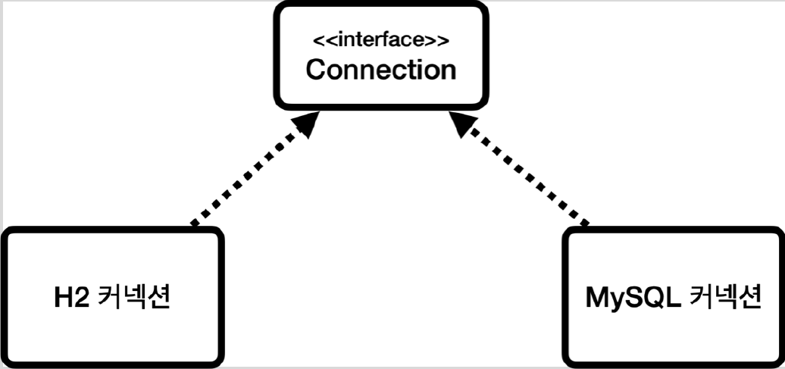

# <a href = "../README.md" target="_blank">스프링 DB 1편 - 데이터 접근 핵심 원리</a>
## Chapter 01. JDBC 이해
### 1.5 데이터베이스 연결
1) (실습) 커넥션 획득하기
2) JDBC 커넥션 인터페이스와 구현
3) DriverManager를 통한 커넥션 요청 흐름

---

# 1.5 데이터베이스 연결

---

## 1) (실습) 커넥션 획득하기

### 1.1 데이터베이스 연결에 필요한 상수 등록
```java
public abstract class ConnectionConst {
    
    public static final String URL = "jdbc:h2:tcp://localhost/~/java-spring-jdbc";
    public static final String USERNAME = "sa";
    public static final String PASSWORD = "";
    
}
```
- 실무에서는 프로젝트 내부에 데이터베이스 접근에 필요한 상수를 노출해선 안 된다. (프로젝트 외부에 등록해두고 실행 시점에 설정파일을 호출해서 사용하는 등의 방법을 사용)
- 이 강의에서, 여러 군데에서 커넥션을 얻어올 때 사용하기 위해 public으로 등록

### 1.2 커넥션 획득(DriverManager.getConnection)
```java
@Slf4j
public class DBConnectionUtil {

    public static Connection getConnection() {
        try {
            Connection connection = DriverManager.getConnection(URL, USERNAME, PASSWORD);
            log.info("get Connection={}, class ={}", connection, connection.getClass());
            return connection;
        } catch (SQLException e) {
            throw new IllegalStateException(e);
        }
    }
}

```
- `DriverManager.getConnection(...)` : 커넥션을 새로 생성해서 얻어옴

### 1.3 커넥션 획득 테스트
```java
@Slf4j
class DBConnectionUtilTest {

    @Test
    @DisplayName("DB와 정상적으로 연결을 맺어야한다.")
    void connection() {
        Connection connection = DBConnectionUtil.getConnection();
        assertThat(connection).isNotNull();
    }
}
```
```
... get Connection=conn0: url=jdbc:h2:tcp://localhost/~/java-spring-jdbc user=SA, class =class org.h2.jdbc.JdbcConnection
```
- 실제로 커넥션이 null이 아니고, H2 데이터베이스의 connection 구현체가 얻어와짐을 알 수 있다.
- 이 커넥션은 JDBC 표준 커넥션 인터페이스인`java.sql.Connection`을 구현하고 있다.

---

## 2) JDBC 커넥션 인터페이스와 구현

- JDBC는 `java.sql.Connection` 표준 커넥션 인터페이스를 정의한다.
  - H2 데이터베이스 드라이버는 JDBC Connection 인터페이스를 구현한 `org.h2.jdbc.JdbcConnection` 구현체를 제공한다.

---

## 3) DriverManager를 통한 커넥션 요청 흐름 

### 3.1 드라이버 매니저(DriverManager)

- JDBC가 제공하는 클래스 : `java.sql.Driver Manager`
- 라이브러리에 등록된 DB 드라이버들을 관리하고, 커넥션을 획득하는 기능을 제공한다.

### 3.2 DriverManager.getConnection(...) 호출
- 애플리케이션 로직에서 커넥션이 필요하면 `DriverManager.getConnection(url, user, password)`을 호출한다.
  - URL: 예) jdbc:h2:tcp://localhost/~/test
  - 이름, 비밀번호 등 접속에 필요한 추가 정보

### 3.3 DirverManager의 드라이버 조회
```groovy
dependencies {
  // 생략
  runtimeOnly 'com.h2database:h2'
}
```
```java
public class JdbcConnection extends TraceObject implements Connection, JdbcConnectionBackwardsCompat,
        CastDataProvider {
    
    // 생략
  
}
```
- `DriverManager` 는 라이브러리에 등록된 드라이버 목록을 자동으로 인식한다.
  - 우리는 H2 데이터베이스 드라이버만 라이브러리에 등록했기 때문에 실질적으로는 H2 드라이버에만 조회될 것이다.

### 3.4 드라이버에 커넥션 요청 및 획득
- 라이브러리에 등록된 드라이버들에게 순서대로 인자들(url, user, password)을 넘겨서 커넥션을 획득할 수 있는지 확인한다.
- 여기서 각각의 드라이버는 URL 정보를 체크해서 본인이 처리할 수 있는 요청인지 확인한다.
- 처리할 수 있는 요청일 경우, 실제 데이터베이스에 연결해서 커넥션을 획득한다.
  - URL이 `jdbc:h2` 로 시작하면 이것은 h2 데이터베이스에 접근하기 위한 규칙이다. 따라서 H2 드라이버는 본인이 처리할 수 있으므로 실제 데이터베이스에 연결해서 커넥션을 획득한다.
  - 반면에 URL이 jdbc:h2 로 시작했는데 MySQL 드라이버가 먼저 실행되면 이 경우 본인이 처리할 수 없다는 결과를 반환하게 되고, 다음 드라이버에게 순서가 넘어간다.
- 이렇게 찾아진 커넥션 구현체를 클라이언트(호출한 애플리케이션 로직)에 반환한다.
  - jdbc 인터페이스 : `java.sql.Connection`
  - H2의 커넥션 구현체 : `org.h2.jdbc.JdbcConnection`

---
