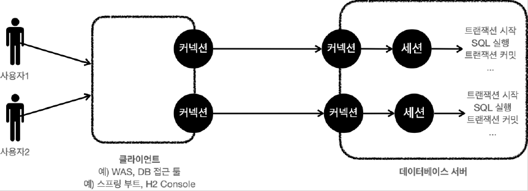

# <a href = "../README.md" target="_blank">스프링 DB 1편 - 데이터 접근 핵심 원리</a>
## Chapter 03. 트랜잭션 이해
### 3.02 데이터베이스 연결 구조와 DB 세션
1) 커넥션과 데이터베이스 세션
2) SQL, 트랜잭션 실행의 주체는 DB 세션
3) 커넥션 풀과 DB 세션

---

# 3.02 데이터베이스 연결 구조와 DB 세션

---

## 1) 커넥션과 데이터베이스 세션

- 사용자는 웹 애플리케이션 서버(WAS)나 DB 접근 툴 같은 클라이언트를 사용해서 데이터베이스 서버에
접근할 수 있다.
- 클라이언트는 데이터베이스 서버에 연결을 요청하고 커넥션을 맺게 된다.
- 이때 데이터베이스 서버는 내부에 **세션**이라는 것을 만든다.
- 그리고 앞으로 해당 커넥션을 통한 모든 요청은 이 세션을 통해서 실행하게 된다.

---

## 2) SQL, 트랜잭션 실행의 주체는 DB 세션
- 개발자가 클라이언트를 통해 SQL을 전달하면 현재 커넥션에 연결된 세션이 SQL을 실행한다.
- 세션은 트랜잭션을 시작하고, 커밋 또는 롤백을 통해 트랜잭션을 종료한다. 그리고 이후에 새로운
트랜잭션을 다시 시작할 수 있다.
- 사용자가 커넥션을 닫거나, 또는 DBA(DB 관리자)가 세션을 강제로 종료하면 세션은 종료된다.

---

## 3) 커넥션 풀과 DB 세션

- 커넥션 풀이 10개의 커넥션을 생성하면, 세션도 10개 만들어진다.
- 애플리케이션 로딩 시점에 세션을 준비해두고 언제든 바로 커넥션풀의 커넥션을 통해 DB 세션에 SQL을 바로 전달할 수 있다.

---
