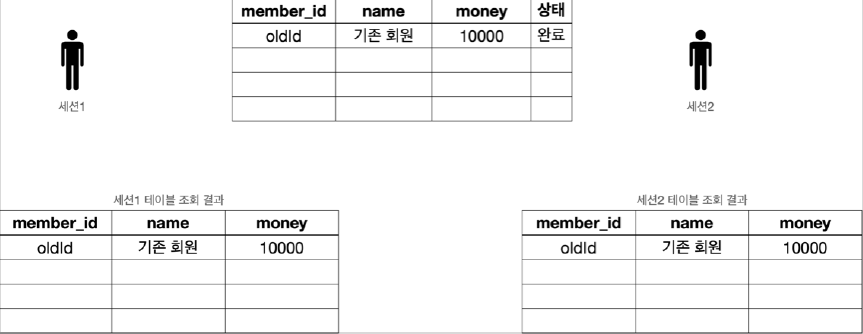
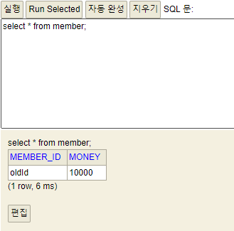

# <a href = "../README.md" target="_blank">스프링 DB 1편 - 데이터 접근 핵심 원리</a>
## Chapter 03. 트랜잭션 이해
### 3.05 트랜잭션 - DB 예제3 - 트랜잭션 실습
1) (실습) 실습 환경 준비
2) (실습) 신규 데이터 추가 - 커밋 전
3) (실습) 세션1에서 커밋했을 때
4) (실습) 세션1에서 롤백했을 때

---

# 3.05 트랜잭션 - DB 예제3 - 트랜잭션 실습

---

## 1) (실습) 실습 환경 준비

### 1.1 서로 다른 두 세션 준비
- H2 데이터베이스 웹 콘솔 창을 2개 열기
- 주의
  - H2 데이터베이스 웹 콘솔 창을 2개 열때 기존 URL을 복사하면 안된다.
  - 꼭 `http://localhost:8082` 를 직접 입력해서 완전히 새로운 세션에서 연결하도록 하자.
  - URL을 복사하면 같은 세션( jsessionId )에서 실행되어서 원하는 결과가 나오지 않을 수 있다.
  - 예) `http://localhost:8082` 에 접근했을 때 다음과 같이 jsessionid 값이 서로 달라야 한다. jsessionid 값이 같으면 같은 세션에 접근하게 된다. 
    - 1번 URL: `http://localhost:8082/login.do?jsessionid=744cb5cbdfeab7d972e93d08d731b005`
    - 2번 URL: `http://localhost:8082/login.do?jsessionid=5e297b3dbeaa2383acc1109942bd2a41`

### 1.2 기본 데이터 추가

```sql
-- 데이터 초기화
set autocommit true;
delete from member;
insert into member(member_id, money) values ('oldId',10000);
```
- 자동 커밋 모드를 사용했기 때문에 별도로 커밋을 호출하지 않아도 된다.
- 만약 잘 진행되지 않으면 이전에 실행한 특정 세션에서 락을 걸고 있을 수 있다. 이때는 H2 데이터베이스 서버를 종료하고 다시 실행해보자.

### 1.3 데이터 추가 확인
```sql
SELECT * FROM member;
```
  

- 이렇게 데이터를 초기화하고, 세션1, 세션2에서 다음 쿼리를 실행해서 결과를 확인하자.

---

## 2) (실습) 신규 데이터 추가 - 커밋 전

### 2.1 세션1 신규 데이터 추가

```sql
-- 트랜잭션 시작
set autocommit false; --수동 커밋 모드
insert into member(member_id, money) values ('newId1',10000);
insert into member(member_id, money) values ('newId2',10000);
```
- 세션1에서 신규 데이터를 추가
- 아직 커밋은 하지 않았다.

### 2.2 세션1, 세션2 각각에서 데이터 조회
```sql
SELECT * FROM member;
```


아직 세션1이 커밋을 하지 않은 상태이기 때문에
- 세션1에서는 입력한 데이터가 보이지만
- 세션2에서는 입력한 데이터가 보이지 않는 것을 확인할 수 있다.

---

## 3) (실습) 세션1에서 커밋했을 때

### 3.1 세션1에서 커밋

```sql
commit; -- 데이터베이스에 반영
```
- 실제 세션1에서 `commit` 명령어를 입력하면 데이터베이스에 반영된다.

### 3.2 커밋 후 양쪽 세션에서 데이터 조회
`
- 세션1이 트랜잭션을 커밋했기 때문에 데이터베이스에 실제 데이터가 반영된다.
- 커밋 이후에는 모든 세션에서 데이터를 조회할 수 있다.

---

## 4) (실습) 세션1에서 롤백했을 때

### 데이터 다시 되돌릴 것
- 앞서 `3) (실습) 세션1에서 커밋했을 때`의 작업 이전까지 되돌려야한다.
- 1~2 의 작업을 다시 그대로 수행한다.

### 4.1 세션1 신규 데이터 추가 후 rollback

```sql
rollback; -- 롤백으로 데이터베이스에 변경 사항을 반영하지 않는다.
```
- 세션1에서 롤백을 호출하여 다시 트랜잭션 시작 이전 단계로 돌아간다.

### 4.2 세션1, 세션2 각각에서 데이터 조회
```sql
SELECT * FROM member;
```

- 양쪽 세션에서 데이터를 다시 조회해보면 롤백으로 데이터가 DB에 반영되지 않은 것을 확인할 수 있다.

---
