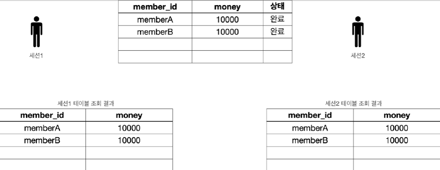
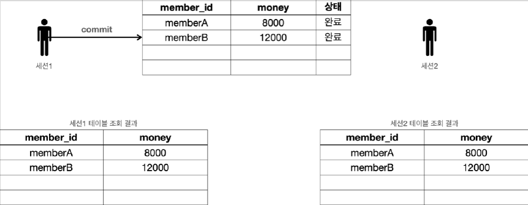
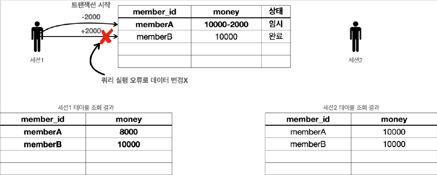
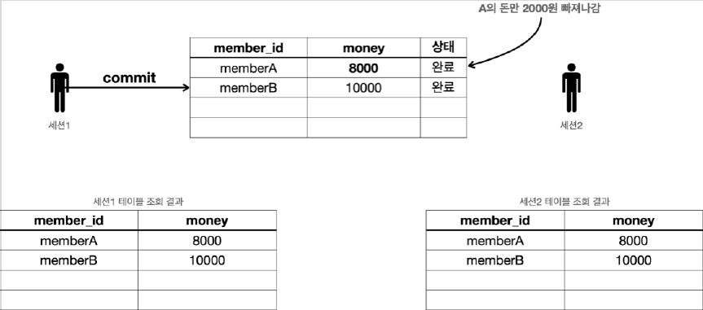
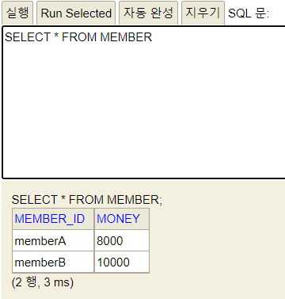

# <a href = "../README.md" target="_blank">스프링 DB 1편 - 데이터 접근 핵심 원리</a>
## Chapter 03. 트랜잭션 이해
### 3.06 트랜잭션 - DB 예제4 - 계좌이체
1) (실습) 계좌이체 정상
2) (실습) 계좌이체 문제 상황에서, 강제 커밋할 때
3) (실습) 계좌이체 문제 상황에서, 롤백
4) 트랜잭션의 원자성
5) 비즈니스 로직은 반드시 트랜잭션에서 이루어져야한다.

---

# 3.06 트랜잭션 - DB 예제4 - 계좌이체

---

## 1) (실습) 계좌이체 정상

### 1.1 기본 데이터 입력

```sql
set autocommit true;
delete from member;
insert into member(member_id, money) values ('memberA',10000);
insert into member(member_id, money) values ('memberB',10000);
```
다음 기본 데이터를 준비한다.
- `memberA` : 10000원
- `memberB` : 10000원

### 1.2 계좌이체 실행 (트랜잭션)

```sql
set autocommit false;
update member set money=10000 - 2000 where member_id = 'memberA';
update member set money=10000 + 2000 where member_id = 'memberB';
```
- `memberA` 의 돈을 `memberB` 에게 2000원 계좌이체하는 트랜잭션을 실행한다.
  1. set autocommit false 로 설정한다.
  2. a의 돈을 감소시키는 update 쿼리, b의 돈을 증가시키는 update 쿼리가 모두 실행되어야 한다.
- 아직 커밋하지 않았으므로 다른 세션에는 기존 데이터가 조회된다.

### 1.3 커밋 후 성공 결과 조회

```sql
commit;
```
```sql
select * from member;
```
- commit 명령어를 실행하면 데이터베이스에 결과가 반영된다.
- 다른 세션에서도 memberA 의 금액이 8000원으로 줄어들고, memberB 의 금액이 12000원으로 증가한 것을 확인할 수 있다.

---

## 2) (실습) 계좌이체 문제 상황에서, 강제 커밋할 때

### 데이터 원상 복구

```sql
set autocommit true;
delete from member;
insert into member(member_id, money) values ('memberA',10000);
insert into member(member_id, money) values ('memberB',10000);
```
- `memberA` : 10000원
- `memberB` : 10000원

### 2.1 잘못된 계좌이체 실행

```sql
set autocommit false;
update member set money=10000 - 2000 where member_id = 'memberA'; -- 성공
update member set money=10000 + 2000 where member_iddd = 'memberB'; -- 쿼리 예외 발생
```
```shell
Column "MEMBER_IDDD" not found; SQL statement:
update member set money=10000 + 2000 where member_iddd = 'memberB' [42122-200] 42S22/42122
```
- 계좌이체를 실행하는 도중에 SQL에 문제가 발생한다.
- 그래서 memberA 의 돈을 2000원 줄이는 것에는 성공했지만, memberB 의 돈을 2000원 증가시키는 것에 실패한다.
  - 두 번째 SQL은 member_iddd 라는 필드에 오타가 있다. 두 번째 update 쿼리를 실행하면 SQL 오류가 발생하는 것을 확인할 수 있다.
- 여기서 문제는 memberA 의 돈은 2000원 줄어들었지만, memberB 의 돈은 2000원 증가하지 않았다는 점이다.
- 결과적으로 계좌이체는 실패하고 memberA 의 돈만 2000원 줄어든 상황이다.

### 2.2 강제 커밋?!
```sql
commit;
```
```sql
select * from member;
```



- 이 상황에서 강제로 commit 을 호출했다.
- 계좌이체는 실패하고 `memberA` 의 돈만 2000원 줄어드는 아주 심각한 문제가 발생한다.
- **트랜잭션 중간에 문제가 발생했을 때는 커밋을 호출하면 안된다.**
  - 롤백을 호출해서 데이터를 트랜잭션 시작 시점으로 원복해야 한다.

---

## 3) (실습) 계좌이체 문제 상황에서, 롤백

### 데이터 원상 복구

```sql
set autocommit true;
delete from member;
insert into member(member_id, money) values ('memberA',10000);
insert into member(member_id, money) values ('memberB',10000);
```
- `memberA` : 10000원
- `memberB` : 10000원

### 3.1 다시 잘못된 계좌이체 실행

```sql
set autocommit false;
update member set money=10000 - 2000 where member_id = 'memberA'; -- 성공
update member set money=10000 + 2000 where member_iddd = 'memberB'; -- 쿼리 예외 발생
```
```shell
Column "MEMBER_IDDD" not found; SQL statement:
update member set money=10000 + 2000 where member_iddd = 'memberB' [42122-200] 42S22/42122
```

### 3.2 오류가 발생했을 때 롤백
```sql
rollback;
```
```sql
select * from member;
```


- 도중에 오류가 발생했을 때는 롤백을 호출해서 트랜잭션을 시작하기 전 단계로 데이터를 복구해야 한다.
- 롤백을 사용한 덕분에 계좌이체를 실행하기 전 상태로 돌아왔다.
- memberA 의 돈도 이전 상태인 10000원으로 돌아오고, memberB 의 돈도 10000원으로 유지되는 것을 확인할 수 있다.

---

## 4) 트랜잭션의 원자성
- 원자성: 트랜잭션 내에서 실행한 작업들은 마치 하나의 작업인 것처럼 모두 성공 하거나 모두 실패해야 한다.
- 트랜잭션의 원자성 덕분에 여러 SQL 명령어를 마치 하나의 작업인 것처럼 처리할 수 있었다.
- 성공하면 한번에 반영하고, 중간에 실패해도 마치 하나의 작업을 되돌리는 것 처럼 간단히 되돌릴 수 있다.

---

## 5) 비즈니스 로직은 반드시 트랜잭션에서 이루어져야한다.

### 4.1 오토 커밋 상황에서 비즈니스 로직이 진행됐을 때
- 계좌이체 중간에 실패했을 때, 쿼리를 하나 실행할 때 마다 바로바로 커밋이 되어버림
- memberA 의 돈만 2000원 줄어드는 심각한 문제가 발생한다.

### 4.2 비즈니스 로직은 트랜잭션에서 진행하라.
- 따라서 이런 종류의 비즈니스 로직은 꼭 수동 커밋 모드를 사용해서 수동으로 커밋, 롤백 할 수 있도록 해야 한다.
- 보통 자동 커밋 모드에서 수동 커밋 모드로 전환 하는 것을 트랜잭션을 시작한다고 표현한다.

---