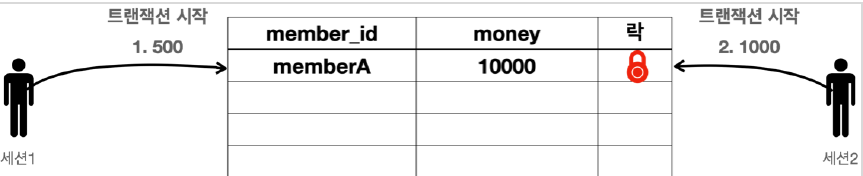
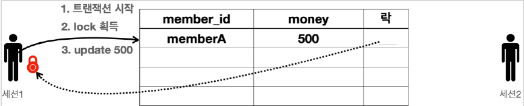
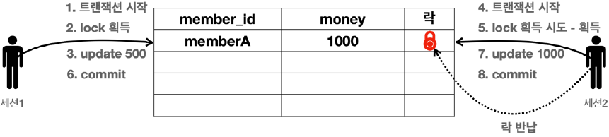

# <a href = "../README.md" target="_blank">스프링 DB 1편 - 데이터 접근 핵심 원리</a>
## Chapter 03. 트랜잭션 이해
### 3.07 DB 락 - 개념 이해
1) 동시 수정의 위험성
2) 데이터 변경(update, delete) 시도 → 락 획득
3) Timeout 안에 락을 획득하지 못 하면 예외가 발생
4) (예제) 동시 변경 시도와 락

---

# 3.07 DB 락 - 개념 이해

---

## 1) 동시 수정의 위험성
- 세션1과 세션2가 동일한 데이터를 수정가능하다면 트랜잭션의 원자성이 깨진다.
- 세션이 트랜잭션을 시작하고 데이터를 수정하는 동안에는 커밋이나 롤백 전까지 다른 세션에서 해당 데이터를 수정할 수 없게 막아야 한다.

---

## 2) 데이터 변경(update, delete) 시도 → 락 획득
- 데이터의 변경(update, delete)을 시도할 때 락을 획득한다.
- 세션의 트랜잭션이 종료되면 락을 반납한다.
- 락을 반납되기 전까지, 해당 리소스에 접근하는 다른 세션은 대기한다.
  - 무한정 대기하는 것은 아님

---

## 3) Timeout 안에 락을 획득하지 못 하면 예외가 발생
```sql
SET LOCK_TIMEOUT 60000; -- 타임아웃 시간을 60초로 설정
```
- 락을 반납되기 전까지, 락 걸린 리소스에 접근하는 다른 세션은 대기한다.
  - 무한정 대기하는 것은 아님
- TIMEOUT 시간 안에 락을 획득하지 못 하면 예외가 발생함.

---

## 4) (예제) 동시 변경 시도와 락

### 4.1 동시 변경 시도 발생

- 세션1은 memberA 의 금액을 500원으로 변경하고 싶음
- 세션2는 memberA 의 금액을 1000원으로 변경하고 싶음

### 4.2 먼저 변경 시도를 한 세션1이 락 획득

- 세션1은 트랜잭션을 시작한다.
- 세션1은 memberA 의 money 를 500으로 변경을 시도한다.
- 이때 해당 row의 락을 먼저 획득해야 한다.
- 락이 남아 있으므로 세션1은 락을 획득한다. (세션1이 세션2보다 조금 더 빨리 요청했다.)
- 세션1은 락을 획득했으므로 해당 row에 update sql을 수행한다.

### 4.3 나중에 접근한 세션 2는 락 때문에 대기

- 세션2는 트랜잭션을 시작한다.
- 세션2도 memberA 의 money 데이터를 변경하려고 시도한다.
- 이때 해당 row의 락을 먼저 획득해야 한다.
- 락이 없으므로 락이 돌아올 때 까지 대기한다.
  - 세션2가 락을 무한정 대기하는 것은 아니다.
  - 락 대기 시간을 넘어가면 락 타임아웃 오류가 발생한다.

### 4.4 세션 1의 트랜잭션 종료 후 락 반납

- 세션1은 커밋을 수행한다. 커밋으로 트랜잭션이 종료되었으므로 락도 반납한다.

### 4.5 세션 2의 락 획득


- 락을 획득하기 위해 대기하던 세션2가 락을 획득한다.
- 세션2는 update sql을 수행한다.

### 4.6 세션 2의 트랜잭션 종료 후 락 반납

- 세션2는 커밋을 수행하고 트랜잭션이 종료되었으므로 락을 반납한다.

---
