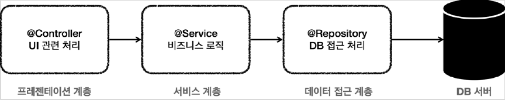

# <a href = "../README.md" target="_blank">스프링 DB 1편 - 데이터 접근 핵심 원리</a>
## Chapter 04. 스프링과 문제 해결 - 트랜잭션
### 4.01 문제점들
1) 애플리케이션 구조
2) 서비스 계층을 특정 기술에 종속적이지 않게 개발해야 한다.
3) MemberServiceV1의 문제점
4) MemberServiceV2의 문제점
5) 트랜잭션 문제
6) 데이터 접근 계층의 JDBC 구현 기술 예외가 서비스 계층으로 누수
7) 순수 JDBC의 문제 - 반복문제
8) 스프링을 통해 문제 해결

---

# 4.01 문제점들

---

## 1) 애플리케이션 구조


### 1.1 프레젠테이션 계층(`@Controller`)
- UI와 관련된 처리 담당
- 웹 요청과 응답
- 사용자 요청을 검증
- 주 사용 기술: 서블릿과 HTTP 같은 웹 기술, 스프링 MVC

### 1.2 서비스 계층(`@Service`)
- 비즈니스 로직을 담당
- 주 사용 기술: 가급적 특정 기술에 의존하지 않고, 순수 자바 코드로 작성

### 1.3 데이터 접근 계층(`@Repository`)
- 실제 데이터베이스에 접근하는 코드
- 주 사용 기술: JDBC, JPA, File, Redis, Mongo ...

---

## 2) 서비스 계층을 특정 기술에 종속적이지 않게 개발해야 한다.

### 2.1 핵심 비즈니스 로직이 들어있는 서비스 계층이 가장 중요하다.
- 시간이 흘러서 UI(웹)와 관련된 부분이 변하고, 데이터 저장 기술을 다른 기술로 변경해도, 비즈니스 로직은 최대한 변경없이 유지되어야 한다.

### 2.2 서비스 계층을 최대한 순수하게 유지
- 서비스 계층을 특정 기술에 종속적이지 않게 개발해야 한다.
- 이렇게 계층을 나눈 이유도 서비스 계층을 최대한 순수하게 유지하기 위한 목적이 크다.
- 기술에 종속적인 부분은 프레젠테이션 계층, 데이터 접근 계층에서 가지고 간다.
- 향후 구현 기술이 변경될 때 변경의 영향 범위를 최소화 할 수 있다.

### 2.3 계층 분리 : 프레젠테이션 계층으로부터 보호
- 클라이언트가 접근하는 UI와 관련된 기술인 웹, 서블릿, HTTP와 관련된 부분을 담당
- 서비스 계층을 UI와 관련된 기술로부터 보호해준다.
- 예) HTTP API를 사용하다가 GRPC 같은 기술로 변경해도 프레젠테이션 계층의 코드만 변경하고, 서비스 계층은 변경하지 않아도 된다.

### 2.4 계층 분리 : 데이터 접근 계층으로부터 보호
- 데이터 접근 계층은 데이터를 저장하고 관리하는 기술을 담당해준다.
- 구체적인 데이터 접근 기술(JDBC, JPA, ...)로부터 서비스 계층을 보호해준다.
  - 예) JDBC를 사용하다가 JPA로 변경해도 서비스 계층은 변경하지 않아도 된다.  
    (물론 서비스 계층에서 데이터 접근 계층을 직접 접근하는 것이 아니라, 추상화된 인터페이스를 의존하는 것이 좋다.  
    그래야 서비스 코드의 변경 없이 JdbcRepository 를 JpaRepository 로 변경할 수 있다.)

### 2.5 유지보수성, 테스트 용이성 증가
- 서비스 계층이 특정 기술에 종속되지 않기 때문에 비즈니스 로직을 유지보수 하기도 쉽고, 테스트 하기도 쉽다.

---

## 3) MemberServiceV1의 문제점
```java
@RequiredArgsConstructor
public class MemberServiceV1 {
    private final MemberRepositoryV1 memberRepository;
    
    public void accountTransfer(String fromId, String toId, int money) throws SQLException {
        Member fromMember = memberRepository.findById(fromId);
        Member toMember = memberRepository.findById(toId);
        memberRepository.update(fromId, fromMember.getMoney() - money);
        memberRepository.update(toId, toMember.getMoney() + money);
    }
}
```
### 3.1 그나마 다행인 점 : 순수 비즈니스 로직만 존재
- 특정 기술에 종속적이지 않고, 순수한 비즈니스 로직만 존재한다.
- 특정 기술과 관련된 코드가 거의 없어서 코드가 깔끔하고, 유지보수 하기 쉽다.
- 향후 비즈니스 로직의 변경이 필요하면 이 부분을 변경하면 된다.

### 3.2 핵심적인 문제점 : 트랜잭션이 없다.
- 도중에 부분적으로 예외가 터지더라도, 롤백이 되지 않아서 원자성이 깨진다.

### 3.3 `SQLException` 이라는 JDBC 기술에 의존
- `memberRepository` 에서 올라오는 예외이기 때문에 `memberRepository` 에서 해결해야 한다.

### 3.4 구체 클래스에 의존하고 있음
- `MemberRepositoryV1` 이라는 구체 클래스에 직접 의존하고 있다.
- `MemberRepository` 인터페이스를 도입하면 향후 `MemberService` 의 코드의 변경 없이 다른 구현 기술로 손쉽게 변경할 수 있다.

---

## 4) MemberServiceV2의 문제점
```java
@Slf4j
@RequiredArgsConstructor
public class MemberServiceV2 {

    private final MemberRepositoryV2 memberRepository;
    private final DataSource dataSource;

    public void accountTransfer(String fromId, String toId, int money) throws SQLException {

        Connection conn = dataSource.getConnection();
        try {
            conn.setAutoCommit(false); // 트랜잭션 시작
            // 비즈니스 로직
            businessLogic(conn, fromId, toId, money);

            // 커밋, 롤백
            conn.commit(); // 성공 시 커밋
        } catch (Exception e) {
            conn.rollback(); // 실패 시 롤백
            throw  new IllegalStateException(e); // 일단 예외를 감싸서 덤지도록 처리함
        } finally {
            release(conn);
        }
    }

    private void businessLogic(Connection conn, String fromId, String toId, int money) throws SQLException {
        // 비즈니스 로직 수행
        Member fromMember = memberRepository.findById(conn, fromId);
        Member toMember = memberRepository.findById(conn, toId);

        memberRepository.update(conn, fromId, fromMember.getMoney()- money);
        memberRepository.update(conn, toId, toMember.getMoney() + money);
    }
}
```

### 4.1 트랜잭션을 도입했더니 JDBC 의존성이 생김
- 트랜잭션은 비즈니스 로직이 있는 서비스 계층에서 시작하는 것이 좋다.
- 그런데 문제는 트랜잭션을 사용하기 위해서 JDBC 기술에 의존해야 한다.
- `javax.sql.DataSource` , `java.sql.Connection` ,`java.sql.SQLException`
- JDBC에서 JPA 같은 다른 기술로 바꾸어 사용하게 되면 서비스 코드도 모두 함께 변경해야 한다.
  - JPA는 트랜잭션을 사용하는 코드가 JDBC와 다르다.

### 4.2 트랜잭션 코드 때문에 코드 복잡도가 늘어남
- 결과적으로 비즈니스 로직보다 JDBC를 사용해서 트랜잭션을 처리하는 코드가 더 많다.
- 핵심 비즈니스 로직과 JDBC 기술이 섞여 있어서 유지보수 하기 어렵다.

---

## 5) 트랜잭션 문제

### 5.1 JDBC 구현 기술이 서비스 계층에 누수되는 문제
- 트랜잭션을 적용하기 위해 JDBC 구현 기술이 서비스 계층에 누수되었다.
- 서비스 계층은 순수해야 한다. 구현 기술을 변경해도 서비스 계층 코드는 최대한 유지할 수 있어야 한다. (변화에 대응)
  - 그래서 데이터 접근 계층에 JDBC 코드를 다 몰아두는 것이다.
  - 물론 데이터 접근 계층의 구현 기술이 변경될 수도 있으니 데이터 접근 계층은 인터페이스를 제공하는 것이 좋다.
- 서비스 계층은 특정 기술에 종속되지 않아야 한다. 지금까지 그렇게 노력해서 데이터 접근 계층으로 JDBC 관련 코드를 모았는데, 트랜잭션을 적용하면서 결국 서비스 계층에 JDBC 구현 기술의 누수가 발생했다.

### 5.2 트랜잭션 동기화 문제
- 같은 트랜잭션을 유지하기 위해 커넥션을 파라미터로 넘겨야 한다.
- 리포지토리의 똑같은 기능도 트랜잭션용 기능과 트랜잭션을 유지하지 않아도 되는 기능으로 분리해야 한다.

### 5.3 트랜잭션 적용 반복 문제
- 트랜잭션 적용 코드를 보면 반복이 많다. try , catch , finally ...

---

## 6) 데이터 접근 계층의 JDBC 구현 기술 예외가 서비스 계층으로 누수
- 데이터 접근 계층의 JDBC 구현 기술 예외가 서비스 계층으로 전파된다.
- `SQLException` 은 체크 예외이기 때문에 데이터 접근 계층을 호출한 서비스 계층에서 해당 예외를 잡아서 처리하거나 명시적으로 throws 를 통해서 다시 밖으로 던져야한다.
- `SQLException` 은 JDBC 전용 기술이다. 향후 JPA나 다른 데이터 접근 기술을 사용하면, 그에 맞는 다른 예외로 변경해야 하고, 결국 서비스 코드도 수정해야 한다.
- 서비스 계층에서 JDBC 기술을 알게되버리는 것이다.

---

## 7) 순수 JDBC의 문제 - 반복문제
- 지금까지 작성한 MemberRepository 코드는 순수한 JDBC를 사용했다.
- 이 코드들은 유사한 코드의 반복이 너무 많다. 
  - try , catch , finally ...
  - 커넥션을 열고, PreparedStatement 를 사용하고, 결과를 매핑하고... 실행하고, 커넥션과 리소스를 정리한다.

---

## 8) 스프링을 통해 문제 해결
- 스프링은 서비스 계층을 순수하게 유지하면서, 지금까지 이야기한 문제들을 해결할 수 있는 다양한 방법과 기술들을 제공한다.

---

