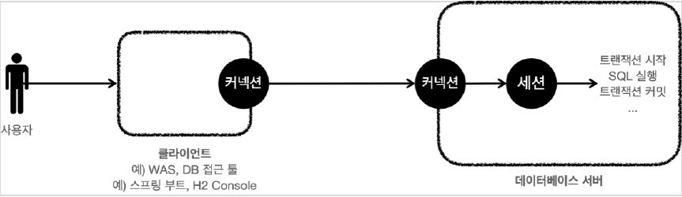
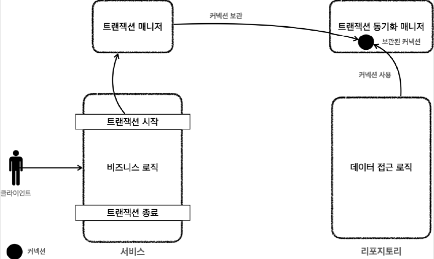

# <a href = "../README.md" target="_blank">스프링 DB 1편 - 데이터 접근 핵심 원리</a>
## Chapter 04. 스프링과 문제 해결 - 트랜잭션
### 4.03 트랜잭션 동기화
1) 트랜잭션 유지를 위해 커넥션을 파라미터로 넘기는 불편함
2) 트랜잭션 동기화 매니저

---

# 4.03 트랜잭션 동기화

### 트랜잭션 매니저
- 앞에서 설명한 `PlatformTransactionManager` 인터페이스 및 그 구현체 계층
- 트랜잭션 추상화, 트랜잭션 동기화를 책임진다.

### 트랜잭션 추상화
- 앞에서 설명한 내용이므로 생략.
- 여러가지 데이터 접근기술의 변경이 일어나도 이들을 추상화했기 때문에 서비스 코드를 변경하지 않아도 된다.

### 트랜잭션 동기화
- 이번에 다룰 내용이다.
- 트랜잭션에서 사용하는 커넥션을 멀티스레드 환경에서 편리하게 사용할 수 있도록 관리해준다.

---

## 1) 트랜잭션 유지를 위해 커넥션을 파라미터로 넘기는 불편함

```java
    public Member findById(Connection conn, String memberId) throws SQLException {
        String sql = "SELECT member_id, money\n" +
                "FROM member\n" +
                "WHERE member_id = ?";

        // Connection conn = null;  
        PreparedStatement pstmt = null;
        ResultSet rs = null;

        try {
            // conn = getConnection(); -- 커넥션을 외부에서 가져오므로 코드를 지움
            pstmt = conn.prepareStatement(sql);

          // 생략
        }
    }   
```
- 트랜잭션을 유지하려면 트랜잭션의 시작부터 끝까지 같은 데이터베이스 커넥션을 유지해아함
- 결국 같은 커넥션을 동기화(맞추어 사용)하기 위해서 이전에는 파라미터로 커넥션을 전달하는 방법을 사용했다.
- 파라미터로 커넥션을 전달하는 방법은 코드가 지저분해지는 것은 물론이고, 커넥션을 넘기는 메서드와 넘기지 않는 메서드를 중복해서 만들어야 하는 등 여러가지 단점들이 많다.

---

## 2) 트랜잭션 동기화 매니저



### 2.1 트랜잭션 동기화
- 스프링은 트랜잭션 동기화 매니저를 제공하고, 트랜잭션 매니저는 내부적으로 이 트랜잭션 동기화 매니저를 사용한다.
- 트랜잭션 동기화 매니저는 스레드 로컬(Thread Local)을 사용하기 때문에 멀티스레드 상황에 안전하게 커넥션을 동기화 할 수 있다. 
  - (cf) 스레드 로컬을 사용하면 각각의 쓰레드마다 별도의 저장소가 부여된다. 따라서 해당 쓰레드만 해당 데이터에 접근할 수 있다.
- 커넥션이 필요하면 트랜잭션 동기화 매니저를 통해 커넥션을 획득하면 된다.
  
- 이전처럼 파라미터로 커넥션을 전달하지 않아도 된다.

### 2.2 트랜잭션 동기화 매니저의 동작 방식
1. 트랜잭션을 시작하려면 커넥션이 필요하다. 트랜잭션 매니저는 데이터소스를 통해 커넥션을 만들고 트랜잭션을 시작한다.
2. 트랜잭션 매니저는 트랜잭션이 시작된 커넥션을 트랜잭션 동기화 매니저에 보관한다.
3. 리포지토리는 트랜잭션 동기화 매니저에 보관된 커넥션을 꺼내서 사용한다.
   - 따라서 파라미터로 커넥션을 전달하지 않아도 된다.
4. 트랜잭션이 종료되면 트랜잭션 매니저는 트랜잭션 동기화 매니저에 보관된 커넥션을 통해 트랜잭션을 종료하고, 커넥션도 닫는다.

---
