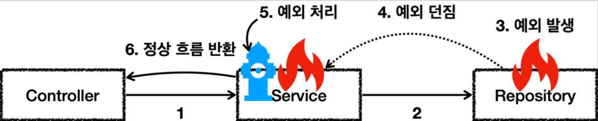

# <a href = "../README.md" target="_blank">스프링 DB 1편 - 데이터 접근 핵심 원리</a>
## Chapter 05. 자바 예외 이해
### 5.2 예외 기본 규칙
1) 예외 정상 처리(try-catch)
2) 예외 떠넘기기(throws)
3) 예외를 처리하지 못 하고 계속 던질 경우
---

# 5.2 예외 기본 규칙

---

## 1) 예외 정상 처리(try-catch)

- 메서드를 호출할 때마다 호출된 메서드의 스택 프레임은 호출한 스택 프레임 위에 쌓인다.
- 예외가 발생하여 해당 계층에서 처리하지 못 했을 경우, 해당 메서드의 흐름을 종료하고 호출한 계층으로(아래의 스택 프레임으로) 예외가 전파된다.
- 예외 전파 흐름을 막으려면, 처리할 수 있는 계층에서 예외를 `try-catch`문으로 처리하면 된다.
- 예외를 처리할 때(잡을 때) catch문에서 지정한 예외뿐 아니라 그 예외의 하위 자식들도 함께 처리된다.
  - 예) `Exception` 을 catch 로 잡으면 그 하위 예외들도 모두 잡을 수 있다.
- 예외를 정상적으로 처리하면 이후에는 애플리케이션 로직이 정상 흐름으로 동작한다.

---

## 2) 예외 떠넘기기(throws)

- 예외를 해당 계층에서 처리하지 못한다면 명시적으로 호출한 곳으로 떠넘길 수 있다. (메서드에 throws 선언)
- 예외를 던질 때 지정한 예외뿐만 아니라 그 예외의 자식들도 함께 떠넘겨진다.
  - 예) `Exception` 을 throws 로 던지면 그 하위 예외들도 모두 떠넘겨진다.

---

## 3) 예외를 처리하지 못 하고 계속 던질 경우

- 자바 `main` 스레드의 경우 예외 로그를 출력하면서 시스템이 종료된다.
- 웹 애플리케이션의 경우 여러 사용자의 요청을 처리하기 때문에 하나의 예외 때문에 시스템이 종료되면 안 된다.
  - WAS가 해당 예외를 받아서 처리하는데, 주로 사용자에게 개발자가 지정한, 오류 페이지를 보여준다.

---
