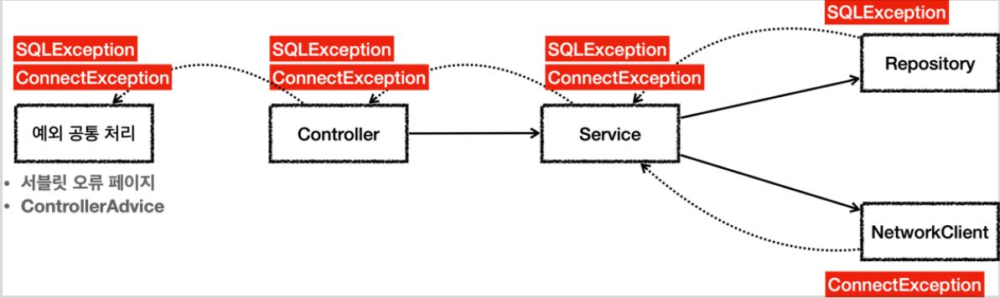

# <a href = "../README.md" target="_blank">스프링 DB 1편 - 데이터 접근 핵심 원리</a>
## Chapter 05. 자바 예외 이해
### 5.5 체크 예외 활용
1) 체크 예외, 언체크 예외 선택 기준
2) 처리할 수 없는 예외는 결국 외부로 전파된다.
3) (실습) 체크 예외의 문제점 : 외부 계층이 체크예외를 알게 된다.
4) 체크 예외를 throws하면 외부 계층에 의존관계가 추가됨
5) 체크 예외를 Exception으로 싸잡아서 throws하지 말라.

---

# 5.5 체크 예외 활용

---

## 1) 체크 예외, 언체크 예외 선택 기준

### 1.1 기본적으로 언체크(런타임) 예외를 사용하자.
- 최근 추세는 대부분의 상황에 언체크 예외를 사용한다.

### 1.2 비즈니스 로직상 정말 중요한 예외일 때 의도적으로 체크 예외를 사용
- 해당 예외를 잡아서 반드시 처리해야 하는 문제일 때만 체크 예외를 사용해야 한다. 
- **다른 개발자들이 컴파일러를 통해, 놓친 중요한 예외를 쉽게 인지할 수 있도록 하기 위해** 사용한다.
- (체크 예외 예)
  - 계좌 이체 실패 예외
  - 결제시 포인트 부족 예외
  - 로그인 ID, PW 불일치 예외
- 물론 위의 경우에도 100% 체크 예외로 만들어야 하는 것은 아니다.
  - 다만 계좌 이체 실패처럼 매우 심각한 문제를 체크 예외로 선언하면, 다른 개발자가 실수로 예외를 놓치면 안된다고 판단할 수 있게 할 수 있다.

---

## 2) 처리할 수 없는 예외는 결국 외부로 전파된다.


### 2.1 예외가 떠넘겨지는 쪽에서는 예외를 처리할 방법을 모르는 경우가 많다.
- 리포지토리는 DB에 접근해서 데이터를 저장하고 관리한다. 여기서는 SQLException 체크 예외를 던진다.
- NetworkClient 는 외부 네트워크에 접속해서 어떤 기능을 처리하는 객체이다. 여기서는 ConnectException 체크 예외를 던진다.
- 서비스는 리포지토리와 NetworkClient 를 둘다 호출한다. 따라서 두 곳에서 올라오는 체크 예외인 `SQLException` 과 `ConnectException` 을 처리해야 한다. 그런데 서비스는 이 둘을 처리할 방법을 모른다.
  - `ConnectException` 처럼 연결이 실패하거나, `SQLException` 처럼 데이터베이스에서 발생하는 문제처럼 심각한 문제들은 대부분 애플리케이션 로직에서 처리할 방법이 없다.
- 서비스는 `SQLException` 과 `ConnectException` 를 처리할 수 없으므로 둘다 밖으로 던진다.
  - `method() throws SQLException, ConnectException`

### 2.2 결국 예외 공통 처리 계층까지 예외가 전파된다.
- 컨트롤러도 두 예외를 처리할 방법이 없다. 외부로 떠넘긴다.
  - `method() throws SQLException, ConnectException`  
- 웹 애플리케이션이라면 서블릿의 오류 페이지나, 또는 스프링 MVC가 제공하는 `ControllerAdvice`에서 이런 예외를 공통으로 처리한다.
  - 이런 문제들은 보통 사용자에게 어떤 문제가 발생했는지 자세히 설명하기가 어렵다.
  - 그래서 사용자에게는 "서비스에 문제가 있습니다." 라는 일반적인 메시지를 보여준다.
    - "데이터베이스에 어떤 오류가 발생했어요" 라고 알려주어도 일반 사용자가 이해할 수 없다. 그리고 보안에도 문제가 될 수 있다.
  - API라면 보통 HTTP 상태코드 500(내부 서버 오류)을 사용해서 응답을 내려준다.

### 2.3 오류 로그, 알람
- 이렇게 해결이 불가능한 공통 예외는 별도의 오류 로그를 남겨야 한다.
- 또, 개발자가 오류를 빨리 인지할 수 있도록 메일, 알림(문자, 슬랙)등을 통해서 전달 받아야 한다.
  - 예를 들어서 `SQLException`이 잘못된 SQL을 작성해서 발생했다면, 개발자가 해당 SQL을 수정해서 배포하기 전까지 사용자는 같은 문제를 겪게 된다.

---

## 3) (실습) 체크 예외의 문제점 : 외부 계층이 체크예외를 알게 된다.

### 3.1 Repository
```java
    static class Repository {
        public void call() throws SQLException {
            throw new SQLException("ex");
        }
    }
```
- jdbc의 체크예외 SQLException이 발생한다.
- 해당 예외를 repository 계층에서 처리하지 못 하므로 외부에 떠넘긴다.

### 3.2 NetworkClient
```java
    static class NetworkClient {
        public void call() throws ConnectException {
            throw new ConnectException("연결 실패");
        }
    }
```
- 체크 예외인 `ConnectionException`이 발생한다. 이 예외를 해당 계층에서 처리하지 못 하므로 외부에 떠넘긴다.

### 3.3 Service
```java
    static class Service {
        private final Repository repository = new Repository();
        private final NetworkClient networkClient = new NetworkClient();


        public void logic() throws SQLException, ConnectException {
            repository.call();
            networkClient.call();
        }
    }
```
- logic 메서드에서 `repository.call()`, `networdClient.call()`을 호출하였다.
- 이들 메서드는 체크예외인 `SQLException`, `ConnectionException`을 외부 계층인 Service에게 떠넘겼다.
- 하지만 `Service.logic()`에서도 이를 처리하지 못 한다. 체크예외이므로 결국 외부에 떠넘겨야한다.
- service에서도 `SQLException`, `ConnectionException`을 알게 됐다.

### 3.4 Controller
```java
    static class Controller {
        private final Service service = new Service();

        public void request() throws SQLException, ConnectException {
            service.logic();
        }
    }


```
- `request()`메서드에서 `service.locic()`을 호출한다.
- 체크예외인 `SQLException`, `ConnectionException`이 외부 계층인 `Controller`에게 떠넘겼다.
- 여기서도 처리하지 못 한다. 체크예외이므로 결국 외부에 떠넘겨야한다. (물론 이 부분은 나중에 ControllerAdvice에 전달되어 적절한 API로 요청한 측에 전달될 것이다.)
- controller도 체크예외를 알게되고, 이 바깥의 계층에서도 해당 체크예외를 알아야할 것이다.

### 3.5 테스트 코드
```java
    @Test
    public void checked() {
        assertThatThrownBy(() -> controller.request())
                .isInstanceOf(SQLException.class);
    }

```
- 실제로 controller의 reqeuest를 호출하여 SQLException이 발생한 것을 확인할 수 있다.

### 3.6 해당 코드의 문제점
1. 복구 불가능한 예외를 외부에 던져야함.
   - 대부분의 예외는 복구가 불가능하다. 일부 복구가 가능한 예외도 있지만 아주 적다.
     - `SQLException` 을 예를 들면 데이터베이스에 무언가 문제가 있어서 발생하는 예외이다. SQL 문법에 문제가 있을 수도 있고, 데이터베이스 자체에 뭔가 문제가 발생했을 수도 있다. 데이터베이스 서버가 중간에 다운 되었을 수도 있다. 이런 문제들은 대부분 발생 복구가 불가능하다.
   - 특히나 대부분의 서비스나 컨트롤러는 이런 문제를 해결할 수는 없다. 따라서 이런 문제들은 일관성 있게 공통으로 처리해야 한다.
   - 오류 로그를 남기고 개발자가 해당 오류를 빠르게 인지하는 것이 필요하다. 서블릿 필터, 스프링 인터셉터, 스프링의 `ControllerAdvice` 를 사용하면 이런 부분을 깔끔하게 공통으로 해결할 수 있다.
2. 의존 관계에 대한 문제
   - 체크 예외의 또 다른 심각한 문제는 예외에 대한 의존 관계 문제이다. 
   - 앞서 대부분의 예외는 복구 불가능한 예외라고 했다. 그런데 체크 예외이기 때문에 컨트롤러나 서비스 입장에서는 본인이 처리할 수 없어도 어쩔 수 없이 `throws` 를 통해 던지는 예외를 선언해야 한다.

---

## 4) 체크 예외를 throws하면 외부 계층에 의존관계가 추가됨
```java
    static class Controller {
        private final Service service = new Service();

        public void request() throws SQLException, ConnectException {
            service.logic();
        }
    }

    static class Service {
    
        private final Repository repository = new Repository();
        private final NetworkClient networkClient = new NetworkClient();
    
    
        public void logic() throws SQLException, ConnectException {
            repository.call();
            networkClient.call();
        }
    }
```

- 서비스, 컨트롤러에서 jdbc 기술인 `java.sql.SQLException` 을 의존하게 된다.
- 향후 리포지토리를 JDBC 기술이 아닌 다른 기술로 변경하면 throws되는 예외도 변하게 될 가능성이 존재한다. 서비스나 컨트롤러 입장에서는 어차피 본인이 처리할 수도 없는 예외를 의존해야 하는 큰 단점이 발생하게 된다.
  - `SQLException` 이 아니라, 예를 들어 JPAException 으로 예외가 변경된다면, `SQLException` 에 의존하던 모든 서비스, 컨트롤러의 코드를 `JPAException`에 의존하도록 고쳐야 한다.
  - `logic() throws SQLException` -> `logic() throws JPAException` (참고로 JPA 예외는 실제 이렇지는 않고, 이해하기 쉽게 예를 든 것이다.)
- 결과적으로 OCP, DI를 통해 클라이언트 코드의 변경 없이 대상 구현체를 변경할 수 있다는 장점이 체크 예외 때문에 발목을 잡게 된다.

---

## 5) 체크 예외를 Exception으로 싸잡아서 throws하지 말라.

### 5.1 `throws Exception`
```java
void method() throws SQLException, ConnectException {..}
```
```java
void method() throws Exception {..}
```
- `SQLException` , `ConnectException` 같은 시스템 예외는 컨트롤러나 서비스에서는 대부분 복구가 불가능하고 처리할 수 없는 체크 예외이다. 따라서 throws를 통해 외부에 떠넘겨야한다.
- 그런데 위와 같이 최상위 예외인 Exception 을 던져도 문제를 해결할 수 있다.
- 이렇게 하면 Exception 은 물론이고 그 하위 타입인 SQLException , ConnectException 도 함께 던지게 된다.
- 코드가 깔끔해지는 것 같지만, Exception 은 최상위 타입이므로 모든 체크 예외를 다 밖으로 던지는 문제가 발생한다.

### 5.2 다른 체크 예외를 체크할 수 있는 기능의 무효화
- 결과적으로 체크 예외의 최상위 타입인 Exception 을 던지게 되면 다른 체크 예외를 체크할 수 있는 기능이 무효화 되고, **중요한 체크 예외를 다 놓치게 된다.**
- 중간에 중요한 체크 예외가 발생해도 컴파일러는 Exception 을 던지기 때문에 문법에 맞다고 판단해서 컴파일 오류가 발생하지 않는다.
- 이렇게 하면 모든 예외를 다 던지기 때문에 체크 예외를 의도한 대로 사용하는 것이 아니다. 따라서 꼭 필요한 경우가 아니면 이렇게 `Exception` 자체를 밖으로 던지는 것은 좋지 않은 방법이다.

---
