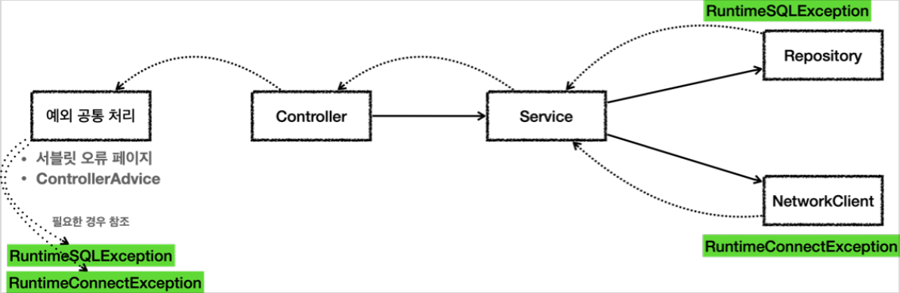
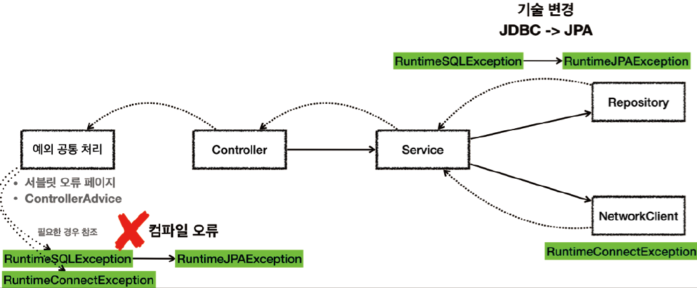

# <a href = "../README.md" target="_blank">스프링 DB 1편 - 데이터 접근 핵심 원리</a>
## Chapter 05. 자바 예외 이해
### 5.6 언체크 예외 활용
1) 런타임 예외 변환 시 외부 계층의 예외 의존 제거
2) (실습) 체크예외를 언체크 예외로 변환하여 적용 - UncheckedAppTest
3) 어차피, 처리가 불가능한 예외들은 외부에서 몰라도 된다. 
4) throws 생략 가능
5) 구현체 교체 시 파급효과가 줄어듬
6) 런타임 예외는 놓칠 수 있으므로 문서화를 하자
7) 최근 라이브러리들은 대부분 런타임 예외를 기본으로 제공

---

# 5.6 언체크 예외 활용

---

## 1) 런타임 예외 변환 시 외부 계층의 예외 의존 제거

- `SQLException` 을 런타임 예외인 `RuntimeSQLException` 으로 변환했다.
- `ConnectException` 대신에 `RuntimeConnectException` 을 사용하도록 바꾸었다.
  - 런타임 예외이기 때문에 서비스, 컨트롤러는 해당 예외들을 처리할 수 없다면 별도의 선언 없이 그냥 두면 된다.
  - 실제로 해당 계층에서는 별도로 throws문을 쓰지 않아도 되고 예외 자체를 의존하지 않는다.

## 2) (실습) 체크예외를 언체크 예외로 변환하여 적용 - UncheckedAppTest

### 2.1 런타임 예외 정의
```java
    static class RuntimeSQLException extends RuntimeException {

        public RuntimeSQLException(Throwable cause) {
            super(cause);
        }

    }

    static class RuntimeConnectException extends RuntimeException {

        public RuntimeConnectException(String message) {
            super(message);
        }
    }
```
- SQLException, ConnectException 대신 외부 계층에 넘길 RuntimeException들을 정의했다.
  - `SQLException` → `RuntimeSQLException`
  - `ConnectException` → `RuntimeSQLException`

### 2.2 체크 예외를 런타임 예외로 전환
```java
    static class Repository {
        public void call() {
            try {
                runSQL();
            } catch (SQLException e) {
                throw new RuntimeSQLException(e);
            }
        }

        private void runSQL() throws SQLException {
            throw new SQLException("ex");
        }
    }

    static class NetworkClient {
        public void call() {
            throw new RuntimeConnectException("연결 실패");
        }

    }
```
- 리포지토리에서 체크 예외인 `SQLException` 이 발생하면 런타임 예외인 `RuntimeSQLException` 으로 전환해서 예외를 던진다.
  - (주의) 이때 기존 예외를 포함해주어야 예외 출력시 스택 트레이스에서 기존 예외도 함께 확인할 수 있다. 예외 포함에 대한 부분은 뒤에서 다룰 것이다.
- NetworkClient 는 단순히 기존 체크 예외를 `RuntimeConnectException` 이라는 런타임 예외가 발생하도록 코드를 바꾸었다.

---

## 3) 어차피, 처리가 불가능한 예외들은 외부에서 몰라도 된다.
- 시스템에서 발생한 예외는 어차피 대부분 복구 불가능 예외이다.
- 체크 예외를 사용하면, 어차피 처리 불가능해서 외부까지 전파될 예외를 외부 계층에서 throws문을 통해 의존해야하는 문제가 있었다.
- 런타임 예외를 사용하면 서비스나 컨트롤러가 이런 복구 불가능한 예외를 신경쓰지 않아도 된다.
- 물론 이렇게 복구 불가능한 예외는 일관성 있게 공통으로 처리해야 한다.
  - `@ControllerAdvice`, 오류페이지 처리, ...

---

## 4) throws 생략 가능
```java
    static class Controller {
    
        public void request() {
            service.logic();
        }
    }

    static class Service {

        public void logic() {
            repository.call();
            networkClient.call();
        }
    }
```
- 런타임 예외는 해당 객체가 처리할 수 없는 예외는 무시하면 된다. 따라서 체크 예외 처럼 예외를 강제로 의존하지 않아도 된다.
- 런타임 예외이기 때문에 컨트롤러나 서비스가 예외를 처리할 수 없다면 다음 부분을 생략할 수 있다.
  - `method() throws RuntimeSQLException, RuntimeConnectException`
- 따라서 컨트롤러와 서비스에서 해당 예외에 대한 의존 관계가 발생하지 않는다.

---

## 5) 구현체 교체 시 파급효과가 줄어듬

- 런타임 예외를 사용하면 중간에 기술이 변경되어도 해당 예외를 사용하지 않는 컨트롤러, 서비스에서는 코드를 변경하지 않아도 된다.
- 구현 기술이 변경되는 경우, 예외를 공통으로 처리하는 곳에서는 예외에 따른 다른 처리가 필요할 수 있다.
  - 하지만 공통 처리하는 한곳만 변경하면 되기 때문에 변경의 영향 범위는 최소화 된다.

---

## 6) 런타임 예외는 놓칠 수 있으므로 문서화를 하자
런타임 예외는 문서화를 잘해야 한다. 또는 코드에 throws 런타임예외 을 남겨서 중요한 예외를 인지할 수 있게 해준다.

### 6.1 런타임 예외의 문서화 사례 - JPA EntityManager
```java
/**
* Make an instance managed and persistent.
* @param entity entity instance
* @throws EntityExistsException if the entity already exists.
* @throws IllegalArgumentException if the instance is not an
* entity
* @throws TransactionRequiredException if there is no transaction when
* invoked on a container-managed entity manager of that is of type
* <code>PersistenceContextType.TRANSACTION</code>
*/
public void persist(Object entity);
```
- 문서에 발생할 수 있는 Runtime 예외를 명시했다.

### 6.2 명시적으로 throws문 작성 사례 - JdbcTemplate
```java
// Jdbctemplate

/**
* Issue a single SQL execute, typically a DDL statement.
* @param sql static SQL to execute
* @throws DataAccessException if there is any problem
*/
void execute(String sql) throws DataAccessException;
```
- 예) `method() throws DataAccessException` 와 같이 문서화 + 코드에도 명시 
  - 런타임 예외도 throws 에 선언할 수 있다. 물론 생략해도 된다.
  - 던지는 예외가 명확하고 중요하다면, 코드에 어떤 예외를 던지는지 명시되어 있기 때문에 개발자가 IDE를 통해서 예외를 확인하가 편리하다.
  - 물론 컨트롤러나 서비스에서 DataAccessException 을 사용하지 않는다면 런타임 예외이기 때문에 무시해도 된다.

---

## 7) 최근 라이브러리들은 대부분 런타임 예외를 기본으로 제공

### 7.1 초기에는 체크 예외가 많았다.
- 처음 자바를 설계할 당시에는 체크 예외가 더 나은 선택이라 생각했다.
- 그래서 자바가 기본으로 제공하는 기능들에는 체크 예외가 많다.

### 7.2 너무 많아진 체크예외, 덕지덕지 붙는 throws 문
- 시간이 흐르면서 복구 할 수 없는 예외가 너무 많아졌다. 
- 특히 라이브러리를 점점 더 많이 사용하면서 처리해야 하는 예외도 더 늘어났다. 
- 체크 예외는 해당 라이브러리들이 제공하는 모든 예외를 처리할 수 없을 때마다 throws 에 예외를 덕지덕지 붙어야 했다.
- 그래서 개발자들은 throws Exception 이라는 극단적?인 방법도 자주 사용하게 되었다.
  - 물론 이 방법은 사용하면 안된다. 모든 예외를 던진다고 선언하는 것인데, 결과적으로 어떤 예외를 잡고 어떤 예외를 던지는지 알 수 없기 때문이다.
  - 체크 예외를 사용한다면 잡을 건 잡고 던질 예외는 명확하게 던지도록 선언해야 한다.

### 7.3 최근 라이브러리들은 대부분 런타임 예외를 기본으로 제공
- 체크 예외의 이런 문제점 때문에 최근 라이브러리들은 대부분 런타임 예외를 기본으로 제공한다.
- 사실 위에서 예시로 설명한 JPA 기술도 런타임 예외를 사용한다. **스프링도 대부분 런타임 예외를 제공**한다.
- 런타임 예외도 필요하면 잡을 수 있기 때문에 필요한 경우에는 잡아서 처리하고, 그렇지 않으면 자연스럽게 던지도록 둔다. 그리고 예외를 공통으로 처리하는 부분을 앞에 만들어서 처리하면 된다.
  - `@ControllerAdvice`

---
