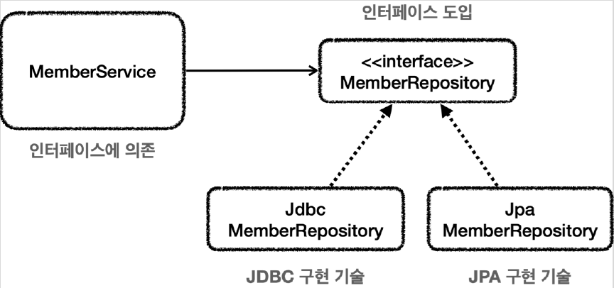

# <a href = "../README.md" target="_blank">스프링 DB 1편 - 데이터 접근 핵심 원리</a>
## Chapter 06. 스프링과 문제 해결 - 예외 처리, 반복
### 6.1 체크 예외와 인터페이스
1) Repository 인터페이스 도입
2) MemberRepository 인터페이스
3) (실습) 리포지토리 추상화 시도 : MemberRepositoryEx
4) 체크예외 때문에 결국 특정 기술에 종속된 인터페이스가 되었다.
5) 런타임 예외 전환을 하자

---

# 6.1 체크 예외와 인터페이스

---

## 1) Repository 인터페이스 도입

- 추후 데이터 접근 기술 변경을 용이하게 하기 위해서 인터페이스를 도입한다.
- `MemberService` 는 `MemberRepository` 인터페이스에만 의존하면 된다.
- 구현 기술을 변경하고 싶으면 DI를 사용해서 `MemberService` 코드의 변경 없이 구현 기술을 변경할 수 있다.

---

## 2) MemberRepository 인터페이스
```java
public interface MemberRepository {

    Member save(Member member);

    Member findById(String memberId);

    void update(String memberId, int money);

    void delete(String memberId);
}
```
- 특정 기술에 종속되지 않는 순수한 인터페이스
- 이 인터페이스를 기반으로 특정 기술을 사용하는 구현체를 만들면 된다.
- 기존에는 이 인터페이스를 도입하기 힘들었는데, 각각의 repository 클래스가 체크예외를 throws하고 있었기 때문이다.
  - 이 부분을 아래에서 설명

## 3) (실습) 리포지토리 추상화 시도 : MemberRepositoryEx
```java
package ttasjwi.jdbc.repository;

import ttasjwi.jdbc.domain.Member;
import java.sql.SQLException;

public interface MemberRepositoryEx {

    Member save(Member member) throws SQLException;

    Member findById(String memberId) throws SQLException;

    void update(String memberId, int money) throws SQLException;

    void delete(String memberId) throws SQLException;
}
```
```java
@Slf4j
public class MemberRepositoryV3 implements MemberRepositoryEx {

    private final DataSource dataSource;

    public MemberRepositoryV3(DataSource dataSource) {
        this.dataSource = dataSource;
    }

    @Override
    public Member save(Member member) throws SQLException {
        String sql = "INSERT INTO MEMBER (member_id, money)\n" +
                "values (?, ?)";
        // 이하 생략
    }
}
```
- 기존에 만든 각각의 repository는 체크예외인 `SQLException`을 throws하고 있었다.
- 이들 구현체를 기반으로 추상화 계층인 인터페이스를 만들려고 하면 인터페이스 계층에서도 `throws SQLException`이 선언되어야한다.
  - 인터페이스의 구현체가 체크 예외를 던지려면, 인터페이스 메서드에 먼저 체크 예외를 던지는 부분이 선언 되어 있어야 한다. 그래야 구현 클래스의 메서드도 체크 예외를 던질 수 있다.
- 참고로 구현 클래스의 메서드에 선언할 수 있는 예외는 부모 타입에서 던진 예외와 같거나 하위 타입이어야 한다.
  - 예) 인터페이스 메서드에 throws Exception 를 선언하면, 구현 클래스 메서드에 `throws SQLException` 는 가능하다. SQLException 은 Exception 의 하위 타입이기 때문이다.

---

## 4) 체크예외 때문에 결국 특정 기술에 종속된 인터페이스가 되었다.
- 구현 기술을 쉽게 변경하기 위해서 인터페이스를 도입하더라도 `SQLException` 과 같은 특정 구현 기술에 종속적인 체크 예외를 사용하게 되면 인터페이스에도 해당 예외를 포함해야 한다.
- 하지만 이것은 우리가 원하던 순수한 인터페이스가 아니다. JDBC 기술에 종속적인 인터페이스일 뿐이다.
- 인터페이스를 만드는 목적은 구현체를 쉽게 변경하기 위함인데, 이미 인터페이스가 특정 구현 기술에 오염이 되어 버렸다.
- 향후 JDBC가 아닌 다른 기술로 변경한다면 인터페이스 자체를 변경해야 한다.

---

## 5) 런타임 예외 전환을 하자
- 체크예외를 런타임 예외로 전환하면, 특정 기술 종속성에서 자유롭다.
- 인터페이스에 런타임 예외를 따로 선언하지 않아도 된다.

---
