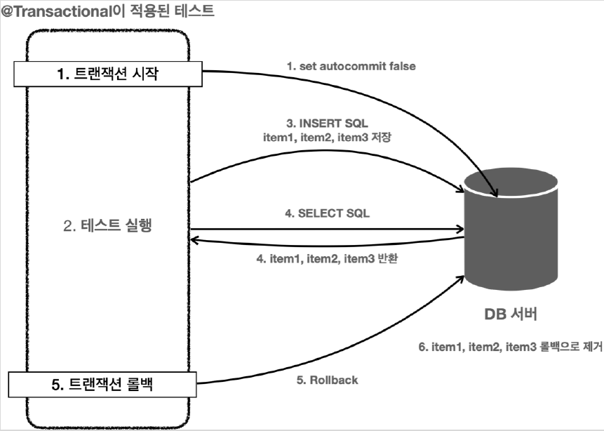

# <a href = "../README.md" target="_blank">스프링 DB 2편 - 데이터 접근 활용 기술</a>
## Chapter 03. 데이터 접근 기술 - 테스트
### 3.4 테스트 - @Transactional
1) 테스트 코드에 `@Transactional` 적용
2) `@Transactional`의 동작 원리
3) 테스트 트랜잭션의 전파
4) 테스트 코드에 트랜잭션을 도입함으로서 얻은 이득
5) 강제로 테스트코드 커밋하기 - `@Commit`

---

# 3.4 테스트 - @Transactional

---

## 1) 테스트 코드에 `@Transactional` 적용
스프링은 테스트 데이터 초기화를 위해 트랜잭션을 적용하고 롤백하는 방식을 `@Transactional` 어노테이션 하나로 깔끔하게 해결해준다.


### 1.1 이전 트랜잭션 롤백 코드 주석처리
- `@Transactional`을 도입하기 전에 기존에 추가한 트랜잭션 의존관계 코드를 주석처리한다.

### 1.2 `@Transactional` 어노테이션 추가
```java
@Transactional
@SpringBootTest
class ItemRepositoryTest {
```
- 테스트 클래스 위에 `@Transactional`을 붙인다.
  - `org.springframework.transaction.annotation.Transactional`

### 1.3 데이터베이스 데이터 삭제
```sql
DELETE FROM item;
```

### 1.4 `ItemRepositoryTest` 실행
- `ItemRepositoryTest` 의 테스트를 모두 여러번 반복 실행해보면 테스트가 모두 성공하는 것을 확인할 수 있다.

---

## 2) `@Transactional`의 동작 원리

### 2.1 실사용 환경과 테스트 환경의 `@Transactioanl` 차이
메서드나, 클래스에 `@Transactioanl` 어노테이션이 있을 때,
- 실사용 환경일 때(main) 로직이 성공적으로 수행되면 커밋하도록 동작한다.
- 테스트 환경일 때(test) **테스트를 트랜잭션 안에서 실행하고, 테스트가 끝나면 트랜잭션을 자동으로 롤백시켜 버린다!**


### 2.2 `findAll()` 실행을 통해 확인하는 트랜잭션 동작 상세

1. 테스트에 `@Transactional` 애노테이션이 테스트 메서드나 클래스에 있으면 먼저 트랜잭션을 시작
2. 테스트를 로직을 실행한다. 테스트가 끝날 때 까지 모든 로직은 트랜잭션 안에서 수행된다.
   - 트래잭션은 기본적으로 전파되기 때문에, 리포지토리에서 사용하는 `JdbcTemplate`도 같은 트랜잭션을 사용한다.
3. 테스트 실행 중에 INSERT SQL을 사용해서 item1 , item2 , item3 를 데이터베이스에 저장한다.
   - 물론 테스트가 리포지토리를 호출하고, 리포지토리는 `JdbcTemplate`을 사용해서 데이터를 저장한다.
4. 검증을 위해서 SELECT SQL로 데이터를 조회한다.
   - 여기서는 앞서 저장한 item1 , item2 , item3 이 조회되었다. 
   - `SELECT` SQL도 같은 트랜잭션을 사용하기 때문에 저장한 데이터를 조회할 수 있다. 다른 트랜잭션에서는 해당 데이터를 확인할 수 없다.
   - 여기서 `assertThat()` 으로 검증이 모두 끝난다.
5. `@Transactional` 이 테스트에 있으면 테스트가 끝날때 트랜잭션을 강제로 롤백한다.
6. 롤백에 의해 앞서 데이터베이스에 저장한 item1 , item2 , item3 의 데이터가 제거된다.

---

## 3) 테스트 트랜잭션의 전파
- 트랜잭션을 테스트에서 시작하기 때문에 서비스, 리포지토리에 있는 `@Transactional` 도 테스트에서 시작한 트랜잭션에 참여한다.
  - 이 부분은 뒤에 트랜잭션 전파에서 더 자세히 다룬다.
  - 요약하면 테스트 실행, 종료까지 모든 코드가 같은 트랜잭션 범위에 속한다 보면 됨.
  - 같은 트랜잭션 범위에 속한다는 것은 같은 트랜잭션을 사용한다는 것이고, 같은 커넥션을 사용한다는 것을 의미

---
    
## 4) 테스트 코드에 트랜잭션을 도입함으로서 얻은 이득
- 테스트가 끝난 후 개발자가 직접 데이터를 삭제하지 않아도 된다.
- 테스트 실행 중에 데이터를 등록하고 중간에 테스트가 강제로 종료되어도 걱정이 없다.
  - 이 경우 트랜잭션을 커밋하지 않기 때문에, 데이터는 자동으로 롤백된다. (보통 데이터베이스 커넥션이 끊어지면 자동으로 롤백되어 버린다.)
- 트랜잭션 범위 안에서 테스트를 진행하기 때문에 동시에 다른 테스트가 진행되어도 서로 영향을 주지 않는 장점이 있다.
- `@Transactional` 덕분에 아주 편리하게 다음 원칙을 지킬수 있게 되었다.
  - 테스트는 다른 테스트와 격리해야 한다.
  - 테스트는 반복해서 실행할 수 있어야 한다.

---

## 5) 강제로 테스트코드 커밋하기 - `@Commit`
```java
import org.springframework.test.annotation.Commit;
@Commit
@Transactional
@SpringBootTest
class ItemRepositoryTest {}
```
- `@Transactional` 을 테스트에서 사용하면 테스트가 끝나면 바로 롤백되기 때문에 테스트 과정에서 저장한 모든 데이터가 사라진다.
- 당연히 이렇게 되어야 하지만, 정말 가끔은 데이터베이스에 데이터가 잘 보관되었는지 최종 결과를 눈으로 확인하고 싶을 때도 있다.
- 이럴 때는 위와 같이 `@Commit` 을 클래스 또는 메서드에 붙이면 테스트 종료후 롤백 대신 커밋이 호출된다.
- (cf) `@Rollback(value = false)` 를 사용해도 된다.

---
