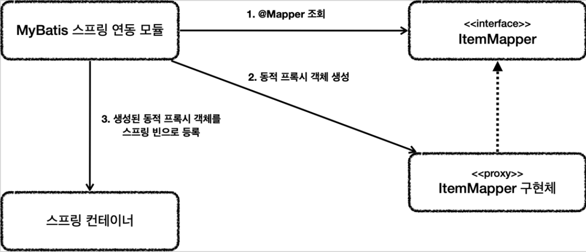

# <a href = "../README.md" target="_blank">스프링 DB 2편 - 데이터 접근 활용 기술</a>
## Chapter 04. 데이터 접근 기술 - MyBatis
### 4.5 MyBatis 적용3 - 분석
1) Mapper 구현체 생성 및 스프링 빈 등록 원리
2) MyBatis 스프링 연동 모듈과 Mapper 구현체
---

# 4.5 MyBatis 적용3 - 분석

---

## 1) Mapper 구현체 생성 및 스프링 빈 등록 원리
`ItemMapper` 매퍼 인터페이스의 구현체가 없는데 어떻게 동작한 것일까?

### 1.1 설정 원리

1. 애플리케이션 로딩 시점에 MyBatis 스프링 연동 모듈은 `@Mapper` 가 붙어있는 인터페이스를 모두 조사한다.
2. 해당 인터페이스가 발견되면 동적 프록시 기술을 사용해서 `ItemMapper` 인터페이스의 구현체를 만든다.
   - `XML`에 작성된 내용, `Mapper` 인터페이스에서 설정한 반환 타입, `@param` 등 설정을 읽고 동적으로 구현체를 생성한다.
3. 생성된 구현체를 스프링 빈으로 등록한다.

### 1.2 실제 빈으로 등록된 구현체 클래스 확인
```java
@Slf4j
@Repository
@RequiredArgsConstructor
public class MyBatisItemRepository implements ItemRepository {

    private final ItemMapper itemMapper;

    @Override
    public Item save(Item item) {
        log.info("itemMapper class = {}", itemMapper.getClass());
        itemMapper.save(item);
        return item;
    }
}
```
```shell
itemMapper class=class com.sun.proxy.$Proxy66
```
- 실행해서 주입 받은 ItemMapper 의 클래스를 출력해보면 JDK 동적 프록시가 적용된 것을 확인할 수 있다.
- 동적 프록시 기술은 스프링 핵심원리 - 고급편에서 자세히 다룬다.

---

## 2) MyBatis 스프링 연동 모듈과 Mapper 구현체

MyBatis 스프링 연동 모듈이 정말 많은 부분을 자동으로 설정해준다.
- MyBatis 스프링 연동 모듈이 만들어주는 `ItemMapper` 의 구현체 덕분에 인터페이스 만으로 편리하게 `XML`의 데이터를 찾아서 호출할 수 있다.
- 원래 MyBatis를 사용하려면 더 번잡한 코드를 거쳐야 하는데, 이런 부분을 인터페이스 하나로 매우 깔끔하고 편리하게 사용할 수 있다.
- Mapper 구현체는 예외 변환까지 처리해준다. `MyBatis`에서 발생한 예외를 스프링 예외 추상화인 `DataAccessException` 에 맞게 변환해서 반환해준다.
    - `JdbcTemplate`이 제공하는 예외 변환 기능을 여기서도 제공한다고 이해하면 된다.
- 데이터베이스 커넥션, 트랜잭션과 관련된 기능도 마이바티스와 함께 연동하고, 동기화해준다.
- 그 외 자동으로 등록해주는 부분은 `org.mybatis.spring.boot.autoconfigure.MybatisAutoConfiguration` 클래스 참고

---
