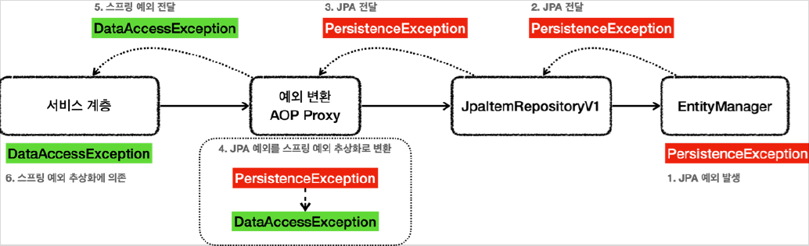

# <a href = "../README.md" target="_blank">스프링 DB 2편 - 데이터 접근 활용 기술</a>
## Chapter 05. 데이터 접근 기술 - JPA
### 5.7 JPA 적용3 - 예외 변환
1) 순수 JPA 기술은 스프링과 관계 없는 JPA 예외를 발생시킨다.
2) 스프링의 JPA 예외 추상화 : `@Repository`
---

# 5.7 JPA 적용3 - 예외 변환

---

## 1) 순수 JPA 기술은 스프링과 관계 없는 JPA 예외를 발생시킨다.
```java
@Repository
@Transactional
public class JpaItemRepositoryV1 implements ItemRepository {

    private final EntityManager em;

    @Override
    public Item save(Item item) {
        em.persist(item);
        return item;
    }
}
```
- `EntityManager` 는 순수한 JPA 기술이고, 스프링과는 관계가 없는 JPA 관련 예외를 발생시킨다.
- JPA는 `PersistenceException`과 그 하위 예외를 발생시킨다.
  - 추가로 JPA는 `IllegalStateException` , `IllegalArgumentException` 을 발생시킬 수 있다. 
- JPA 예외를 스프링 예외 추상화(`DataAccessException`)로 변환하는 비밀은 `@Repository`에 있다. 

---

## 2) 스프링의 JPA 예외 추상화 : `@Repository`

### 2.1 `@Repository`가 붙기 전


### 2.2 `@Repository`가 붙은 후


### 2.3 `@Repository`의 기능
- `@Repository`가 붙은 클래스는 컴포넌트 스캔의 대상이 된다.
- `@Repository`가 붙은 클래스는 예외 변환 AOP의 적용 대상이 된다.
  - 스프링과 JPA를 함께 사용하는 경우 스프링은 JPA 예외 변환기(`PersistenceExceptionTranslator`)를 등록한다.
  - 예외 변환 AOP 프록시는 JPA 관련 예외가 발생하면 JPA 예외 변환기를 통해 발생한 예외를 스프링 데이터 접근 예외로 변환한다.

### 2.4 (참고) JPA 예외 변환 세부 로직
- 스프링 부트는 `PersistenceExceptionTranslationPostProcessor` 를 자동으로 등록하는데, 여기에서 `@Repository` 를 AOP 프록시로 만드는 어드바이저가 등록된다.
- 복잡한 과정을 거쳐서 실제 예외를 변환하는데, 실제 JPA 예외를 변환하는 코드는 `EntityManagerFactoryUtils.convertJpaAccessExceptionIfPossible()` 이다.


---
