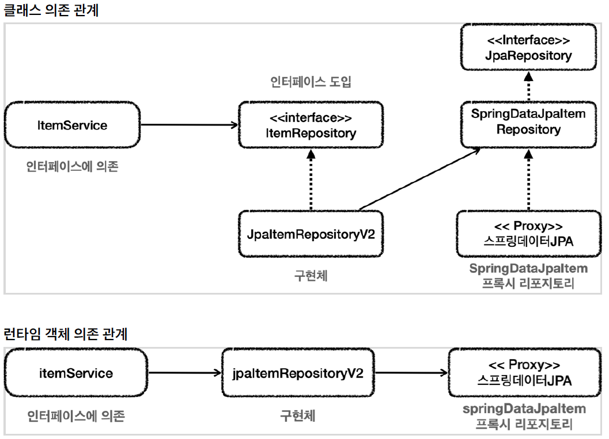
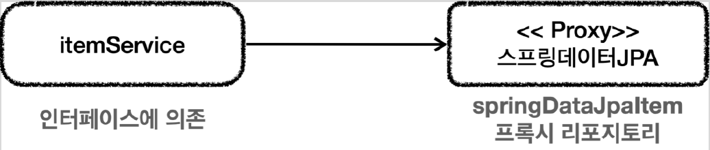

# <a href = "../README.md" target="_blank">스프링 DB 2편 - 데이터 접근 활용 기술</a>
## Chapter 08. 데이터 접근 기술 - 활용 방안
### 8.1 스프링 데이터 JPA 예제와 트레이드 오프
1) 어댑터 사용의 장점 : 구조적 안정성
2) 어댑터 사용의 단점 : 복잡도 증가, 유지보수 비용 증가
3) 객체 의존관계를 변경할 때 : 단순한 구조와 개발 편의성
4) 트레이드 오프

---

# 8.1 스프링 데이터 JPA 예제와 트레이드 오프

---

## 1) 어댑터 사용의 장점 : 구조적 안정성

- 중간에서 `JpaItemRepositoryV2 가 어댑터 역할을 해줌.
- 덕분에 `ItemService` 가 사용하는 `ItemRepository` 인터페이스를 그대로 유지할 수 있고, 클라이언트인 MemberService 의 코드를 변경하지 않아도 되는 장점이 있다.
- 유지보수 관점에서 `ItemService` 를 변경하지 않고, `ItemRepository` 의 구현체를 변경할 수 있는 장점이 있다.
  - 그러니까 DI, OCP 원칙을 지킬 수 있다는 좋은 점이 분명히 있다.

---

## 2) 어댑터 사용의 단점 : 복잡도 증가, 유지보수 비용 증가
- 구조를 맞추기 위해서, 중간에 어댑터가 들어가면서 전체 구조가 너무 복잡해지고 사용하는 클래스도 많아지는 단점이 생겼다.
- 개발자 입장에서는 중간에 어댑터도 만들고, 실제 코드까지 만들고, 이들을 유지보수해야하는 비용이 발생한다.

---

## 3) 객체 의존관계를 변경할 때 : 단순한 구조와 개발 편의성

- ItemService 코드를 일부 고쳐서 직접 스프링 데이터 JPA를 사용하는 방법이다.
- `ItemService` 에서 스프링 데이터 JPA로 만든 리포지토리를 직접 참조한다. 물론 이 경우 ItemService 코드를 변경해야 한다.
- DI, OCP 원칙을 포기하는 대신에, 복잡한 어댑터를 제거하고, 구조를 단순하게 가져갈 수 있는 장점이 있다.

---

## 4) 트레이드 오프

### 4.1 구조적 안정성 vs 단순한 구조/개발 편의성
- DI, OCP를 지키기 위해 어댑터를 도입하고, 더 많은 코드를 유지한다.
- 어댑터를 제거하고 구조를 단순하게 가져가지만, DI, OCP를 포기하고, ItemService 코드를 직접 변경한다.

### 4.2 정답은 없다.
- 결국 여기서 발생하는 트레이드 오프는 구조의 안정성 vs 단순한 구조와 개발의 편리성 사이의 선택이다.
- 이 둘 중에 하나의 정답만 있을까? 그렇지 않다. 어떤 상황에서는 구조의 안정성이 매우 중요하고, 어떤 상황에서는 단순한 것이 더 나은 선택일 수 있다.

### 4.3 자원은 항상 무한하지 않고, 추상화는 비용이 발생한다.
- 개발을 할 때는 항상 자원이 무한한 것이 아니다.
- 어설픈 추상화는 오히려 독이 되는 경우도 많다. 무엇보다 **추상화도 비용(유지보수 관점에서의 비용)이 든다.** 인터페이스도 비용이 든다.
- 이 추상화 비용을 넘어설 만큼 효과가 있을 때 추상화를 도입하는 것이 실용적이다.

### 4.4 현재 상황에 맞는 최선의 선택을 하자.
- 이런 선택에서 하나의 정답이 있는 것은 아니지만, 프로젝트의 현재 상황에 맞는 더 적절한 선택지가 있을 수 있다.
- 그리고 현재 상황에 맞는 선택을 하는 개발자가 좋은 개발자라 생각한다.

---
