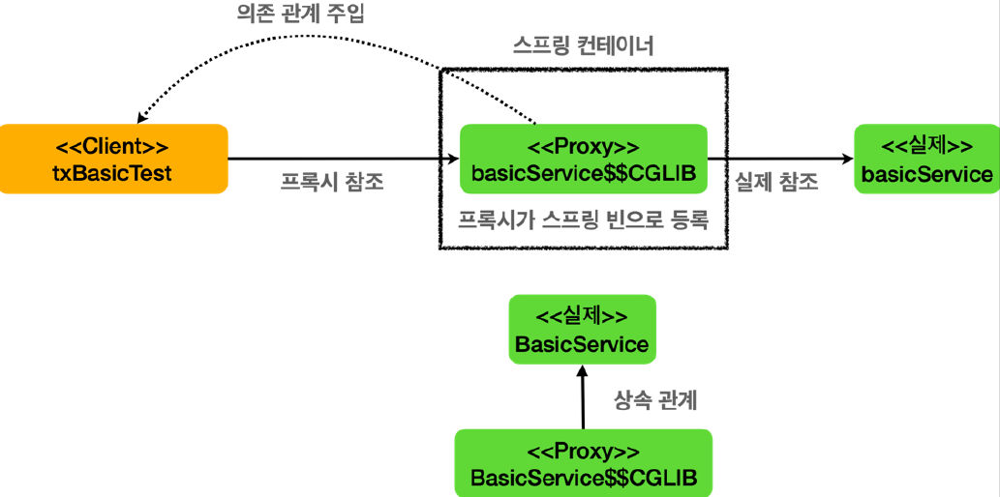
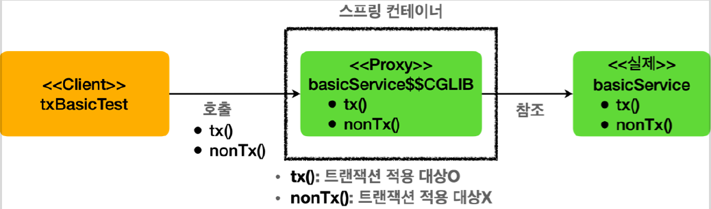

# <a href = "../README.md" target="_blank">스프링 DB 2편 - 데이터 접근 활용 기술</a>
## Chapter 09. 스프링 트랜잭션 이해
### 9.03 트랜잭션 적용 확인
1) TxApplyBasicTest 테스트 코드 작성
2) (실습) `proxyCheck()` : 프록시 여부 확인
3) `@Transactional` : 스프링 컨테이너에 트랜잭션 프록시 등록
4) 트랜잭션 프록시 동작 방식
5) (실습) `txTest()` : 트랜잭션 프록시 동작 방식 확인

---

# 9.03 트랜잭션 적용 확인

---

## 1) TxApplyBasicTest 테스트 코드 작성

### 1.1 클래스 어노테이션
```java
@Slf4j
@SpringBootTest
public class TxBasicTest {
    
}
```
- 스프링의 빈들을 가져다 테스트를 진행해야하므로 `@SpringBootTest`를 달아야함
- 로깅을 위해 `@Slf4j`

### 1.2 BasicService : 트랜잭션 적용/비적용 기능
```java
    @Autowired
    private BasicService basicService;

    @TestConfiguration
    static class TxApplyBasicConfig {
        @Bean
        BasicService basicService() {
            return new BasicService();
        }
    }

    @Slf4j
    static class BasicService {

        @Transactional
        public void tx() {
            log.info("call tx");
            boolean txActive = TransactionSynchronizationManager.isActualTransactionActive();
            log.info("tx active = {}", txActive);
        }

        public void nonTx() {
            log.info("call nonTx");
            boolean txActive = TransactionSynchronizationManager.isActualTransactionActive();
            log.info("tx active = {}", txActive);
        }
    }
```
- 테스트 전용 스프링 빈 BasicService를 작성하고, 등록한다.
- `tx` : 트랜잭션 적용 메서드
- `nonTx` : 트랜잭션 비적용 메서드

### 1.3 테스트 코드
```java
    @Test
    public void proxyCheck() {
        log.info("aop class = {}",basicService.getClass());
        assertThat(AopUtils.isAopProxy(basicService)).isTrue();
    }

    @Test
    public void txTest() {
        basicService.tx();
        basicService.nonTx();
    }
```
- `proxyTest()` : BasicService가 AOP 프록시 적용 대상인지 여부를 테스트한다.
- `txTest` : basicService의 `tx`, `nonTx` 메서드를 순차적으로 호출하여, 트랜잭션이 적용됐는지 여부를 눈으로 확인한다.

---

## 2) (실습) `proxyCheck()` : 프록시 여부 확인
```java
    @Test
    public void proxyCheck() {
        log.info("aop class = {}",basicService.getClass());
        assertThat(AopUtils.isAopProxy(basicService)).isTrue();
    }
```

### 2.1 `AopUtils.isAopProxy(...)`
- 객체 인스턴스가 AOP 프록시인지 여부 반환

### 2.2 선언적 트랜잭션 방식에서의 트랜잭션과 AOP
- 선언적 트랜잭션 방식에서 스프링 트랜잭션은 AOP를 기반으로 동작한다.
- `@Transactional` 을 메서드나 클래스에 붙이면 해당 객체는 트랜잭션 AOP 적용의 대상이 된다.
- 결과적으로 실제 객체 대신에 트랜잭션을 처리해주는 프록시 객체가 스프링 빈에 등록된다.
- 그리고 주입을 받을 때도 실제 객체 대신에 프록시 객체가 주입된다.

### 2.3 실행 결과 확인
```shell
TxBasicTest   : aop class = class com.ttasjwi.springtx.apply.TxBasicTest$BasicService$$EnhancerBySpringCGLIB$$2754d400
```
클래스 이름을 출력해보면 `basicService$$EnhancerBySpringCGLIB...` 라고 프록시 클래스의 이름이 출력되는 것을 확인할 수 있다.

---

## 3) `@Transactional` : 스프링 컨테이너에 트랜잭션 프록시 등록

- `@Transactional` 어노테이션이 특정 클래스나 메서드에 하나라도 있으면 있으면 트랜잭션 AOP는 프록시를 만들어서 스프링 컨테이너에 등록한다. 그리고 실제 basicService 객체 대신에 프록시인 `basicService$$CGLIB` 를 스프링 빈에 등록한다. 그리고 프록시는 내부에 실제 `basicService` 를 참조하게 된다. 여기서 핵심은 **실제 객체 대신에 프록시가 스프링 컨테이너에 등록되었다는 점**이다.
- 클라이언트인 `txBasicTest` 는 스프링 컨테이너에 `@Autowired BasicService basicService` 로 의존관계 주입을 요청한다. 스프링 컨테이너에는 실제 객체 대신에 프록시가 스프링 빈으로 등록되어 있기 때문에 프록시를 주입한다.
- 프록시는 `BasicService` 를 상속해서 만들어지기 때문에 다형성을 활용할 수 있다. 따라서 `BasicService` 대신에 프록시인 `BasicService$$CGLIB` 를 주입할 수 있다.

---

## 4) 트랜잭션 프록시 동작 방식



클라이언트가 주입 받은 `basicService$$CGLIB` 는 트랜잭션을 적용하는 프록시이다.

### 4.1 트랜잭션 적용 메서드
- 클라이언트가 `basicService.tx()`를 호출하면, 프록시의 `tx()` 가 호출된다.
- 여기서 프록시는 `tx()` 메서드가 트랜잭션을 사용할 수 있는지 확인해본다.
- tx() 메서드에는 `@Transactional` 이 붙어있으므로 트랜잭션 적용 대상이다.
- 따라서 트랜잭션을 시작한 다음에 "실제" `basicService.tx()` 를 호출한다.
- 그리고 실제 `basicService.tx()` 의 호출이 끝나서 프록시로 제어가(리턴) 돌아오면 프록시는 트랜잭션 로직을 커밋하거나 롤백해서 트랜잭션을 종료한다.

### 4.2 트랜잭션 미적용 메서드
- 클라이언트가 `basicService.nonTx()` 를 호출하면, 트랜잭션 프록시의 `nonTx()` 가 호출된다.
- 여기서 `nonTx()` 메서드가 트랜잭션을 사용할 수 있는지 확인해본다.
- `nonTx()` 에는 `@Transactional` 이 없으므로 적용 대상이 아니다.
- 따라서 트랜잭션을 시작하지 않고, `basicService.nonTx()` 를 호출하고 종료한다.

---

## 5) (실습) `txTest()` : 트랜잭션 프록시 동작 방식 확인

### 5.1 로깅 옵션 추가
```properties
logging.level.org.springframework.transaction.interceptor=TRACE
```
- `application.properties`에 위 옵션을 적어준다.
- 이 로그를 추가하면 트랜잭션 프록시가 호출하는 트랜잭션의 시작과 종료를 명확하게 로그로 확인할 수 있다.

### 5.2 `TransactionSynchronizationManager.isActualTransactionActive()`
- 현재 쓰레드에 트랜잭션이 적용되어 있는지 확인할 수 있는 기능이다.
- 결과가 true 면 트랜잭션이 적용되어 있는 것이다. 트랜잭션의 적용 여부를 가장 확실하게 확인할 수 있다.

### 5.3 `basicService.tx()` 호출 결과
```java
@Transactional
public void tx() {
    log.info("call tx");
    boolean txActive = TransactionSynchronizationManager.isActualTransactionActive();
    log.info("tx active = {}", txActive);
}
```
```shell
TransactionInterceptor : Getting transaction for [com.ttasjwi.springtx.apply.TxBasicTest$BasicService.tx]
y.TxBasicTest$BasicService : call tx
y.TxBasicTest$BasicService : tx active = true
TransactionInterceptor : Completing transaction for [com.ttasjwi.springtx.apply.TxBasicTest$BasicService.tx]
```
- 로그를 통해 `tx()` 호출시에는 `tx active=true` 를 통해 트랜잭션이 적용된 것을 확인할 수 있다.
- `TransactionInterceptor` 로그를 통해 트랜잭션 프록시가 트랜잭션을 시작하고 완료한 내용을 확인할 수 있다.

### 5.4 `basicService.nonTx()` 호출 결과
```java
public void nonTx() {
    log.info("call nonTx");
    boolean txActive = TransactionSynchronizationManager.isActualTransactionActive();
    log.info("tx active = {}", txActive);
}
```
```shell
y.TxBasicTest$BasicService     : call nonTx
y.TxBasicTest$BasicService     : tx active = false
```
- `nonTx()` 호출시에는 tx active=false 를 통해 트랜잭션이 없는 것을 확인할 수 있다.

---
