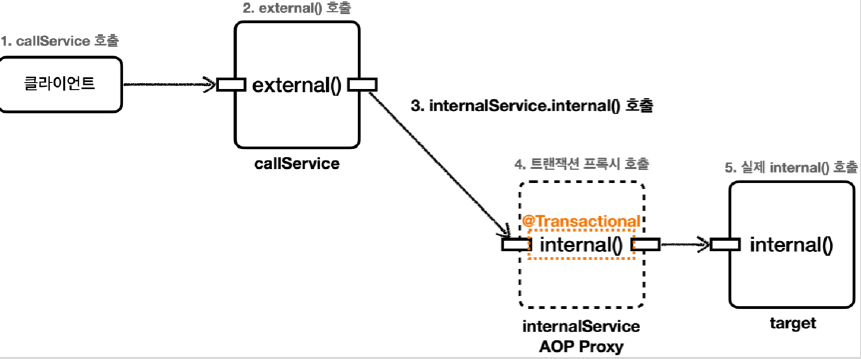

# <a href = "../README.md" target="_blank">스프링 DB 2편 - 데이터 접근 활용 기술</a>
## Chapter 09. 스프링 트랜잭션 이해
### 9.06 트랜잭션 AOP 주의 사항 - 프록시 내부 호출2
1) InternalCallV2Test - 내부 호출 트랜잭션 메서드를 외부로 분리
2) 프록시 내부 호출 문제 해결 방안
3) public 메서드만 트랜잭션이 적용된다.

---

# 9.06 트랜잭션 AOP 주의 사항 - 프록시 내부 호출2

---

## 1) InternalCallV2Test - 내부 호출 트랜잭션 메서드를 외부로 분리

### 1.1 CallService로부터 InternalService 분리
```java

    @Slf4j
    @RequiredArgsConstructor
    static class CallService {

        private final InternalService internalService;

        public void external() {
            log.info("call external");
            printTxInfo(); // this.printTxInfo();
            internalService.internal(); // this.internal();
        }
        public void printTxInfo() {
            boolean txActive = TransactionSynchronizationManager.isActualTransactionActive();
            log.info("tx active : {}", txActive);
        }
    }
```
```java
    @Slf4j
    static class InternalService {

        @Transactional
        public void internal() {
            log.info("call internal");
            printTxInfo();
        }

        public void printTxInfo() {
            boolean txActive = TransactionSynchronizationManager.isActualTransactionActive();
            log.info("tx active : {}", txActive);
        }
    }
```
- `InternalService` 클래스를 만들고 `internal()` 메서드를 여기로 옮겼다.
- 이렇게 메서드 내부 호출을 외부 호출로 변경했다.

### 1.2 프록시 여부 확인 
```java
    @Test
    void printProxy() {
        log.info("callService class= {}", callService.getClass());
        assertThat(AopUtils.isAopProxy(callService)).isFalse();

        log.info("internalService class = {}", internalService.getClass());
        assertThat(AopUtils.isAopProxy(internalService)).isTrue();
    }
```
```shell
callService class= class com.ttasjwi.springtx.apply
.InternalCallV2Test$CallService

internalService class = class com.ttasjwi.springtx.apply
.InternalCallV2Test$InternalService$$EnhancerBySpringCGLIB$$14ca45d
```
- `CallService` 에는 트랜잭션 관련 코드가 전혀 없으므로 트랜잭션 프록시가 적용되지 않는다.
- `InternalService` 에는 트랜잭션 관련 코드가 있으므로 트랜잭션 프록시가 적용된다.

### 1.3 실행 분석


실제 호출되는 흐름을 분석해보자.

1. 클라이언트인 테스트 코드는 `callService.external()` 을 호출한다.
2. `callService` 는 실제 `callService` 객체 인스턴스이다.
3. `callService` 는 주입 받은 `internalService.internal()` 을 호출한다.
4. `internalService` 는 트랜잭션 프록시이다. `internal()` 메서드에 `@Transactional` 이 붙어 있으므로 트랜잭션 프록시는 트랜잭션을 적용한다.
5. 트랜잭션 적용 후 실제 `internalService` 객체 인스턴스의 `internal()` 을 호출한다.

### 1.4 `internalCall()` 실행 로그
```shell
TransactionInterceptor           : Getting transaction for [com.ttasjwi.springtx.apply.InternalCallV2Test$InternalService.internal]
InternalService : call internal
InternalService : tx active : true
TransactionInterceptor           : Completing transaction for [com.ttasjwi.springtx.apply.InternalCallV2Test$InternalService.internal]
```

### 1.5 `externalCallV2()` 실행로그
```shell
CallService   : call external
CallService   : tx active : false
TransactionInterceptor           : Getting transaction for [com.ttasjwi.springtx.apply.InternalCallV2Test$InternalService.internal]
InternalService : call internal
InternalService : tx active : true
TransactionInterceptor           : Completing transaction for [com.ttasjwi.springtx.apply.InternalCallV2Test$InternalService.internal]
```
- `TransactionInterceptor` 를 통해 트랜잭션이 적용되는 것을 확인할 수 있다.
- `InternalService` 의 `tx active=true` 로그를 통해 `internal()` 호출에서 트랜잭션이 적용된 것을 확인할 수 있다.

---

## 2) 프록시 내부 호출 문제 해결 방안
- 여러가지 다른 해결방안도 있지만, 실무에서는 이렇게 별도의 클래스로 분리하는 방법을 주로 사용한다.
- 스프링 핵심원리 고급편 13. 실무 주의사항 - 프록시와 내부 호출 문제에서 더 다양한 해결 방안을 다룬다.

---

## 3) public 메서드만 트랜잭션이 적용된다.
### 3.1 public 메서드만 트랜잭션이 적용된다.
- 스프링의 트랜잭션 AOP 기능은 public 메서드에만 트랜잭션을 적용하도록 기본 설정이 되어있고, `protected` , `private` , `package-visible`에는 트랜잭션이 적용되지 않는다.
- `protected` , `package-visible`은 본래 외부에서 호출이 가능한 메서드들인데, 이들에게까지 트랜잭션이 적용되는 것을 막은 것이다.
  - 실제로 앞서 실행했던 코드를 `package-visible` 로 변경해보면 적용되지 않는 것을 확인할 수 있다.
- 이 부분은 앞서 설명한 프록시의 내부 호출과는 무관하고, 스프링이 막아둔 것이다.

### 3.2 public 메서드만 트랜잭션이 적용되는 이유
```java
@Transactional
public class Hello {
    public method1() {}

    method2() {}

    protected method3() {}

    private method4() {}
}
```
- 만약 클래스 레벨에 트랜잭션을 적용하여, 모든 접근 레벨에 메서드에 트랜잭션이 걸릴 수 있다면 의도하지 않는 곳 까지 트랜잭션이 과도하게 적용된다.
- 트랜잭션은 주로 비즈니스 로직의 시작점에 걸기 때문에 대부분 외부에 열어준 곳을 시작점으로 사용한다.
- 이런 이유로 public 메서드에만 트랜잭션을 적용하도록 설정되어 있다.

### 3.3 public이 아닌 곳에 `@Transactional`이 걸리면 무시됨
public 이 아닌곳에 @Transactional 이 붙어 있으면 예외가 발생하지는 않고, 트랜잭션 적용만 무시된다.

---
