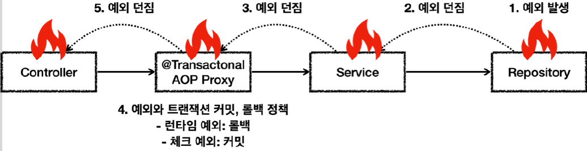

# <a href = "../README.md" target="_blank">스프링 DB 2편 - 데이터 접근 활용 기술</a>
## Chapter 09. 스프링 트랜잭션 이해
### 9.09 예외와 트랜잭션 커밋, 롤백 - 기본
1) 예외 발생 시 스프링 트랜잭션 기본 정책
2) 트랜잭션 커밋/롤백 로그 설정
3) (실습) 런타임 예외 기본 롤백 확인
4) (실습) 체크 예외 기본 커밋 확인
5) `rollbackFor` : 추가로 롤백 예외를 지정
6) (실습) `rollBackFor` 지정 예외의 롤백 확인

---

# 9.09 예외와 트랜잭션 커밋, 롤백 - 기본

---

## 1) 예외 발생 시 스프링 트랜잭션 기본 정책


예외가 발생했는데, 내부에서 예외를 처리하지 못하고, 트랜잭션 범위( `@Transactional`가 적용된 AOP ) 밖으로 예외를 던지면 스프링 트랜잭션 AOP는 예외의 종류에 따라 트랜잭션을 커밋하거나 롤백한다.
- 언체크 예외 : `RuntimeException` , `Error` 와 그 하위 예외가 발생하면 트랜잭션을 롤백한다.
- 체크 예외 : `Exception` 과 그 하위 예외가 발생하면 트랜잭션을 커밋한다.

물론 정상 응답(리턴)하면 트랜잭션을 커밋한다.

---

## 2) 트랜잭션 커밋/롤백 로그 설정
```properties
# 트랜잭션 커밋/롤백 로그(DataSourceTransactionManager)
logging.level.org.springframework.jdbc.datasource.DataSourceTransactionManager=DEBUG

# 트랜잭션 커밋/롤백 로그(JpaTransactionManager)
logging.level.org.springframework.orm.jpa.JpaTransactionManager=DEBUG

logging.level.org.hibernate.resource.transaction=DEBUG
```
위 내용을 `application.properties`에 추가하면 트랜잭션이 커밋되었는지 롤백 되었는지 로그로 확인할 수 있다.

---

## 3) (실습) 런타임 예외 기본 롤백 확인

### 3.1 테스트 준비
```java
    @Slf4j
    static class RollbackService {

        // 런타임 예외 발생 : 롤백
        @Transactional
        public void runtimeException() {
            log.info("call RuntimeException");
            throw new RuntimeException();
        }
    }
```
```java
    @Test
    public void runtimeException() {
        assertThatThrownBy(() -> service.runtimeException())
                .isInstanceOf(RuntimeException.class);
    }
```

### 3.2 테스트 실행
```shell
Getting transaction for [... RollbackService.runtimeException]
call RuntimeException
Completing transaction for [... RollbackService.runtimeException] after exception: RuntimeException
Initiating transaction rollback
Rolling back JPA transaction on EntityManager
```
- `RuntimeException` 이 발생하므로 트랜잭션이 롤백된다.

---

## 4) (실습) 체크 예외 기본 커밋 확인

### 4.1 테스트 준비
```java
    static class MyException extends Exception {

    }
```
```java
   @Slf4j
    static class RollbackService {
        // 체크 예외 발생 : 커밋
        @Transactional
        public void checkedException() throws MyException {
            log.info("call checkedException");
            throw new MyException();
        }
    }
```
```java
    @Test
    public void checkedException() {
        assertThatThrownBy(() -> service.checkedException())
                .isInstanceOf(MyException.class);
    }
```
- `MyException`은 `Exception`을 상속한 체크 예외이다.

### 4.2 테스트 실행
```shell
Getting transaction for [...RollbackService.checkedException]
call checkedException
Completing transaction for [...RollbackService.checkedException] after exception: MyException
Initiating transaction commit
Committing JPA transaction on EntityManager
```
- 체크 예외가 트랜잭션 범위 밖으로 던져지면, 트랜잭션이 커밋된다.

---

## 5) `rollbackFor` : 추가로 롤백 예외를 지정
```java
@Transactional(rollbackFor = Exception.class)
```
- `rollbackFor` 옵션을 사용하면 기본 정책에 추가로 어떤 예외가 발생할 때 롤백할 지 지정할 수 있다.
- 위와 같이 지정하면 체크 예외인 `Exception` 이 발생해도 커밋 대신 롤백된다. (자식 타입도 롤백된다.)

---

## 6) (실습) `rollBackFor` 지정 예외의 롤백 확인

### 6.1 테스트 준비
```java
    @Transactional(rollbackFor = MyException.class)
    public void rollbackFor() throws MyException {
        log.info("call rollbackFor");
        throw new MyException();
    }
```
```java
    @Test
    public void rollbackFor() {
        assertThatThrownBy(() -> service.rollbackFor())
                .isInstanceOf(MyException.class);
    }
```
- 기본 정책과 무관하게 특정 예외를 강제로 롤백하고 싶으면 `rollbackFor` 를 사용하면 된다. (해당 예외의 자식도 포함된다.)

### 6.2 테스트 실행
```shell
Getting transaction for [...RollbackService.rollbackFor]
call rollbackFor
Completing transaction for [...RollbackService.rollbackFor] after exception: MyException
Initiating transaction rollback
Rolling back JPA transaction on EntityManager
```
- `rollbackFor = MyException.class` 을 지정했기 때문에 `MyException` 이 발생하면 체크 예외이지만 트랜잭션이 롤백된다.

---
