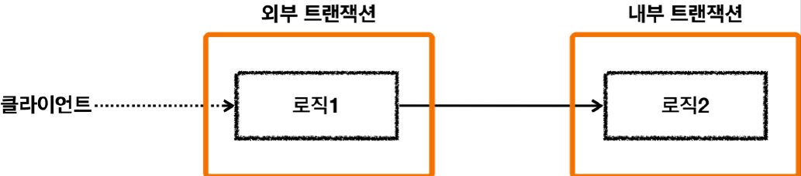
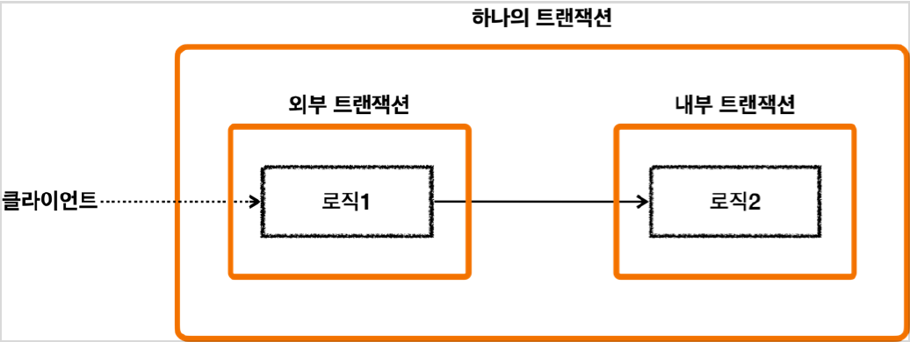

# <a href = "../README.md" target="_blank">스프링 DB 2편 - 데이터 접근 활용 기술</a>
## Chapter 10. 스프링 트랜잭션 전파1 - 기본
### 10.3 스프링 트랜잭션 전파3 - 전파 기본
1) 트랜잭션 전파
2) 외부 트랜잭션, 내부 트랜잭션
3) 대원칙 : 모든 논리 트랜잭션이 커밋되어야 물리 트랜잭션이 커밋된다.

---

# 10.3 스프링 트랜잭션 전파3 - 전파 기본

---

## 1) 트랜잭션 전파
- 트랜잭션이 진행된 도중에 다른 트랜잭션을 수행 시, 어떻게 동작할 지 결정하는 것
  - 기존 트랜잭션과 별도의 트랜잭션을 진행해야 할 것인가.
  - 아니면 기존 트랜잭션을 그대로 이어 받아서 트랜잭션을 수행해야 할 것인가?
  - ...
- 스프링은 다양한 트랜잭션 전파 옵션을 제공한다.

---

## 2) 외부 트랜잭션, 내부 트랜잭션

### 2.1 외부 트랜잭션과 내부 트랜잭션

- 외부 트랜잭션이 수행중이고, 아직 끝나지 않았는데, 내부 트랜잭션이 수행된다.
- 외부 트랜잭션 : 둘 중 상대적으로 밖에 있는 트랜잭션. 처음 시작된 트랜잭션으로 이해하면 된다.
- 내부 트랜잭션 : 내부에 있는 것 처럼 보이는 트랜잭션. 외부에 트랜잭션이 수행되고 있는 도중에 호출된 트랜잭션.

### 2.2 기본적으로 스프링은 외부,내부 트랜잭션을 하나의 트랜잭션으로 묶는다.

- 외부 트랜잭션에서 내부 트랜잭션을 호출하였을 경우 스프링은 외부 트랜잭션과 내부 트랜잭션을 묶어서 하나의 트랜잭션을 만들어준다.
- 내부 트랜잭션이 외부 트랜잭션에 참여하는 것이다.
- 이것이 기본 동작이고, 옵션을 통해 다른 동작방식도 선택할 수 있다.
- 다른 동작 방식은 뒤에서 다룬다.

---

## 3) 논리 트랜잭션과 물리 트랜잭션

스프링은 이해를 돕기 위해 논리 트랜잭션과 물리 트랜잭션이라는 개념을 나눈다.  
논리 트랜잭션들은 하나의 물리 트랜잭션으로 묶인다.  

### 3.1 물리 트랜잭션
- 우리가 이해하는 실제 데이터베이스에 적용되는 트랜잭션을 뜻한다.
- 실제 커넥션을 통해서 트랜잭션을 시작( `setAutoCommit(false)`) 하고, 실제 커넥션을 통해서 커밋, 롤백하는 단위이다.

### 3.2 논리 트랜잭션
- 트랜잭션 매니저를 통해 트랜잭션을 사용하는 단위이다.
- 논리 트랜잭션 개념은 트랜잭션이 진행되는 중에 내부에 추가로 트랜잭션을 사용하는 경우에 나타난다.
- 단순히 트랜잭션이 하나인 경우, 둘을 구분하지는 않는다.
  - 더 정확히는 `REQUIRED` 전파 옵션을 사용하는 경우에 나타나고, 이 옵션은 뒤에서 설명한다.

---

## 3) 대원칙 : 모든 논리 트랜잭션이 커밋되어야 물리 트랜잭션이 커밋된다.
왜 이렇게 논리 트랜잭션과 물리 트랜잭션을 나누어 설명하는 것일까?  
트랜잭션이 사용중일 때 또 다른 트랜잭션이 내부에 사용되면 여러가지 복잡한 상황이 발생한다.  
이때 논리 트랜잭션 개념을 도입하면 다음과 같은 단순한 원칙을 만들 수 있다.  

### 3.1 대원칙
- 모든 논리 트랜잭션이 커밋되어야 물리 트랜잭션이 커밋된다.
- 하나의 논리 트랜잭션이라도 롤백되면 물리 트랜잭션은 롤백된다.

### 3.2 모든 논리 트랜잭션이 커밋되면 물리 트랜잭션이 커밋된다.

모든 논리 트랜잭션이 커밋 되었으므로 물리 트랜잭션도 커밋된다.

### 3.3 하나의 논리 트랜잭션이라도 롤백되면 물리 트랜잭션은 롤백된다.

- 첫번째 사례는 외부 트랜잭션이 롤백됐으므로, 물리 트랜잭션이 롤백된다.
- 두번째 사례는 내부 트랜잭션이 롤백됐으므로, 물리 트랜잭션이 롤백된다.

---
