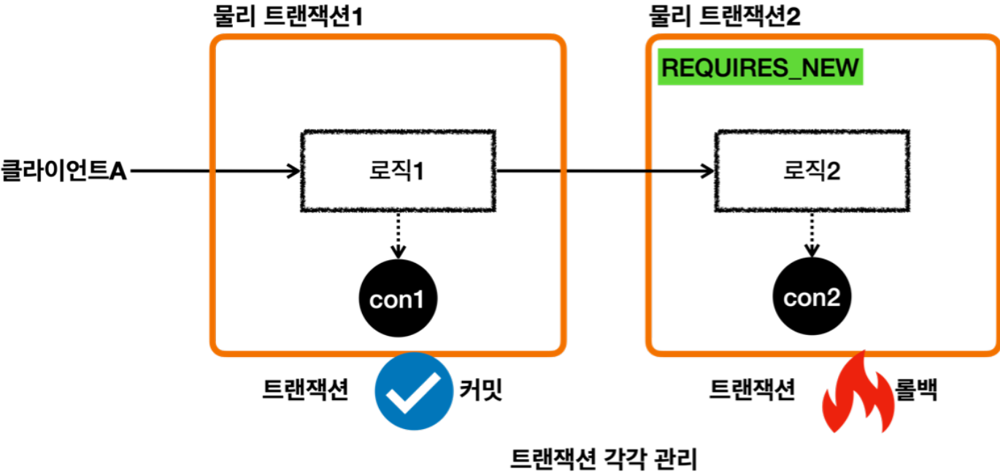
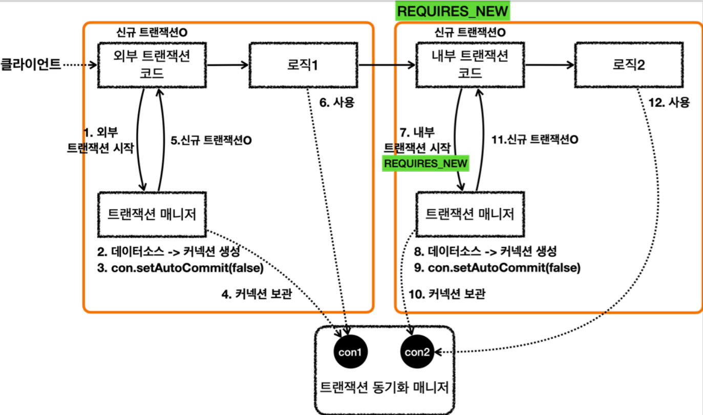
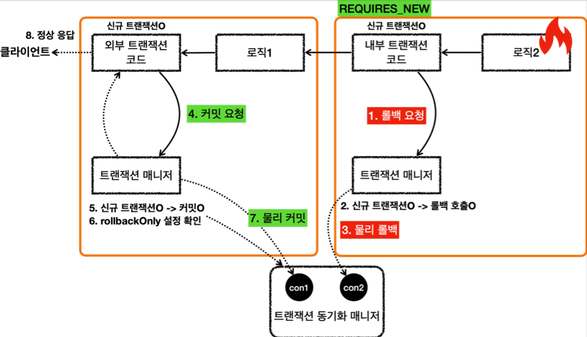

# <a href = "../README.md" target="_blank">스프링 DB 2편 - 데이터 접근 활용 기술</a>
## Chapter 10. 스프링 트랜잭션 전파1 - 기본
### 10.7 스프링 트랜잭션 전파7 - REQUIRES_NEW
1) REQUIRES_NEW 옵션 : 외부 트랜잭션과 내부 트랜잭션 분리
2) (실습) `inner_rollback_requires_new()`
3) 로그 분석 : 내부 트랜잭션이 롤백되도, 외부 트랜잭션이 물리적으로 커밋된다.
4) 요청 흐름 - REQUIRES_NEW 적용
5) 응답 흐름 - REQUIRES_NEW 적용
6) 물리 트랜잭션이 명확히 분리되지만, 커넥션 고갈을 가속시킨다.
---

# 10.7 스프링 트랜잭션 전파7 - REQUIRES_NEW

---

## 1) REQUIRES_NEW 옵션 : 외부 트랜잭션과 내부 트랜잭션 분리


### 1.1 물리 트랜잭션의 분리
- 물리 트랜잭션을 분리하려면 내부 트랜잭션을 시작할 때 REQUIRES_NEW 옵션을 사용하면 된다.
- 외부 트랜잭션과 내부 트랜잭션이 각각 별도의 물리 트랜잭션을 가진다.

### 1.2 커넥션을 따로 사용한다.
- 별도의 물리 트랜잭션을 가진다는 뜻은 DB 커넥션을 따로 사용한다는 뜻이다.

### 1.3 두 트랜잭션이 서로 영향을 끼치지 않는다.
- 이 경우 내부 트랜잭션이 롤백되면서 로직 2가 롤백되어도 로직 1에서 저장한 데이터에는 영향을 주지 않는다.
- 최종적으로 로직2는 롤백되고, 로직1은 커밋된다.

---

## 2) (실습) 외부 트랜잭션과 내부 트랜잭션을 분리 - `inner_rollback_requires_new()`
```java
    @Test
    public void inner_rollback_requires_new() {
        log.info("외부 트랜잭션 시작");
        TransactionStatus outer = txManager.getTransaction(new DefaultTransactionAttribute());
        log.info("outer.isNewTransaction() = {}", outer.isNewTransaction()); // true

        log.info("내부 트랜잭션 시작");
        DefaultTransactionAttribute definition = new DefaultTransactionAttribute();
        definition.setPropagationBehavior(TransactionDefinition.PROPAGATION_REQUIRES_NEW);
        TransactionStatus inner = txManager.getTransaction(definition);
        log.info("inner.isNewTransaction() = {}", inner.isNewTransaction()); // true

        log.info("내부 트랜잭션 롤백");
        txManager.rollback(inner);

        log.info("외부 트랜잭션 커밋");
        txManager.commit(outer);
    }
```
- 내부 트랜잭션을 시작할 때 전파 옵션인 `propagationBehavior` 에 `PROPAGATION_REQUIRES_NEW` 옵션을 주었다.
- 이 전파 옵션을 사용하면 내부 트랜잭션을 시작할 때 기존 트랜잭션에 참여하는 것이 아니라 새로운 물리 트랜잭션을 만들어서 시작하게 된다.

---

## 3) 로그 분석 : 내부 트랜잭션이 롤백되도, 외부 트랜잭션이 물리적으로 커밋된다.

### 3.1 외부 트랜잭션 시작
```shell
외부 트랜잭션 시작
Creating new transaction with name [null]: PROPAGATION_REQUIRED,ISOLATION_DEFAULT
Acquired Connection [HikariProxyConnection@1205343271 wrapping conn0] for JDBC transaction
Switching JDBC Connection [HikariProxyConnection@1205343271 wrapping conn0] to manual commit
outer.isNewTransaction() = true
```
- 외부 트랜잭션을 시작하면서 `conn0` 를 획득하고 `manual commit` 으로 변경해서 물리 트랜잭션을 시작한다.
- 외부 트랜잭션은 신규 트랜잭션이다.(`outer.isNewTransaction()=true`)

### 3.2 내부 트랜잭션 시작 : 새로운 물리 트랜잭션
```shell
내부 트랜잭션 시작
Suspending current transaction, creating new transaction with name [null]
Acquired Connection [HikariProxyConnection@757150717 wrapping conn1] for JDBC transaction
Switching JDBC Connection [HikariProxyConnection@757150717 wrapping conn1] to manual commit
inner.isNewTransaction() = true
```
- 내부 트랜잭션을 시작하면서 `conn1` 를 획득하고 `manual commit` 으로 변경해서 물리 트랜잭션을 시작한다.
- 내부 트랜잭션은 외부 트랜잭션에 참여하는 것이 아니라, `PROPAGATION_REQUIRES_NEW` 옵션을 사용했기 때문에 완전히 새로운 신규 트랜잭션으로 생성된다.(`inner.isNewTransaction()=true`)

### 3.3 내부 트랜잭션 롤백
```shell
내부 트랜잭션 롤백
Initiating transaction rollback
Rolling back JDBC transaction on Connection [HikariProxyConnection@757150717 wrapping conn1]
Releasing JDBC Connection [HikariProxyConnection@757150717 wrapping conn1] after transaction
Resuming suspended transaction after completion of inner transaction
```
- 내부 트랜잭션을 롤백한다.
- 내부 트랜잭션은 신규 트랜잭션이기 때문에 실제 물리 트랜잭션을 롤백한다.
- 내부 트랜잭션은 `conn1` 을 사용하므로 `conn1` 에 물리 롤백을 수행한다.

### 3.4 외부 트랜잭션 커밋
```shell
외부 트랜잭션 커밋
Initiating transaction commit
Committing JDBC transaction on Connection [HikariProxyConnection@1205343271 wrapping conn0]
Releasing JDBC Connection [HikariProxyConnection@1205343271 wrapping conn0] after transaction
```
- 외부 트랜잭션을 커밋한다.
- 외부 트랜잭션은 신규 트랜잭션이기 때문에 실제 물리 트랜잭션을 커밋한다.
- 외부 트랜잭션은 `conn0` 를 사용하므로 `conn0` 에 물리 커밋을 수행한다.

---

## 4) 요청 흐름 - REQUIRES_NEW 적용


### 4.1 요청 흐름 - 외부 트랜잭션
1. `txManager.getTransaction()` 를 호출해서 외부 트랜잭션을 시작한다.
2. 트랜잭션 매니저는 데이터소스를 통해 커넥션을 생성한다.
3. 생성한 커넥션을 수동 커밋 모드( `setAutoCommit(false)` )로 설정한다. - **물리 트랜잭션 시작**
4. 트랜잭션 매니저는 트랜잭션 동기화 매니저에 커넥션을 보관한다.
5. 트랜잭션 매니저는 트랜잭션을 생성한 결과를 `TransactionStatus` 에 담아서 반환하는데, 여기에 신규
   트랜잭션의 여부가 담겨 있다. `isNewTransaction` 를 통해 신규 트랜잭션 여부를 확인할 수 있다.
   트랜잭션을 처음 시작했으므로 신규 트랜잭션이다.( `true` )
6. 로직1이 사용되고, 커넥션이 필요한 경우 트랜잭션 동기화 매니저를 통해 트랜잭션이 적용된 커넥션을
   획득해서 사용한다.

### 4.2 요청 흐름 - 내부 트랜잭션
7. **REQUIRES_NEW 옵션과 함께** `txManager.getTransaction()` 를 호출해서 내부 트랜잭션을
   시작한다.
   - 트랜잭션 매니저는 `REQUIRES_NEW` 옵션을 확인하고, 기존 트랜잭션에 참여하는 것이 아니라 새로운 트랜잭션을 시작한다.
8. 트랜잭션 매니저는 데이터소스를 통해 커넥션을 생성한다.
9. 생성한 커넥션을 수동 커밋 모드( `setAutoCommit(false)` )로 설정한다. - **물리 트랜잭션 시작**
10. 트랜잭션 매니저는 트랜잭션 동기화 매니저에 커넥션을 보관한다.
    - 이때 `con1` 은 잠시 보류되고, 지금부터는 `con2` 가 사용된다. (내부 트랜잭션을 완료할 때 까지 `con2` 가 사용된다.)
11. 트랜잭션 매니저는 신규 트랜잭션의 생성한 결과를 반환한다. `isNewTransaction == true`
12. 로직2가 사용되고, 커넥션이 필요한 경우 트랜잭션 동기화 매니저에 있는 `con2` 커넥션을 획득해서 사용한다.

---

## 5) 응답 흐름 - REQUIRES_NEW 적용


### 5.1 응답 흐름 - 내부 트랜잭션
1. 로직2가 끝나고 트랜잭션 매니저를 통해 내부 트랜잭션을 롤백한다.
   - 로직2에 문제가 있어서 롤백한다고 가정한다.
2. 트랜잭션 매니저는 롤백 시점에 신규 트랜잭션 여부에 따라 다르게 동작한다.  
   현재 내부 트랜잭션은 신규 트랜잭션이다. 따라서 실제 롤백을 호출한다.
3. 내부 트랜잭션이 `con2` 물리 트랜잭션을 롤백한다.
   - 트랜잭션이 종료되고, `con2` 는 종료되거나, 커넥션 풀에 반납된다.
   - 이후에 `con1` 의 보류가 끝나고, 다시 `con1` 을 사용한다.

### 5.2 응답 흐름 - 외부 트랜잭션
4. 외부 트랜잭션에 커밋을 요청한다.
5. 외부 트랜잭션은 신규 트랜잭션이기 때문에 물리 트랜잭션을 커밋한다.
6. 이때 `rollbackOnly` 설정을 체크한다. `rollbackOnly` 설정이 없으므로 커밋한다.
7. 본인이 만든 `con1` 커넥션을 통해 물리 트랜잭션을 커밋한다.
   트랜잭션이 종료되고, `con1` 은 종료되거나, 커넥션 풀에 반납된다.

---

## 6) 물리 트랜잭션이 명확히 분리되지만, 커넥션 고갈을 가속시킨다.
- `REQUIRES_NEW` 옵션을 사용하면 물리 트랜잭션이 명확하게 분리된다.
- `REQUIRES_NEW` 를 사용하면 데이터베이스 커넥션이 동시에 2개 사용된다는 점을 주의해야 한다.
   - 한 클라이언트 요청에 대해 2개 이상의 커넥션을 사용하게 하는 것은, 빠른 커넥션 고갈을 야기한다.
   - 이용자 수가 많고 `REQUIRES_NEW`가 적용된 로직이 시간적으로 오래 걸린다면, 다른 사용자는 커넥션을 획득하기까지 오래 기다려야한다.

---

