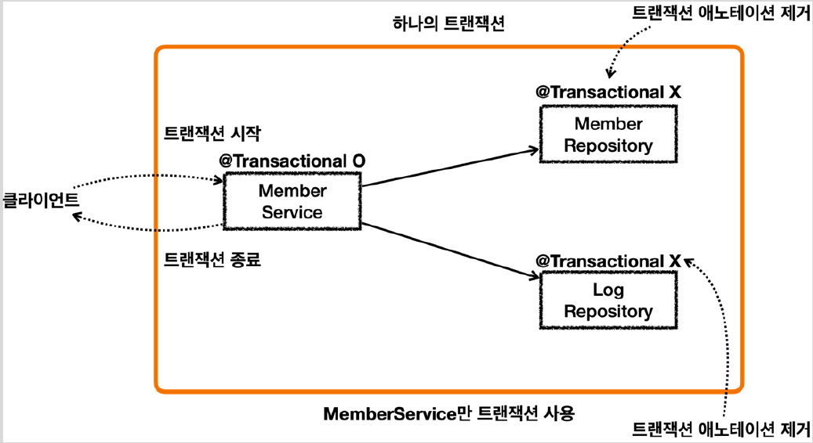
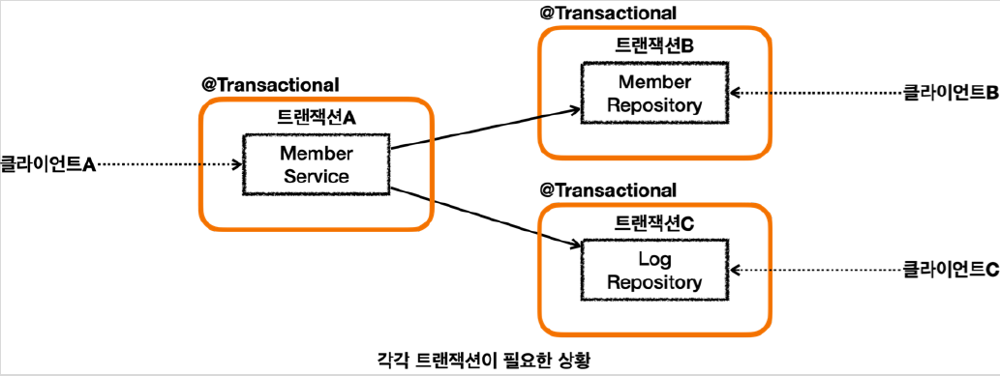

# <a href = "../README.md" target="_blank">스프링 DB 2편 - 데이터 접근 활용 기술</a>
## Chapter 11. 스프링 트랜잭션 전파2 - 활용
### 11.3 트랜잭션 전파 활용3 - 단일 트랜잭션
1) 서비스에만 트랜잭션 사용하기
2) 요구사항 추가 : 부분적으로 트랜잭션이 필요한 상황
3) 트랜잭션 전파 개념이 필요하다.

---

# 11.3 트랜잭션 전파 활용3 - 단일 트랜잭션

---

## 1) 서비스에만 트랜잭션 사용하기

### 1.1 서비스에만 트랜잭션 적용
회원 리포지토리와 로그 리포지토리를 하나의 트랜잭션으로 묶는 가장 간단한 방법은
이 둘을 호출하는 회원 서비스에만 트랜잭션을 사용하는 것이다.

### 1.2 테스트 코드 : singleTx
```java
    /**
     * memberService    @Transactional:ON
     * memberRepository @Transactional:OFF
     * logRepository    @Transactional:OFF
     */
    @Test
    public void singleTx() {
        //given
        String username = "singleTx";

        //when
        memberService.joinV1(username);

        //then
        assertTrue(memberRepository.find(username).isPresent());
        assertTrue(logRepository.find(username).isPresent());
    }
```
- `MemberService` 에만 `@Transactional` 코드를 추가한다.
  ```java
  @Transactional // 추가
  public void joinV1(String username) {
  ```
- MemberRepository, LogRepository에 달려있는 `@Transactional` 코드를 제거한다.
  ```java
  //MemberRepository
  //@Transactional //제거
  public void save(Member member)
  ```
  ```java
  //LogRepository
  //@Transactional //제거
  public void save(Log logMessage)
  ```
  
### 1.3 로직을 하나의 트랜잭션으로 편리하게 관리

- 이렇게 하면 `MemberService` 를 시작할 때 부터 종료할 때 까지의 모든 로직을 하나의 트랜잭션으로 묶을 수 있다.
- `MemberService` 가 `MemberRepository` , `LogRepository` 를 호출하므로 이 로직들은 같은 트랜잭션을 사용한다.
- `MemberService` 만 트랜잭션을 처리하기 때문에 앞서 배운 논리 트랜잭션, 물리 트랜잭션, 외부 트랜잭션, 내부 트랜잭션, rollbackOnly , 신규 트랜잭션, 트랜잭션 전파와 같은 복잡한 것을 고민할 필요가 없다.
- 아주 단순하고 깔끔하게 트랜잭션을 묶을 수 있다.

### 1.4 모든 로직이 하나의 커넥션을 사용


- `@Transactional` 이 `MemberService` 에만 붙어있기 때문에 여기에만 트랜잭션 AOP가 적용된다.
  - `MemberRepository` , `LogRepository` 는 트랜잭션 AOP가 적용되지 않는다.
- `MemberService` 의 시작부터 끝까지, 관련 로직은 해당 트랜잭션이 생성한 커넥션을 사용하게 된다.
  - `MemberService` 가 호출하는 `MemberRepository` , `LogRepository` 도 같은 커넥션을 사용하면서 자연스럽게 트랜잭션 범위에 포함된다. 
- (참고) 같은 쓰레드를 사용하면 트랜잭션 동기화 매니저는 같은 커넥션을 반환한다.

--

## 2) 요구사항 추가 : 부분적으로 트랜잭션이 필요한 상황




- 클라이언트 A는 `MemberService` 부터 `MemberRepository` , `LogRepository` 를 모두 하나의 트랜잭션으로 묶고 싶다.
- 클라이언트 B는 `MemberRepository` 만 호출하고 여기에만 트랜잭션을 사용하고 싶다.
- 클라이언트 C는 `LogRepository` 만 호출하고 여기에만 트랜잭션을 사용하고 싶다.
- 클라이언트 A만 생각하면 `MemberService` 에 트랜잭션 코드를 남기고, `MemberRepository` ,`LogRepository` 의 트랜잭션 코드를 제거하면 앞서 배운 것 처럼 깔끔하게 하나의 트랜잭션을 적용할 수 있다.
- 하지만 이렇게 되면 클라이언트 B, C가 호출하는 `MemberRepository` , `LogRepository` 에는 트랜잭션을 적용할 수 없다.

---

## 3) 트랜잭션 전파 개념이 필요하다.

- 여기서 더 복잡화해서 클라이언트 Z가 호출하는 `OrderService` 에서도 트랜잭션을 시작할 수 있어야 하고, 클라이언트A가 호출하는 `MemberService` 에서도 트랜잭션을 시작할 수 있어야 한다면?
- 이런 문제를 해결하기 위해 트랜잭션 전파가 필요하다.

---
