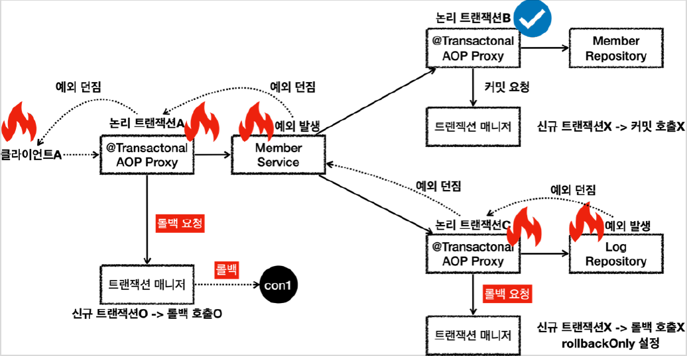

# <a href = "../README.md" target="_blank">스프링 DB 2편 - 데이터 접근 활용 기술</a>
## Chapter 11. 스프링 트랜잭션 전파2 - 활용
### 11.5 트랜잭션 전파 활용5 - 전파 롤백
1) 모든 로직 각각에 트랜잭션 적용(REQUIRED) - 예외 안 잡고 롤백
2) 물리 트랜잭션이 롤백되어 데이터 정합성 문제를 해결했다.
---

# 11.5 트랜잭션 전파 활용5 - 전파 롤백

---

## 1) 모든 로직 각각에 트랜잭션 적용(REQUIRED) - 예외 안 잡고 롤백

### 1.1 개요

- `LogRepository`에서 예외가 발생하여 내부 논리 트랜잭션이 롤백 요청을 한다.
- 이를 신규 트랜잭션인 `MemberService`에서 잡지 않았다.
- 물리 트랜잭션이 롤백된다.

### 1.2 `outerTxOn_fail()`
```java
    /**
     * memberService    @Transactional:ON
     * memberRepository @Transactional:ON
     * logRepository    @Transactional:ON Exception
     */
    @Test
    public void outerTxOn_fail() {
        //given
        String username = "로그예외_outerTxOn_fail";

        //when
        assertThatThrownBy(() -> memberService.joinV1(username))
                .isInstanceOf(RuntimeException.class);

        //then : 모든 데이터가 롤백된다.
        assertTrue(memberRepository.find(username).isEmpty());
        assertTrue(logRepository.find(username).isEmpty());
    }
```
- 모든 계층에 트랜잭션이 적용되어 있다. (REQUIRED)
- 여기서는 로그예외 라고 넘겼기 때문에 `LogRepository` 에서 런타임 예외가 발생한다.

---



### 1.3 MemberService - 신규 트랜잭션 생성, 물리 트랜잭션 시작 
- 클라이언트A가 MemberService 를 호출하면서 트랜잭션 AOP가 호출된다.
- 여기서 신규 트랜잭션이 생성되고, 물리 트랜잭션도 시작한다.

### 1.4 MemberRepository - 내부 트랜잭션 참여
- `MemberRepository` 를 호출하면서 트랜잭션 AOP가 호출된다.
- 이미 트랜잭션이 있으므로 기존 트랜잭션에 참여한다.

### 1.5 MemberRepository - 내부 트랜잭션 커밋
`MemberRepository` 의 로직 호출이 끝나고 정상 응답하면 트랜잭션 AOP가 호출된다.
  - 트랜잭션 AOP는 정상 응답이므로 트랜잭션 매니저에 커밋을 요청한다.
  - 이 경우 신규 트랜잭션이 아니므로 실제 커밋을 호출하지 않는다.

### 1.6 LogRepository - 내부 트랜잭션 참여
- `LogRepository` 를 호출하면서 트랜잭션 AOP가 호출된다.
- 이미 트랜잭션이 있으므로 기존 트랜잭션에 참여한다.

### 1.7 LogRepository - 내부 트랜잭션 롤백 요청, 예외 throw
- `LogRepository` 로직에서 런타임 예외가 발생한다. 예외를 던지면 트랜잭션 AOP가 해당 예외를 받게 된다.
  - 트랜잭션 AOP는 런타임 예외가 발생했으므로 트랜잭션 매니저에 롤백을 요청한다.
  - 이 경우 신규 트랜잭션이 아니므로 물리 롤백을 호출하지는 않는다.
  - 대신에 `rollbackOnly` 를 설정한다.
- `LogRepository` 가 예외를 던졌기 때문에 트랜잭션 AOP도 해당 예외를 그대로 밖으로 던진다.

### 1.8  예외 throw, 신규 트랜잭션 롤백 요청, 물리 트랜잭션 롤백
- `MemberService` 에서도 런타임 예외를 받게 되는데, 여기 로직에서는 해당 런타임 예외를 처리하지 않고 밖으로 던진다.
- 트랜잭션 AOP는 런타임 예외가 발생했으므로 트랜잭션 매니저에 롤백을 요청한다.
- 이 경우 신규 트랜잭션이므로 물리 롤백을 호출한다.
  - **참고로 이 경우 어차피 롤백이 되었기 때문에, rollbackOnly 설정은 참고하지 않는다.**
  - 신규 트랜잭션이 롤백되면 rollbackOnly 설정과 무관하게 무조건 물리 롤백을 호출한다.
- `MemberService` 가 예외를 던졌기 때문에 트랜잭션 AOP도 해당 예외를 그대로 밖으로 던진다.
- 클라이언트A는 `LogRepository` 부터 넘어온 런타임 예외를 받게 된다.

---

## 2) 물리 트랜잭션이 롤백되어 데이터 정합성 문제를 해결했다.
- 내부 논리 트랜잭션이 롤백되고, 여기서 예외가 신규 트랜잭션으로 throw됐다.
- 신규 트랜잭션에서 떠넘겨진 예외를 처리하지 못 하고 롤백되면서, 물리 트랜잭션 전체가 롤백됐다.
- 회원과 회원 이력 로그를 처리하는 부분을 하나의 트랜잭션으로 묶은 덕분에 문제가 발생했을 때 회원과 회원 이력 로그가 모두 함께 롤백된다.
- 따라서 데이터 정합성에 문제가 발생하지 않는다.

---
