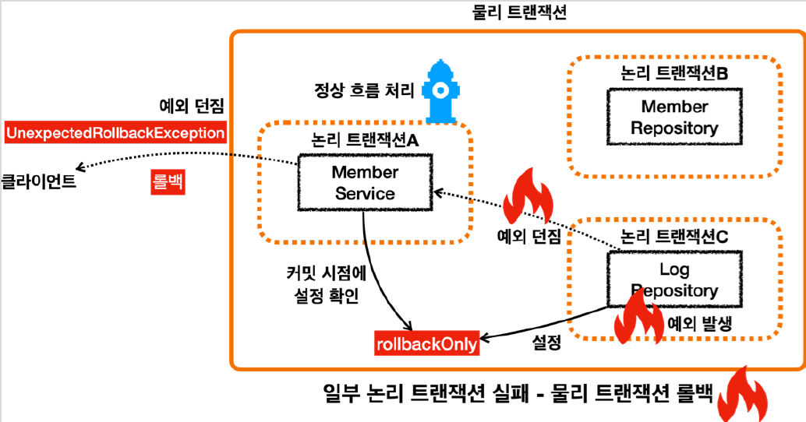
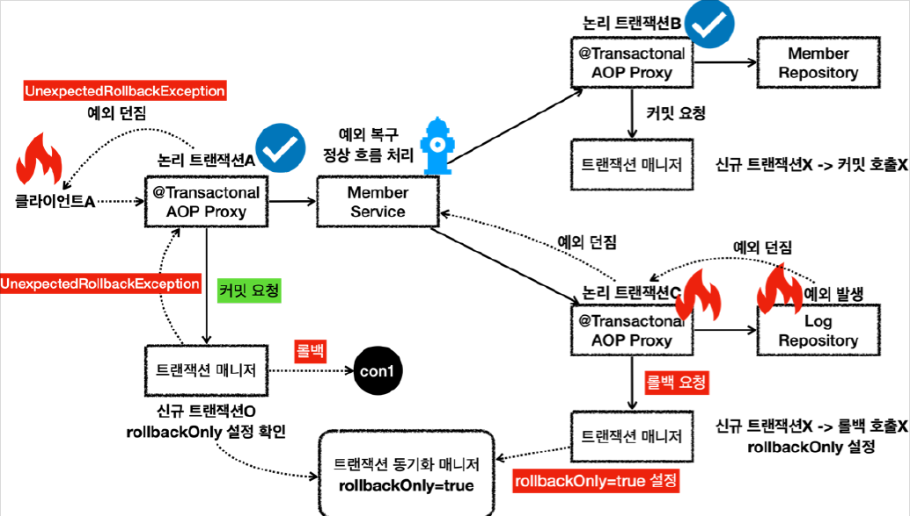

# <a href = "../README.md" target="_blank">스프링 DB 2편 - 데이터 접근 활용 기술</a>
## Chapter 11. 스프링 트랜잭션 전파2 - 활용
### 11.6 트랜잭션 전파 활용6 - 복구 REQUIRED
1) 요구사항 추가 : 예외를 잡아서 복구시키고 롤백 시키지 않기
2) 서비스에서 예외를 잡아서 처리하면 정상흐름으로 돌려 커밋할 수 있지 않을까? → 실패
3) 모든 로직 각각에 트랜잭션 적용(REQUIRED) - 예외를 잡아서 복구했음에도 롤백
4) 내부 롤백(`readOnly`), 외부 커밋 → 물리 롤백, `UnexpectedRollbackException` 발생

---

# 11.6 트랜잭션 전파 활용6 - 복구 REQUIRED

---

## 1) 요구사항 추가 : 예외를 잡아서 복구시키고 롤백 시키지 않기
- 앞서 회원과 로그를 하나의 트랜잭션으로 묶어서 데이터 정합성 문제를 깔끔하게 해결했다.
- 그런데 회원 이력 로그를 DB에 남기는 작업에 가끔 문제가 발생해서 회원 가입 자체가 안되는 경우가 가끔 발생하게 되었다. 그래서 사용자들이 회원 가입에 실패해서 이탈하는 문제가 발생하기 시작했다.
- 회원 이력 로그의 경우 여러가지 방법으로 추후에 복구가 가능할 것으로 보인다.
- 그래서 비즈니스 요구사항이 변경되었다. **회원 가입을 시도한 로그를 남기는데 실패하더라도 회원 가입은 유지되어야 한다.**

---

## 2) 서비스에서 예외를 잡아서 처리하면 정상흐름으로 돌려 커밋할 수 있지 않을까? → 실패

- 단순하게 생각해보면 `LogRepository` 에서 예외가 발생하면 그것을 `MemberService` 에서 예외를 잡아서 처리하면 될 것 같다?
- 이렇게 하면 `MemberService` 에서 정상 흐름으로 바꿀 수 있기 때문에 `MemberService` 의 트랜잭션 AOP 에서 커밋을 수행할 수 있다?
- **위와 같이 생각했다면 틀렸다. 내부 트랜잭션 롤백으로 인한 `readOnly` 마킹 때문에 결국 롤백된다.**

---

## 3) 모든 로직 각각에 트랜잭션 적용(REQUIRED) - 예외를 잡아서 복구했음에도 롤백
```java

    /**
     * memberService    @Transactional:ON Recover
     * memberRepository @Transactional:ON
     * logRepository    @Transactional:ON Exception
     */
    @Test
    public void recoverException_fail() {
        //given
        String username = "로그예외_recoverException_fail";

        //when
        assertThatThrownBy(() -> memberService.joinV2(username))
                .isInstanceOf(UnexpectedRollbackException.class);

        //then : 모든 데이터가 롤백된다.
        assertTrue(memberRepository.find(username).isEmpty());
        assertTrue(logRepository.find(username).isEmpty());
    }
```
- 모든 계층이 트랜잭션을 사용한다.
  - joinV2에 `@Transactional`를 달아줘야한다.
- **여기서 `memberService.joinV2()`를 호출하는 부분을 주의해야 한다.** `joinV2()`에는 예외를 잡아서 정상 흐름으로 변환하는 로직이 추가되어 있다.
  ```java
        log.info("=== LogRepository 호출 시작 ===");
        try {
            logRepository.save(logMessage);
        } catch (RuntimeException e) {
            log.info("log 저장에 실패했습니다. logMessage = {}", logMessage.getMessage());
            log.info("정상 흐름 반환");
        }
        log.info("=== LogRepository 호출 종료 ===");
  ```

## 4) 내부 롤백(`readOnly`), 외부 커밋 → 물리 롤백, `UnexpectedRollbackException` 발생

### 4.1 대원칙
논리 트랜잭션 중 하나라도 롤백되면 전체 트랜잭션은 롤백된다.

### 4.2 개요

- 내부 트랜잭션에서 `rollbackOnly=true` 를 설정하기 때문에 결과적으로 정상 흐름 처리를 해서 외부
트랜잭션에서 커밋을 호출해도 물리 트랜잭션은 롤백된다.
- 그리고 `UnexpectedRollbackException` 이 던져진다.



### 4.3 LogRepository - 내부 트랜잭션 롤백 요청, 예외 throw
- `LogRepository` 에서 예외가 발생한다.
- 예외를 던지면 LogRepository 의 트랜잭션 AOP가 해당 예외를 받는다.
- 신규 트랜잭션이 아니므로 물리 트랜잭션을 롤백하지는 않고, 트랜잭션 동기화 매니저에 `rollbackOnly` 를 표시한다.
- 이후 트랜잭션 AOP는 전달 받은 예외를 밖으로 던진다.

### 4.4 MemberService - 예외 복구, 신규 트랜잭션 커밋 시도
- 예외가 MemberService 에 던져지고, MemberService 는 해당 예외를 복구한다. 그리고 정상적으로 리턴한다.
- 정상 흐름이 되었으므로 `MemberService` 의 트랜잭션 AOP는 커밋을 호출한다.

### 4.5 트랜잭션 매니저 - `rollbackOnly` 때문에 롤백, `UnexpectedRollbackException` 발생
- 커밋을 호출할 때 신규 트랜잭션이므로 실제 물리 트랜잭션을 커밋해야 한다. 이때 `rollbackOnly` 를 체크한다.
- `rollbackOnly` 가 체크 되어 있으므로 물리 트랜잭션을 롤백한다.
- 내부 트랜잭션이 롤백됐는데 외부 트랜잭션이 커밋이 발생했으므로 트랜잭션 매니저는 `UnexpectedRollbackException` 예외를 던진다.
- 트랜잭션 AOP도 전달받은 `UnexpectedRollbackException` 을 클라이언트에 던진다.

---
