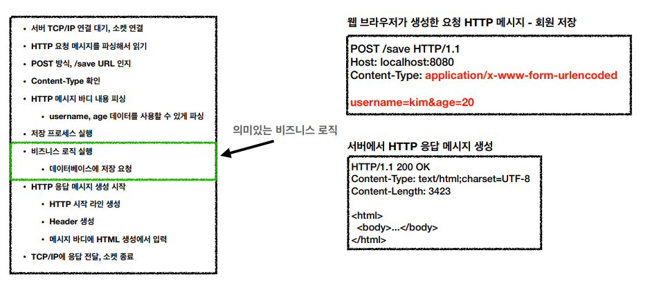
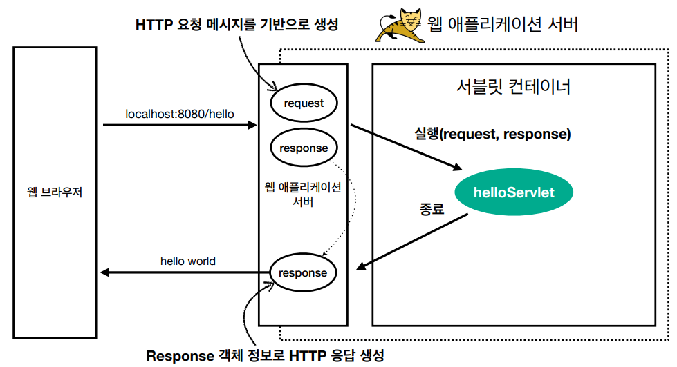

# <a href = "../README.md" target="_blank">스프링 MVC 1편 - 백엔드 웹 개발 핵심 기술</a>
## Chapter 01. 웹 어플리케이션의 이해
### 1.2 서블릿
1) 도입 배경 : WAS에서 처리해야하는 너무 많은 업무량
2) 서블릿의 도입
3) 서블릿을 통한 HTTP 요청, 응답의 흐름
4) 서블릿 컨테이너
---

# 1.2 서블릿

---

## 1) 도입 배경 : WAS에서 처리해야하는 너무 많은 업무량

- HTTP 요청 메시지를 읽고 요청에 대응하는 프로세스를 실행하여 로직을 수행하고, 응답 메시지를 작성하는 과정에서 해야할 일이 너무 많음.
- 이 과정에서 해야할 일이 너무 많다. 비즈니스 로직에만 집중할 수 있도록, 간소화시킬 방법이 없을까?
- 이 삽질 과정을 체험하고 싶다면, 박재성 님이 출간한 [자바 웹 프로그래밍 Next Step](https://www.aladin.co.kr/shop/wproduct.aspx?ItemId=91501933) 을 참고해보자.

---

## 2) 서블릿의 도입
```java
@WebServlet(name = "helloServlet", urlPatterns = "/hello")
public class HelloServlet extends HttpServlet {
    @Override
    protected void service(HttpServletRequest request, HttpServletResponse response){
        //애플리케이션 로직
    }
}
```
1. 서블릿 : 웹 어플리케이션 개발 시, 요청-응답 흐름의 로직을 편리하게 다룰 수 있도록 제공되는 자바 표준 기술.
2. 실행 트리거
   - urlPatterns(/hello)의 URL이 호출되면 서블릿 코드가 실행
3. 의의
   - 실질적으로 비즈니스 로직 전후의 모든 과정을 서블릿이 모두 수행해줌.
     - `HttpServletRequest` : HTTP 요청 정보를 편리하게 사용할 수 있음
     - `HttpServletResponse` : HTTP 응답 정보를 편리하게 제공할 수 있음
   - 개발자는 HTTP 스펙을 매우 편리하게 사용할 수 있다.

---

## 3) 서블릿을 통한 HTTP 요청, 응답의 흐름

- 요청
  - WAS는 Request, Response 객체를 새로 만들어서 서블릿 객체 호출
  - 개발자는 Request 객체에서 HTTP 요청 정보를 편리하게 꺼내서 사용
- 응답
  - 개발자는 Response 객체에 HTTP 응답 정보를 편리하게 입력
  - WAS는 Response 객체에 담겨있는 내용으로 HTTP 응답 정보를 생성

---

## 4) 서블릿 컨테이너


### 서블릿 컨테이너란?
- 톰캣처럼 서블릿을 지원하는 WAS를 서블릿 컨테이너라고 함
- 서블릿 컨테이너는 서블릿 객체를 생성, 초기화, 호출, 종료하는 생명주기 관리
  - 수동으로 서블릿 인스턴스를 개발자가 관리할 필요가 없다.

### 서블릿은 싱글톤 인스턴스다.
서블릿 객체는 싱글톤으로 관리된다.
- 고객의 요청이 올 때 마다 계속 객체를 생성하는 것은 비효율
- 최초 로딩 시점에 서블릿 객체를 미리 만들어두고 재활용
- 모든 고객 요청은 동일한 서블릿 객체 인스턴스에 접근
- 서블릿 컨테이너 종료시 함께 종료
- **주의점 : 공유 자원이므로, 공유 변수 사용 시 주의해야한다.**

### 서블릿과 JSP 
- JSP도 서블릿으로 변환 되어서 사용됨

### 동시요청 - 멀티 스레드
- 여러 동시 요청에 대해 멀티스레드를 사용하여 처리할 수 있도록 지원됨
