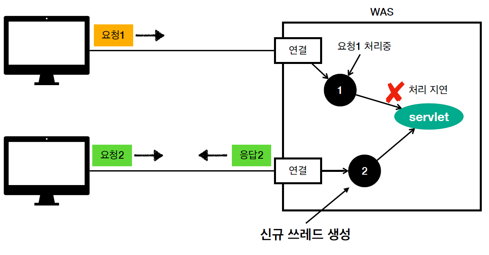
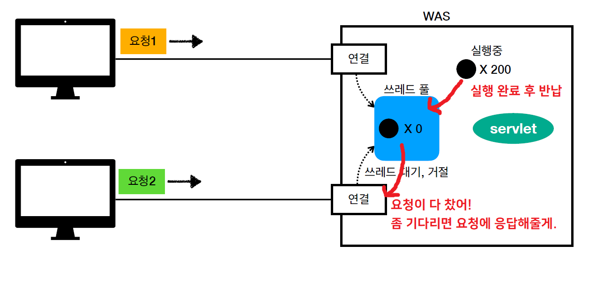
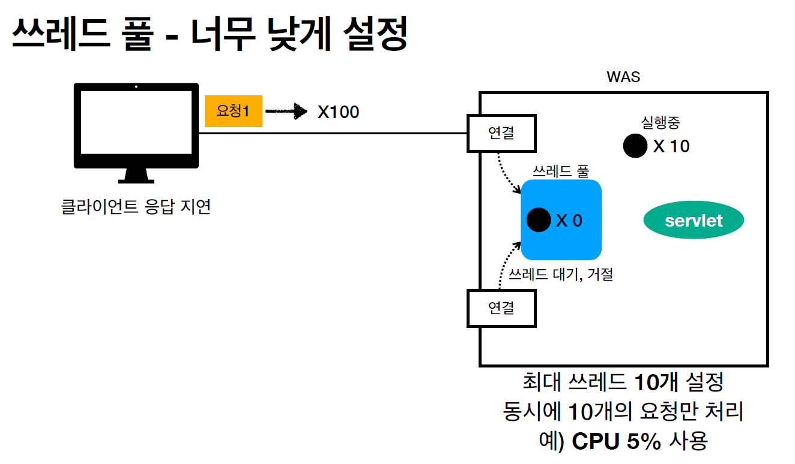

# <a href = "../README.md" target="_blank">스프링 MVC 1편 - 백엔드 웹 개발 핵심 기술</a>
## Chapter 01. 웹 어플리케이션의 이해
### 1.3 동시요청 - 멀티 스레드
1) 서블릿 호출의 주체는 스레드
2) 싱글 스레드의 한계
3) 멀티 스레드 - 요청마다 스레드를 생성
4) 스레드 풀 : 요청마다 스레드 생성의 단점 보완
5) WAS의 주요 튜닝 포인트는 최대 스레드 수
6) WAS(서블릿 컨테이너 - 톰캣)의 멀티 스레드 관리 지원
---

# 1.3 동시요청 - 멀티 스레드

---

## 1) 서블릿 호출의 주체는 스레드


- 애플리케이션 코드를 하나하나 순차적으로 실행하는 것은 스레드
- 자바 메인 메서드를 처음 실행하면 main이라는 이름의 쓰레드가 실행
- 쓰레드가 없다면 자바 애플리케이션 실행이 불가능
- 쓰레드는 한번에 하나의 코드 라인만 수행
- 동시 처리가 필요하면 쓰레드를 추가로 생성

---

## 2) 싱글 스레드의 한계

- 서블릿 호출의 주체는 스레드
- 스레드가 부족하면 다른 사용자의 요청이 들어왔을 때 병목이 발생.
- 응답성이 좋지 않으므로 고객에게 안 좋은 UX를 제공

---

## 3) 멀티 스레드 - 요청마다 스레드를 생성


### 3.1 요청마다 스레드 생성 시 장점
- 동시 요청을 처리할 수 있다.
- 리소스(CPU, 메모리)가 허용할 때 까지 처리가능
- 하나의 스레드가 지연 되어도, 나머지 스레드는 정상 동작한다. 

### 3.2 요청마다 스레드 생성 시 단점
- 스레드는 생성 비용은 매우 비싸다. 
  - 고객의 요청이 올 때 마다 쓰레드를 생성하면, 응답 속도가 늦어진다.
- 쓰레드는 컨텍스트 스위칭 비용이 발생한다.
  - 컨텍스트 스위칭 : 여러 스레드가 번갈아가면서 작업
- 쓰레드 생성에 제한이 없다. 
  - 고객 요청이 너무 많이 오면, CPU, 메모리 임계점을 넘어서 서버가 죽을 수 있다.
    - 예) 치킨 할인, 수강 신청, ...

---

## 4) 스레드 풀 : 요청마다 스레드 생성의 단점 보완



### 4.1 스레드 풀의 특징
- 필요한 쓰레드를 쓰레드 풀에 보관하고 관리한다.
- 쓰레드 풀에 생성 가능한 쓰레드의 최대치를 관리한다. 톰캣은 최대 200개 기본 설정 (변경 가능)
  - `application.yml` 설정을 조정하여 풀 프로퍼티를 변경할 수 있다.
  - 참고자료 : https://www.baeldung.com/java-web-thread-pool-config
    ```yaml
    server:
      tomcat:
        threads:
          max: 200
          min-spare: 10
        accept-count: 100
      port: 8080
    ```
### 4.2 스레드 사용
- 스레드가 필요하면, 이미 생성되어 있는 스레드를 스레드 풀에서 꺼내서 사용한다.
- 사용을 종료하면 스레드 풀에 해당 스레드를 반납한다.
- 최대 스레드가 모두 사용중이어서 스레드 풀에 스레드가 없을 때
  - 기다리는 요청은 거절하거나
  - 특정 숫자만큼만 대기하도록 설정할 수 있다.

### 4.3 스레드 풀의 장점
- 스레드가 미리 생성되어 있으므로, 스레드를 생성하고 종료하는 비용(CPU)이 절약되고, 응답 시간이 빠르다.
  - 매번 사용 후 재사용!
- 생성 가능한 스레드의 최대치가 있으므로 너무 많은 요청이 들어와도 기존 요청은 안전하게 처리할 수 있다.

---

## 5) WAS의 주요 튜닝 포인트는 최대 스레드 수

### 5.1 스레드 갯수 조절이 문제다.

- 스레드 갯수가 너무 적으면 
  - 동시 요청이 많으면, 서버 리소스는 여유롭지만, 클라이언트는 금방 응답 지연
- 스레드 갯수가 너무 많으면
  - 스레드들이 컨텍스트 스위칭을 계속 반복.
  - 동시 요청이 많으면, CPU, 메모리 리소스 임계점 초과로 서버 다운
- 장애 발생시 
  - 클라우드면 일단 서버부터 늘리고, 이후에 튜닝 
  - 클라우드가 아니면 열심히 튜닝

### 5.2 스레드의 적정 갯수
- 적정 갯수는 어떻게 찾는가?
- 애플리케이션 로직의 복잡도(시간 복잡도, 공간복잡도), CPU, 메모리, IO 리소스 상황에 따라 모두 다름
- 결국 **성능 테스트**를 해보면서 병목 포인트를 찾아내고, 튜닝해야함.
  - 아무리 잘 하는 사람도 최적의 해를 바로 내지 못 함.
  - 최대한 실제 서비스와 유사하게 성능 테스트 시도
    - 툴: 아파치 ab, 제이미터, nGrinder

---

## 6) WAS(서블릿 컨테이너 - 톰캣)의 멀티 스레드 관리 지원
- 멀티 스레드에 대한 부분은 WAS(서블릿 컨테이너 - 톰캣)가 처리
- 개발자가 멀티 스레드 관련 코드를 신경쓰지 않아도 됨
  - 멀티 스레드 프로그래밍을 개발자가 직접 다루는 것은 매우 복잡도가 높고 오류 발생 여지가 크다.
- 개발자는 마치 싱글 스레드 프로그래밍을 하듯이 편리하게 소스 코드를 개발
  - 서블릿 코드에 비즈니스 로직을 담고 이 부분에만 집중하면 된다.
- 멀티 쓰레드 환경이므로 싱글톤 객체(서블릿, 스프링 빈)는 주의해서 사용
  - 공유 변수 문제 주의

---