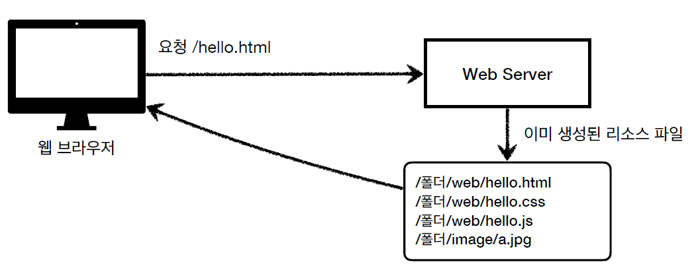
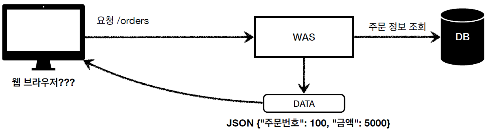
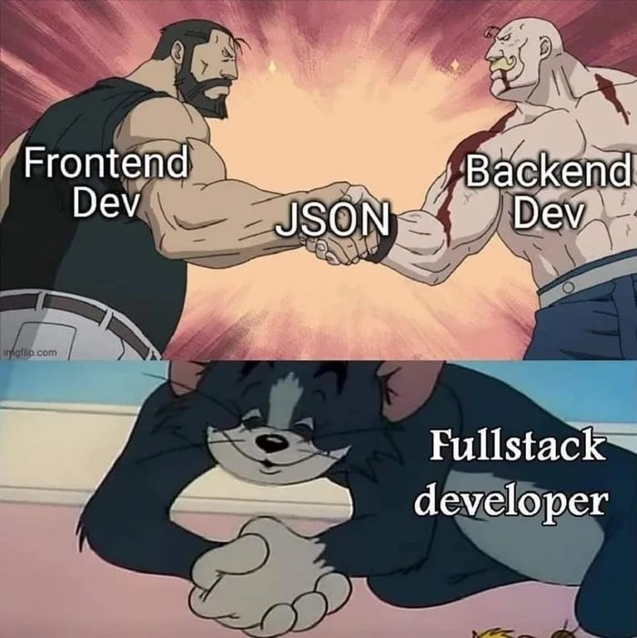

# <a href = "../README.md" target="_blank">스프링 MVC 1편 - 백엔드 웹 개발 핵심 기술</a>
## Chapter 01. 웹 어플리케이션의 이해
### 1.4 HTML, HTTP API, SSR, CSR
1) 웹 컨텐츠 리소스
2) SSR : 서버 사이드 렌더링
3) CSR : 클라이언트 사이드 렌더링
4) 선택과 집중 - 어디까지 알아야할까?

---

# 1.4 HTML, HTTP API, SSR, CSR

---

## 1) 웹 컨텐츠 리소스
결국 서버 개발자가 고민해야하는 것들
- 정적 리소스를 어떻게 제공할 것인가
- 동적 HTML 페이지를 어떻게 제공할 것인가
- HTTP API로 어떻게 서버간에 데이터를 주고받을 것인가

### 1.1 정적 리소스

- 고정된 HTML, CSS, JS, 이미지, 영상 등
- 브라우저는 정적으로 전달받은 html 파일을 해석해서 렌더링한다.

### 1.2 동적 리소스 - 동적 HTML

- 동적으로, 요청상황에 맞게 필요한 html 파일을 생성해서 전달
- 웹 브라우저는 동적으로 전달받은 html 파일을 해석해서 렌더링한다.

### 1.3 동적 리소스 - HTTP API

- 최근 웹 어플리케이션 개발 트렌드!
- HTML이 아니라 데이터(Http API)를 전달
- 데이터만 주고받는다. UI화면이 필요하다면, 클라이언트 단에서 별도로 처리한다.
  - 주로 JSON 형식으로 데이터를 주고 받는다.
- 다양한 시스템에서 호출된다.
  - 웹 클라이언트(자바스크립트)
  - 서버 - 서버 : OAuth, 공공 API, ...
  - 모바일(안드로이드, IOS)
  - PC 웹 애플리케이션
  - ...

---

## 2) SSR : 서버 사이드 렌더링

- HTML 최종 결과를 서버에서 만들어서 웹 브라우저에 전달
- 화면이 정적이고 복잡하지 않을 때 사용
- 관련기술: JSP, Thymeleaf, ...
  - 요즘 선택적으로 배운다면 스프링이 공식적으로 지원하는 `Thymeleaf`를 사용하는 것이 좋다.

---

## 3) CSR : 클라이언트 사이드 렌더링

- React, Vue.js
- 복잡하고 동적인 UI 사용
- 웹 프론트엔드 개발자의 전문 분야

---

## 4) 선택과 집중 - 어디까지 알아야할까?

- 서버 사이드 렌더링 기술 하나쯤은 학습해둘 것.
  - JSP 비추
  - 스프링에서 공식적으로 지원하는 Thymeleaf 추천
- 백엔드 엔지니어의 웹 프론트엔드 개발 기술 학습은 어디까지나 **옵션**
  - 프론트엔드, 모바일 분야 담당자들과의 최소한의 의사소통을 할 수 있도록 약간 배워두는 것은 나쁘지 않다. 
- 풀스택에 대한 환상을 버리자.
  - 백엔드 엔지니어는 수 많은 백엔드 기술을 학습하기도 벅차다.
    - Java, OOP, Spring, DB, JPA, HTTP, 인프라, OS, ...
  - 웹 프론트엔드도 깊이있게 잘 하려면 숙련에 정말 오랜 시간이 필요하다.

---