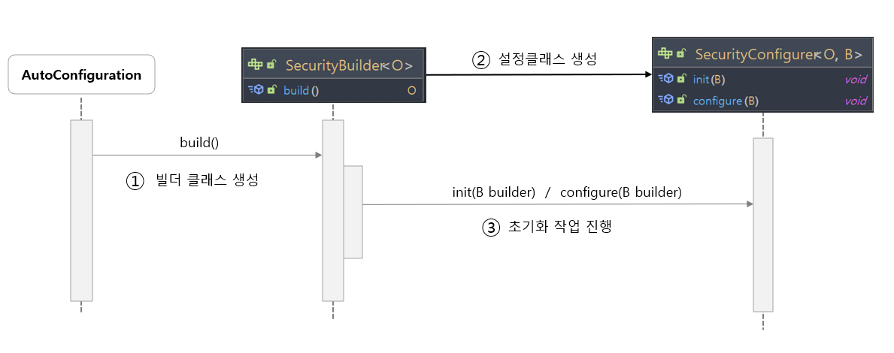

# <a href = "../README.md" target="_blank">스프링 시큐리티 OAuth2</a>
## Chapter 01. Spring Security Fundamentals
### 1.2 초기화 과정 이해 - SecurityBuilder, SecurityConfigurer
1) SecurityBuilder, SecurityConfigurer
2) 자동 설정에서의 SecurityBuilder
3) 예전 방식의 커스텀 설정 방법 : WebSecurityConfigurerAdapter
4) 최신의 커스텀 보안 설정 방법 : SecurityFilterChain 빈 등록
---

# 1.2 초기화 과정 이해 - SecurityBuilder, SecurityConfigurer

---

## 1) SecurityBuilder, SecurityConfigurer


- `SecurityBuilder` : 웹 보안을 구성하는 빈 객체, 설정 클래스들을 생성하는 역할
  - 구현체) WebSecurity, HttpSecurity, …
  - 참고) WebSecurity, HttpSecurity 순으로 초기화가 진행된다.
- `SecurityConfigurer` : Http 요청과 관련된 보안 처리를 담당하는 필터들을 생성, 여러 초기화 설정에 관여함.

---

## 2) 자동 설정에서의 SecurityBuilder

### 2.1 개요

- 자동설정에 의해, SecurityBuilder 구현체가 생성된다.
- SecurityBuilder의 `build()` 가 호출된다.
- SecurityBuilder는 이 메시지를 수신 받고, SecurityConfigurer 를 생성한다.
- SecurityConfigurer의 init, configure 메서드를 호출하여, 초기화 작업이 진행된다.

### 2.2 상세

- 애플리케이션 로딩 시점에 WebSecurity, HttpSecurity의 apply를 통해 초기화 작업을 진행한다.
  - `apply(SecurityConfigurer)`를 호출하여 초기화 대상이 될 `SecurityConfigurer` 를 생성, 적용한다.
- `build()` 를 호출한다.
- build가 호출됨에 따라 SecurityBuilder 내부적으로 여러가지 메서드가 실행된다.
  - init, build가 이 과정에서 호출된다. 여기서 Filter, AuthenticationProvider, AuthenticationManager 등 인증/인가에 필요한 여러가지 객체들이 생성된다.
  - 이전 버전의 SpringSecurity에서는 WebSecurityConfigurerAdapter의 init, build를 통해 진행됐었다. 그런데 SecurityConfigurer를 상속받은 클래스이기 때문에 본질적인 원리는 같다.
- 최종적으로 `performBuild()`가 내부적으로 호출되어 `FilterChainProxy`, `SecurityFilterChain`가 생성된다.
  - WebSecurity에서 FilterChainProxy를 생성
  - HttpSecurity에서 SecurityFilterChain을 생성
  - FilterChainProxy에서 SecurityFilterChain를 참조

---

## 3) 예전 방식의 커스텀 설정 방법 : WebSecurityConfigurerAdapter
```java
@Configuration
public class SecurityConfig extends WebSecurityConfigurerAdapter {
    @Override
    protected void configure(HttpSecurity http) throws Exception {
      // ...
    }
}
```
이 방식은 deprecated 되었고, 최신 스프링 시큐리티에서는 아예 WebSecurityConfigurerAdapter가 없어졌다.

---

## 4) 최신의 커스텀 보안 설정 방법 : SecurityFilterChain 빈 등록
```java
@Configuration
public class SecurityConfig {

    @Bean
    public SecurityFilterChain defaultSecurityFilterChain(HttpSecurity http) throws Exception {
        http.authorizeHttpRequests(request -> request.anyRequest().authenticated()); // 모든 요청에 대해 인증
        http.formLogin(); // 폼 로그인
        http.apply(new CustomSecurityConfigurer(true)); // 초기화 대상 SecurityConfigurer 등록
        return http.build();
    }
}
```
- SecurityFilterChain을 스프링 빈으로 등록
- http.apply를 통해 사용자 정의 SecurityConfigurer을 추가적으로 초기화 대상으로 지정할 수 있다.

---
