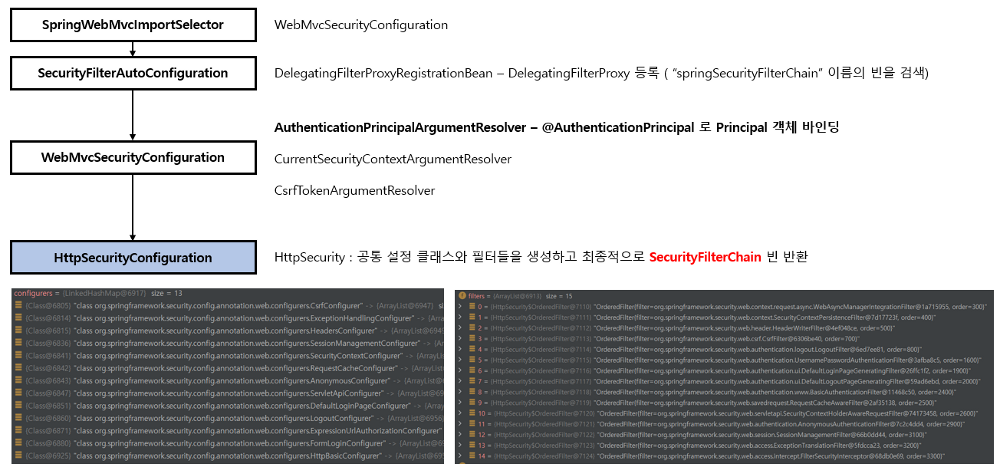

# <a href = "../README.md" target="_blank">스프링 시큐리티 OAuth2</a>
## Chapter 01. Spring Security Fundamentals
### 1.3 자동설정에 의한 초기화 과정 이해
1) 자동 설정
2) 커스텀 설정
---

# 1.3 자동설정에 의한 초기화 과정 이해

---

## 1) 자동 설정

- SpringWebMvc  ImportSelector가 실행된다.
    - ImportSelector 인터페이스는 조건에 따라 원하는 설정 클래스를 로딩해주는 계약이다.
    - WebMvCImportSelector는 이 인터페이스의 구현체이고, 디스패처 서블릿이 존재하는 지 확인하고, 디스패처 서블릿이 있다면 WebSecurityConfiguration을 로딩한다.
- SecurityFilterAutoConfiguration가 실행되고, DelegatingFilterProxyRegistrationBean이라는 빈 클래스를 생성한다.
    - DelegatingFilterProxyRegistrationBean은 DelegatingFilterProxy를 등록하는 역할을 수행
        - DelegatingFilterProxy는 ‘springSecurityFilterChain’ 이름을 가진 빈을 검색한다.
        - 이 빈을 검색하면 이후 우리가 등록할 `FilterChainProxy`가 검색되어진다.
        - 이후 doFilter 요청이 들어오면 이 필터에 위임한다.
- WebMvcSecurityConfiguration 이 실행된다. 이 클래스는 여러가지 ArgumentResolver를 등록한다.
    - AuthenticationPrincipalArgumentResolver
        - 이 ArgumentResolver가 있다면 메서드 파라미터에 `@AuthenticationPrincipal` 어노테이션이 달려있려있을 때 `Principal` 로 객체를 바인딩해준다.
    - CurrentSecurityContextArgumentResolver
    - CsrfTokenArgumentResolver
- HttpSecurityConfiguration 이 실행된다. (최근 스프링 시큐리티에서 생성됨)
    - 이 설정 클래스는 HttpSecurity를 생성한다. (싱글톤이 아닌, 프로토 타입으로 생성됨)
        - HttpSecurity는 기본 SecurityConfigurer들을 생성한다. 이 SecurityConfigurer들에는 init, build 메서드가 구현되어 있다. 이 메서드들을 통해 인증/인가에 필요한 여러가지 필터들이 생성된다.

- SpringBootWebSecurityConfiguration 이 실행된다.(스프링 부트의 기본 설정)
    - 앞의 HttpSecurityConfiguration 에서 생성된 HttpSecurity를 주입받아서, Form 로그인 및 HttpBasic 로그인 기능을 추가 정의한 기본 SecurityFilterChian 빈을 정의한다.
- WebSecurityConfiguration 이 실행된다.
    - WebSecurity를 만든다.
    - WebSecurity는 내부적으로 `securityFilterChainBuilders` 를 갖고 있는데, 이는 `SecuriyBuilder` (우리가 앞에서 만든 HttpSecuriy도 여기에 포함된다.)들의 리스트이다.
        - SecuriryBuilder는 SecuriyFilterChain을 갖고 있다.
    - Web Security는 SecuriyBuilder 각각에게 build 메서드를 호출하면, SecuirtyBuilder에서 SecuriryFilterChain를 만들어 반환하고, 이들을 모아 `FilterChainProxy` 생성자에게 전달한다.
        - 스프링 부트가 기본적으로 주입해주는 filterChain은 DefaultSecurityFilterChain이다.

---

## 2) 커스텀 설정

- 우리가 커스텀 `SecurityFilterChain` 을 빈으로 등록하면, SpringBootWebSecurityConfiguration의 SecurityFilterChainConfigurations가 구동되지 않는다.
- 여러개의 SecurrityFilterChain을 수동으로 등록하면, 모두 SecurityFilterChains에 등록되어 체이닝된다.(이들은 각각 프로토타입으로 생성된다.)

---
