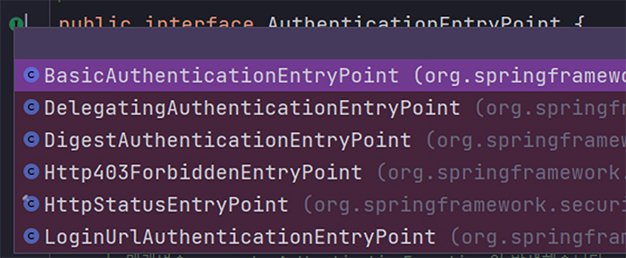

# <a href = "../README.md" target="_blank">스프링 시큐리티 OAuth2</a>
## Chapter 01. Spring Security Fundamentals
### 1.4 AuthenticationEntryPoint의 이해
1) AuthenticationEntryPoint 란?
2) ExceptionHandlingConfigurer
3) 실습 코드

---

# 1.4 AuthenticationEntryPoint의 이해

---

## 1) 인증 예외 처리의 필요성
- 한 애플리케이션에서 지원하는 인증 방식은 여러가지가 있다. 예를 들어, 하나의 애플리케이션에서 어떤 인증방식도 제공되지 않을 수 있고,
Form 인증 방식이 지원될 수도 있으며, HttpBasic 인증 방식이 제공될 수도 있다.
- 특정 인증 방식 하나만 지원하지 않고, 여러 개의 인증 방식이 동시에 지원될 수 있다.
- 어떤 방식이든, 인증을 요구하는 애플리케이션에서 인증되지 않은 사용자가 리소스에 접근할 경우 인증 예외가 발생하게 되는데
후속 처리를 담당할 계층이 필요하다.

---

## 2) AuthenticationEntryPoint 계약

### 2.1 계약
```java
public interface AuthenticationEntryPoint {

    void commence(HttpServletRequest request, HttpServletResponse response, AuthenticationException authException)
            throws IOException, ServletException;

} 
```
스프링 시큐리티에서 인증 예외 발생 시 후속 처리는`AuthenticationEntryPoint` 인터페이스로 표준화 시켰다.  
commence 메서드를 통해 인증 예외의 후속처리를 수행할 수 있다.

### 2.2 스프링 시큐리티에서 제공하는 구현체


스프링 시큐리티는 AuthenticationEntryPoint는 다음과 같은 기본 구현체를 제공한다.
- `BasicAuthenticationEntryPoint` : HttpBasic 인증 방식 사용 시 스프링이 기본적으로 적용
- `LoginUrlAuthenticationEntryPoint` : Form 인증 방식 사용 시 스프링이 기본적으로 적용
- `DigestAuthenticationEntryPoint` : Digest 인증 방식이 사용 시 스프링이 기본적으로 적용
- `Http403ForbiddenEntryPoint` : 어떤 인증 방식도 존재하지 않을 경우 스프링이 기본적으로 적용
- `HttpStatusEntryPoint` : Http 상태코드만 전달하고 싶을 때 쓸 수 있도록 제공되는 EntryPoint
- `DelegatingAuthenticationEntryPoint` : 내부적으로 key를 RequestMatcher, value를 AuthenticationEntryPoint 로 하는 Map을 가짐. 복수의 AuthenticationEntryPoint를 동시에 지원하고 싶을 때 사용한다.

---

그렇다면, 위의 AuthenticationEntryPoint는 어떻게 등록할 것일까, 그리고 스프링은 이들을 어떻게 등록해줄 것이며, 최종적으로 구성된 Filter에서는 어떻게 사용되는걸까?

---

## 3) 설정 - ExceptionHandlingConfigurer

### 3.1 ExceptionHandlingConfigurer

```java
public final class ExceptionHandlingConfigurer<H extends HttpSecurityBuilder<H>>
		extends AbstractHttpConfigurer<ExceptionHandlingConfigurer<H>, H> {

	// 생략
}
```
`ExceptionHandlingConfigurer`은 스프링 시큐리티의 인증/인가 예외를 처리할 필터, ExceptionTranslationFilter 구성을 담당하는 클래스이다.
이 클래스에 `AuthenticationEntryPoint`를 등록하고, 이를 기반으로 인증/인가 후속처리를 담당하는 필터 `ExceptionTranslationFilter` 를 구성할 수 있다.

### 3.2 필드
```java

	private AuthenticationEntryPoint authenticationEntryPoint;
	private AccessDeniedHandler accessDeniedHandler;
	private LinkedHashMap<RequestMatcher, AuthenticationEntryPoint> defaultEntryPointMappings = new LinkedHashMap<>();
	private LinkedHashMap<RequestMatcher, AccessDeniedHandler> defaultDeniedHandlerMappings = new LinkedHashMap<>();
```
- 이 클래스는 내부적으로 4개의 필드를 가진다.
  - `AuthenticationEntryPoint` : 사용자가 수동으로 등록한 커스텀 AuthenticationEntryPoint가 이곳으로 등록된다.
  - `AccessDeniedHandler` : 사용자가 수동으로 등록한 커스텀 AccessDeniedHandler가 이 곳에 등록된다. (이 글 작성시점에 이 부분을 학습하지 않았는데, 정황상으로 보면 인가와 관련된 예외발생 시 후속처리를 이 곳에서 담당하는 것으로 추정된다.)
  - `defaultEntryPointMappings` : 스프링 시큐리티 설정 과정에서 등록된 기본 `AuthenticationEntryPoint`들이 이곳에 등록된다. (이것들이 등록되는 과정은 바로 아래에서 다룰 것이다.)
  - `defaultDeniedHandlerMappings` : 스프링 시큐리티 설정 과정에서 등록된 기본 `AccessDeniedHandle` 들이 이곳에 등록된다. (이것들이 등록되는 과정은 바로 아래에서 다룰 것이다.)

### 3.3 디폴트 EntryPoint의 등록 과정
```java
// ExceptionHandlingConfigurer의 defaultAuthenticationEntryPointFor(...) 메서드
public ExceptionHandlingConfigurer<H> defaultAuthenticationEntryPointFor(AuthenticationEntryPoint entryPoint,
			RequestMatcher preferredMatcher) {
		this.defaultEntryPointMappings.put(preferredMatcher, entryPoint);
		return this;
	}
```
```java
// httpBasic 인증 활성화
@Configuration
public class SecurityConfig {

    @Bean
    public SecurityFilterChain securityFilterChain(HttpSecurity http) throws Exception {
        http.authorizeHttpRequests().anyRequest().authenticated();
        http.httpBasic();
        return http.build();
    }
}
```
우리가 스프링 시큐리티 설정 작업에서에서, Http Basic  인증방식, Form 로그인 방식, Digest 인증 방식 또는 HttpBasic 인증 방식을 활성화하였을 때 `defaultEntryPointMappings` 에는 `BasicAuthenticationEntryPoint` , `LoginUrlAuthenticationEntryPoint` , `DigestAuthenticationEntryPoint` 가 추가되어진다. (이 과정에서 ExceptionHandlingConfigurer의 `defaultAuthenticationEntryPointFor`가 호출되어 진다.)

### 3.4 커스텀 EntryPoint의 등록 과정
```java
// 사용자의 커스텀 AuthenticationEntryPoint

@Slf4j
public class CustomAuthenticationEntryPoint implements AuthenticationEntryPoint {

    @Override
    public void commence(HttpServletRequest request, HttpServletResponse response, AuthenticationException authException) throws IOException, ServletException {
        log.info("가장 우선시된다.");
    }
}
```
```java
// ExceptionHandlingConfigurer 의 authenticationEntryPoint(...) 메서드
public ExceptionHandlingConfigurer<H> authenticationEntryPoint(AuthenticationEntryPoint authenticationEntryPoint) {
		this.authenticationEntryPoint = authenticationEntryPoint;
		return this;
	}
```
```java
// 사용자의 CustomAuthenticationEntryPoint 수동 등록
@Configuration
public class SecurityConfig {

    @Bean
    public SecurityFilterChain securityFilterChain(HttpSecurity http) throws Exception {
        http.authorizeHttpRequests().anyRequest().authenticated();
        http.formLogin();
        http.exceptionHandling().authenticationEntryPoint(new CustomAuthenticationEntryPoint());
        return http.build();
    }
}
```
사용자가, 커스텀 AuthenticationEntryPoint를 수동으로 등록하였을 때 이들은 `ExceptionHandlingConfigurer` 의 AuthenticationEntryPoint 필드에 등록되어 진다. (이 과정에는 `authenticationEntryPoint` 메서드가 호출 되어 지정된다.)

### 3.5 AuthenticationEntryPoint 결정 및 ExceptionTranslationFilter 구성

```java
AuthenticationEntryPoint getAuthenticationEntryPoint(H http) {
    AuthenticationEntryPoint entryPoint = this.authenticationEntryPoint;
    if (entryPoint == null) {
        entryPoint = createDefaultEntryPoint(http);
    }
    return entryPoint;
}

private AuthenticationEntryPoint createDefaultEntryPoint(H http) {
    if (this.defaultEntryPointMappings.isEmpty()) {
        return new Http403ForbiddenEntryPoint();
    }
    if (this.defaultEntryPointMappings.size() == 1) {
        return this.defaultEntryPointMappings.values().iterator().next();
    }
    DelegatingAuthenticationEntryPoint entryPoint = new DelegatingAuthenticationEntryPoint(
            this.defaultEntryPointMappings);
    entryPoint.setDefaultEntryPoint(this.defaultEntryPointMappings.values().iterator().next());
    return entryPoint;
}
```
최종적으로 ExceptionTranslationFilter를 구성할 때, AuthenticationEntryPoint를 하나 넘겨야한다. 이를 결정하는 로직이 필요한데 이 부분은 위의 메서드를 살펴보면 어느 정도 알 수 있다.
- 커스텀 AuthenticationEntryPoint가 지정되어 있다 → 최우선적으로 선택
- 커스텀 AuthenticationEntryPoint가 없다.
    - DefaultAuthenticationEntryPoint가 없을 때
        - `Http403ForbiddenEntryPoint` 가 등록된다. 실제 요청측에는 403 상태코드가 전달된다.
    - `DefaultAuthenticationEntryPoint`가 1개 있을 때
        - 해당  `AuthenticationEntryPoint` 가 등록된다.
        - Form 인증 활성화, HttpBasic 인증 활성화, Digest 인증 활성화를 하면 등록되는 EntryPoint들이 이에 해당된다.
    - `DefaultAuthenticationEntryPoint`가 2개 이상 있을 때
        - 2개 이상의 인증 방식을 지정했다면 2개 이상의 EntryPoint들이 등록되는데, 이 경우에는 이들 모두를 지원하는 `DelegatingAuthenticationEntryPoint` 를 만들어서, 해당 AuthenticationEntryPoint를 등록한다. 실제 인증 예외가 발생하여 이 entryPoint의 `commence(...)` 가 호출되면, 내부적으로 가진 복수의 AuthenticationEntryPoint 들에게 순서대로 질의하여 해당 인증 예외 처리할 수 있는지 여부를 확인하고 처리할 수 있으면 해당 방식대로 처리하도록 한다.
        - 예를 들어 HttpBasic 인증, Form 인증이 모두 활성화되었을 때 Form 인증을 하게 되면 `DelegatingAuthenticationEntryPoint` 에 등록된 `LoginUrlAuthenticationEntryPoint` 가 실행된다.

---

## 4) 실습 코드
- [링크](https://github.com/ttasjwi/spring-security-oauth2/commits/SpringSecurity-Fundamentals_AuthenticationEntryPoint)

---
