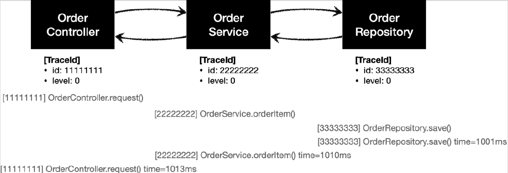

# <a href = "../README.md" target="_blank">스프링 핵심 원리 - 고급편</a>
## Chapter 01. 예제 만들기
### 1.5 로그 추적기 V1 - 적용
1) `v0` -> `v1`
2) 각 계층마다 로그 추적기 의존관계 추가
3) 각 메서드 시작/종료 시점에 로그 추적기 코드 실행 - V1 적용
4) 실행 및 로그 확인
5) 남은 문제 : 메서드 깊이 표현, HTTP 요청 구분
---

# 1.5 로그 추적기 V1 - 적용

---

## 1) `v0` -> `v1` 복사

### 1.1 복사
- `hello.advanced.app.v1` 패키지 생성
- 복사
  - `v0.OrderRepositoryV0` → `v1.OrderRepositoryV1`
  - `v0.OrderServiceV0` → `v1.OrderServiceV1`
  - `v0.OrderControllerV0` → `v1.OrderControllerV1`

### 1.2 v1 의존관계 변경
코드 내부 의존관계를 클래스를 V1으로 변경한다.
- `OrderControllerV1` : `OrderServiceV0` → `OrderServiceV1`
- `OrderServiceV1` : `OrderRepositoryV0` → `OrderRepositoryV1`

### 1.3 컨트롤러 매핑 정보 변경
- `OrderControllerV1` 매핑 정보 변경
  - `@GetMapping("/v1/request")`

### 1.4 실행 확인
실행해서 정상 동작하는지 확인하자.
- 실행: `http://localhost:8080/v1/request?itemId=hello`
- 결과: "ok"

---

## 2) 각 계층마다 로그 추적기 의존관계 추가
```java
@RestController
@RequiredArgsConstructor
public class OrderControllerV1 {
    private final HelloTraceV1 trace; // 추가
}
```
```java
@Service
@RequiredArgsConstructor
public class OrderServiceV1 {
    private final HelloTraceV1 trace; // 추가
}
```
```java
@Repository
@RequiredArgsConstructor
public class OrderRepositoryV1 {
    private final HelloTraceV1 trace; // 추가
}
```
로그 추적기를 사용하기 위해 `HelloTraceV1` 의존관계를 추가한다.
  - HelloTraceV1 은 `@Component` 어노테이션을 가지고 있기 때문에 컴포넌트 스캔의 대상이 된다. 따라서 자동으로 스프링 빈으로 등록된다.
  - 롬복의 `@RequriedArgsConstructor`는 final이 붙은 필드를 인자로 하는 생성자를 만든다.
  - 스프링은 생성자가 하나뿐인 스프링 빈에 대하여 `@Autowired`가 없으면 생성자를 통해 빈을 주입하여 빈을 등록한다.

---

## 3) 각 메서드 시작/종료 시점에 로그 추적기 코드 실행 - V1 적용

### 3.1 OrderControllerV1
```java
    @GetMapping("/v1/request")
    public String request(String itemId) {

        TraceStatus status = null;
        try {
            status = trace.begin("OrderController.request()");
            orderService.orderItem(itemId);
            trace.end(status);
            return "ok";
        } catch (Exception e) {
            trace.exception(status, e);
            throw e; // 예외를 반드시 컨트롤러 밖으로 던져주어야 함.
        }
    }
```
- `trace.begin("OrderController.request()")`
  - 로그를 시작할 때 메시지 이름으로 컨트롤러 이름 + 메서드 이름을 주었다.
  - 이렇게 하면 어떤 컨트롤러와 메서드가 호출되었는지 로그로 편리하게 확인할 수 있다. 물론 수작업이다.
- 단순하게 `trace.begin()` , `trace.end()` 코드 두 줄만 적용하면 될 줄 알았지만, 실상은 그렇지 않다.
`trace.exception()` 으로 예외까지 처리해야 하므로 지저분한 try , catch 코드가 추가된다.
- `begin()` 의 결과 값으로 받은 `TraceStatus status` 값을 `end()` , `exception()` 에 넘겨야 한다.
  결국 try , catch 블록 모두에 이 값을 넘겨야한다. 따라서 try 상위에 `TraceStatus status` 코드를
  선언해야 한다. 만약 try 안에서 `TraceStatus status` 를 선언하면 try 블록안에서만 해당 변수가
  유효하기 때문에 catch 블록에 넘길 수 없다. 따라서 컴파일 오류가 발생한다.
- `throw e` : 예외를 꼭 다시 던져주어야 한다. 그렇지 않으면 여기서 예외를 먹어버리고, 이후에 정상
  흐름으로 동작한다. 로그는 애플리케이션에 흐름에 영향을 주면 안된다. 로그 때문에 예외가 사라지면
  안된다.

### 3.2 OrderServiceV1
```java
    public void orderItem(String itemId) {
        TraceStatus status = null;
        try {
            status = trace.begin("OrderService.orderItem()");
            orderRepository.save(itemId);
            trace.end(status);
        } catch (Exception e) {
            trace.exception(status, e);
            throw e; // 예외를 꼭 다시 던져주어야 한다.
        }
    }
```

### 3.3 OrderRepositoryV1
```java
    public void save(String itemId) {
        TraceStatus status = null;
        try {
            status = trace.begin("OrderRepository.save()");

            // 저장 로직
            if (itemId.equals("ex")) {
                throw new IllegalArgumentException("예외 발생!");
            }
            sleep(1000); // 상품이 저장되는데 1초 걸린다.

            trace.end(status);
        } catch (Exception e) {
            trace.exception(status, e);
            throw e; // 예외를 꼭 다시 던져주어야 한다.
        }
    }
```

---

## 4) 실행 및 로그 확인

### 4.1 정상 실행
http://localhost:8080/v1/request?itemId=hello

```shell
[11111111] OrderController.request()
[22222222] OrderService.orderItem()
[33333333] OrderRepository.save()
[33333333] OrderRepository.save() time=1000ms
[22222222] OrderService.orderItem() time=1001ms
[11111111] OrderController.request() time=1001ms
```

- 아직 level 관련 기능을 개발하지 않았으므로 level 값은 항상 0이다. 
- 트랜잭션ID 값도 다르다. 이 부분은 아직 개발하지 않았다.

### 4.2 예외 실행
http://localhost:8080/v1/request?itemId=ex

```shell
[5e110a14] OrderController.request()
[6bc1dcd2] OrderService.orderItem()
[48ddffd6] OrderRepository.save()
[48ddffd6] OrderRepository.save() time=0ms ex=java.lang.IllegalStateException: 예외 발생!
[6bc1dcd2] OrderService.orderItem() time=6ms ex=java.lang.IllegalStateException: 예외 발생!
[5e110a14] OrderController.request() time=7ms ex=java.lang.IllegalStateException: 예외 발생!
```

---

## 5) 남은 문제 : 메서드 깊이 표현, HTTP 요청 구분

### 요구사항
- ~~모든 PUBLIC 메서드의 호출과 응답 정보를 로그로 출력~~
- 애플리케이션의 흐름을 변경하면 안됨
- ~~로그를 남긴다고 해서 비즈니스 로직의 동작에 영향을 주면 안됨~~
- ~~메서드 호출에 걸린 시간~~
- ~~정상 흐름과 예외 흐름 구분~~
- ~~예외 발생시 예외 정보가 남아야 함~~
- 메서드 호출의 깊이 표현
- HTTP 요청을 구분
  - HTTP 요청 단위로 특정 ID를 남겨서 어떤 HTTP 요청에서 시작된 것인지 명확하게 구분이 가능해야
  함
  - 트랜잭션 ID (DB 트랜잭션X)

### 남은 문제
- 아직 구현하지 못한 요구사항은 메서드 호출의 깊이를 표현하고, 같은 HTTP 요청이면 같은 트랜잭션 ID를
  남기는 것이다.
- 이 기능은 직전 로그의 깊이와 트랜잭션 ID가 무엇인지 알아야 할 수 있는 일이다.
- 예를 들어서 `OrderController.request()` 에서 로그를 남길 때 어떤 깊이와 어떤 트랜잭션 ID를
  사용했는지를 그 다음에 로그를 남기는 `OrderService.orderItem()` 에서 로그를 남길 때 알아야한다.
  - 결국 현재 로그의 상태 정보인 `트랜잭션ID` 와 `level` 이 다음으로 전달되어야 한다.
  - 정리하면 로그에 대한 문맥( Context ) 정보가 필요하다.

---
