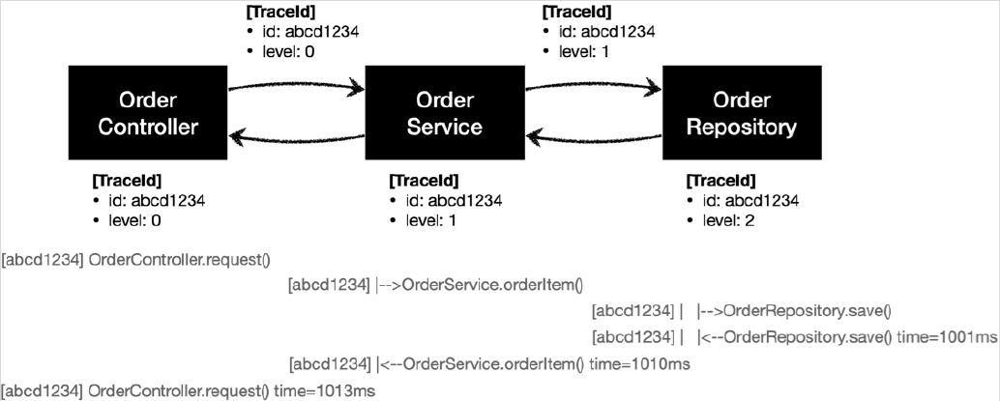

# <a href = "../README.md" target="_blank">스프링 핵심 원리 - 고급편</a>
## Chapter 01. 예제 만들기
### 1.7 로그 추적기 V2 - 적용
1) `v1` -> `v2` 복사
2) V2 적용하기 : 메서드마다 traceId 파라미터 추가
3) 실행 및 로그 분석
4) 파라미터를 수정하지 않고 TraceId를 동기화할 방법이 필요

---

## 1.7 로그 추적기 V2 - 적용

---

## 1) `v1` -> `v2` 복사

### 1.1 복사
- `hello.advanced.app.v2` 패키지 생성
- 복사
    - `v1.OrderRepositoryV1` → `v2.OrderRepositoryV2`
    - `v1.OrderServiceV1` → `v2.OrderServiceV2`
    - `v1.OrderControllerV1` → `v2.OrderControllerV2`

### 1.2 v2 의존관계 변경
코드 내부 의존관계를 클래스를 V2으로 변경한다.
- `OrderControllerV2` : `OrderServiceV1` → `OrderServiceV2`
- `OrderServiceV2` : `OrderRepositoryV1` → `OrderRepositoryV2`

### 1.3 컨트롤러 매핑 정보 변경
- `OrderControllerV2` 매핑 정보 변경
    - `@GetMapping("/v2/request")`

### 1.4 실행 확인
실행해서 정상 동작하는지 확인하자.
- 실행: `http://localhost:8080/v1/request?itemId=hello`
- 결과: v1 의 코드를 그대로 복사했기 때문에 v1 과 같은 로그가 출력되면 성공이다.

---

## 2) V2 적용하기 : 메서드마다 traceId 파라미터 추가

### 2.1 개요 

- 메서드 호출의 깊이를 표현하고, HTTP 요청도 구분해보자.
- 이렇게 하려면 처음 로그를 남기는 `OrderController.request()` 에서 로그를 남길 때 어떤 깊이와 어떤
트랜잭션 ID를 사용했는지 다음 차례인 `OrderService.orderItem()` 에서 로그를 남기는 시점에
알아야한다.
- 결국 현재 로그의 상태 정보인 트랜잭션ID 와 level 이 다음에 호출되는 메서드로 전달되어야 한다.
- 이 정보는 `TraceStatus.traceId` 에 담겨있다. 따라서 traceId 를 컨트롤러에서 서비스를 호출할 때 넘겨줘야한다.
- 마찬가지로 서비스에서 리포지토리를 호출할 때도 traceId를 넘겨줘야한다.

### 2.2 로그추적기 의존관계 변경
```java
@RestController
@RequiredArgsConstructor
public class OrderControllerV2 {
    private final HelloTraceV2 trace; // v2로 변경
}
```
```java
@Service
@RequiredArgsConstructor
public class OrderServiceV2 {
    private final HelloTraceV21 trace; // v2로 변경
}
```
```java
@Repository
@RequiredArgsConstructor
public class OrderRepositoryV2 {
    private final HelloTraceV2 trace; // v2로 변경
}
```
beginSync 메서드가 추가된 로그 추적기를 사용하기 위해 `HelloTraceV2`로 의존관계를 변경한다.

### 2.3 OrderControllerV2
```java
    @GetMapping("/v2/request")
    public String request(String itemId) {

        TraceStatus status = null;
        try {
            status = trace.begin("OrderController.request()");
            orderService.orderItem(status.getTraceId(), itemId);
            trace.end(status);
            return "ok";
        } catch (Exception e) {
            trace.exception(status, e);
            throw e; // 예외를 반드시 컨트롤러 밖으로 던져주어야 함.
        }
    }
```
- `TraceStatus status = trace.begin()` 에서 반환 받은 `TraceStatus` 에는 트랜잭션ID 와 level 정보가 있는 `TraceId` 가 있다.
- `orderService.orderItem()` 을 호출할 때 TraceId 를 파라미터로 전달한다.
- `TraceId` 를 파라미터로 전달하기 위해 `OrderServiceV2.orderItem()` 의 파라미터에 `TraceId` 를 추가해야 한다.

### 2.4 OrderServiceV2
```java
    public void orderItem(TraceId traceId, String itemId) {
        TraceStatus status = null;
        try {
            status = trace.beginSync(traceId, "OrderService.orderItem()");
            orderRepository.save(status.getTraceId(), itemId);
            trace.end(status);
        } catch (Exception e) {
            trace.exception(status, e);
            throw e; // 예외를 꼭 다시 던져주어야 한다.
        }
    }
```
- `orderItem()` 은 파라미터로 전달 받은 `traceId` 를 사용해서 `trace.beginSync()` 를 실행한다.
- `beginSync()` 는 내부에서 다음 `traceId` 를 생성하면서 트랜잭션ID는 유지하고 level 은 하나 증가시킨다.
- `beginSync()` 가 반환한 새로운 `TraceStatus` 를 `orderRepository.save()` 를 호출하면서 파라미터로 전달한다.
-  `TraceId` 를 파라미터로 전달하기 위해 `orderRepository.save()` 의 파라미터에 `TraceId` 를 추가해야 한다.

### 2.5 OrderRepositoryV2
```java
    public void save(TraceId traceId, String itemId) {
        TraceStatus status = null;
        try {
            status = trace.beginSync(traceId, "OrderRepository.save()");

            // 저장 로직
            if (itemId.equals("ex")) {
                throw new IllegalArgumentException("예외 발생!");
            }
            sleep(1000); // 상품이 저장되는데 1초 걸린다.

            trace.end(status);
        } catch (Exception e) {
            trace.exception(status, e);
            throw e; // 예외를 꼭 다시 던져주어야 한다.
        }
    }
```
- `save()` 는 파라미터로 전달 받은 `traceId` 를 사용해서 `trace.beginSync()` 를 실행한다.
- `beginSync()` 는 내부에서 다음 `traceId` 를 생성하면서 트랜잭션ID는 유지하고 level 은 하나
증가시킨다.
- `beginSync()` 는 이렇게 갱신된 traceId 로 새로운 `TraceStatus` 를 반환한다.
- `trace.end(status)` 를 호출하면서 반환된 `TraceStatus` 를 전달한다.

---

## 3) 실행 및 로그 분석

### 3.1 정상 실행 흐름 
```shell
[c80f5dbb] OrderController.request()
[c80f5dbb] |-->OrderService.orderItem()
[c80f5dbb] | |-->OrderRepository.save()
[c80f5dbb] | |<--OrderRepository.save() time=1005ms
[c80f5dbb] |<--OrderService.orderItem() time=1014ms
[c80f5dbb] OrderController.request() time=1017ms
```
http://localhost:8080/v2/request?itemId=hello

### 3.2 예외 흐름
```shell
[ca867d59] OrderController.request()
[ca867d59] |-->OrderService.orderItem()
[ca867d59] | |-->OrderRepository.save()
[ca867d59] | |<X-OrderRepository.save() time=0ms ex=java.lang.IllegalStateException: 예외 발생!
[ca867d59] |<X-OrderService.orderItem() time=7ms ex=java.lang.IllegalStateException: 예외 발생!
[ca867d59] OrderController.request() time=7ms ex=java.lang.IllegalStateException: 예외 발생!
```

### 3.3 로그 확인
- 실행 로그를 보면 같은 HTTP 요청에 대해서 트랜잭션ID 가 유지되고, level 도 잘 표현되는 것을 확인할 수 있다.

---

## 4) 남은 문제 : 파라미터를 수정하지 않고 TraceId를 동기화할 방법이 필요

### 4.1 요구사항
드디어 모든 요구사항을 만족했다.

- ~~모든 PUBLIC 메서드의 호출과 응답 정보를 로그로 출력~~
- ~~애플리케이션의 흐름을 변경하면 안됨~~
- ~~로그를 남긴다고 해서 비즈니스 로직의 동작에 영향을 주면 안됨~~
- ~~메서드 호출에 걸린 시간~~
- ~~정상 흐름과 예외 흐름 구분~~
  - ~~예외 발생시 예외 정보가 남아야 함~~
- ~~메서드 호출의 깊이 표현~~
- ~~HTTP 요청을 구분~~
  - ~~HTTP 요청 단위로 특정 ID를 남겨서 어떤 HTTP 요청에서 시작된 것인지 명확하게 구분이 가능해야
  함~~
  - ~~트랜잭션 ID (DB 트랜잭션X)~~

### 4.2 남은 문제
- HTTP 요청을 구분하고 깊이를 표현하기 위해서 `TraceId` 동기화가 필요하다.
- `TraceId` 의 동기화를 위해서 관련 메서드의 모든 파라미터를 수정해야 한다.
  - 만약 인터페이스가 있다면 인터페이스까지 모두 고쳐야 하는 상황이다.
- 로그를 처음 시작할 때는 `begin()` 을 호출하고, 처음이 아닐때는 `beginSync()` 를 호출해야 한다.
  - 만약에 컨트롤러를 통해서 서비스를 호출하는 것이 아니라, 다른 곳에서 서비스를 처음으로 호출하는
    상황이라면 파리미터로 넘길 TraceId 가 없다.
- **HTTP 요청을 구분하고 깊이를 표현하기 위해서 TraceId 를 파라미터로 넘기는 것 말고 다른 대안은
  없을까?**

---
