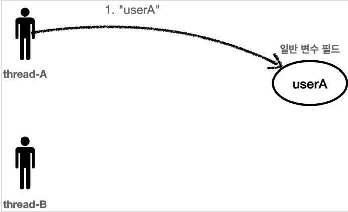
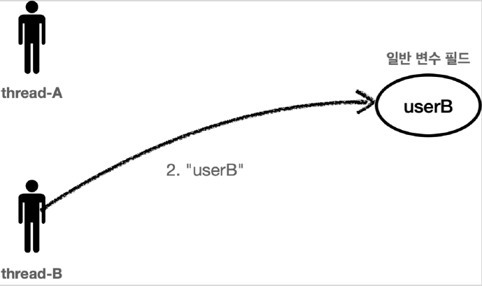
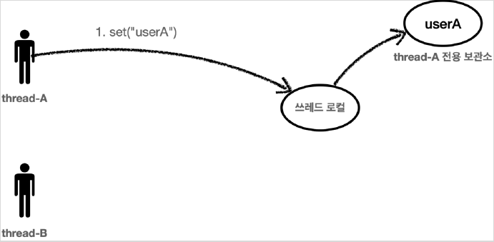

# <a href = "../README.md" target="_blank">스프링 핵심 원리 - 고급편</a>
## Chapter 02. 스레드 로컬 - ThreadLocal
### 2.5 ThreadLocal - 소개
1) 기존 : 일반적인 변수 필드에 여러 스레드가 데이터를 저장하는 방식
2) 스레드 로컬 : 각 스레드마다 할당된 특별한 저장소
3) 스레드 로컬 : 흐름
---

# 2.5 ThreadLocal - 소개

---

## 1) 기존 : 일반적인 변수 필드에 여러 스레드가 데이터를 저장하는 방식

- 여러 스레드가 같은 인스턴스의 필드에 접근하면 처음 쓰레드가 보관한 데이터가 사라질 수 있다.
- thread-A 가 userA 라는 값을 저장하고 thread-B 가 userB 라는 값을 저장하면 직전에 thread-A 가 저장한 userA 값은 사라진다.

---

## 2) 스레드 로컬 : 각 스레드마다 할당된 특별한 저장소

### 2.1 해당 스레드만 접근할 수 있는 특별한 저장소
- 쓰레드 로컬은 해당 쓰레드만 접근할 수 있는 특별한 저장소를 말한다.
  - 쉽게 이야기해서 물건 보관 창구를 떠올리면 된다. 여러 사람이 같은 물건 보관 창구를 사용하더라도 창구 직원은 사용자를 인식해서
    사용자별로 확실하게 물건을 구분해준다.
  - 사용자A, 사용자B 모두 창구 직원을 통해서 물건을 보관하고, 꺼내지만 창구 지원이 사용자에 따라 보관한
    물건을 구분해주는 것이다.

### 2.2 순수 java 언어 차원에서 지원하는 기술이다.
- java는 언어차원에서 쓰레드 로컬을 지원하기 위한 `java.lang.ThreadLocal` 클래스를 제공한다.

---

## 3) 스레드 로컬 : 흐름

### 3.1 스레드 A : 스레드 A 전용 보관소에 "userA" 저장

`thread-A` 가 "userA" 라는 값을 저장하면 쓰레드 로컬은 `thread-A` 전용 보관소에 데이터를 안전하게
보관한다.

### 3.2 스레드 B : 스레드 B 전용 보관소에 "userB" 저장

`thread-B` 가 "userB" 라는 값을 저장하면 쓰레드 로컬은 `thread-B` 전용 보관소에 데이터를 안전하게
보관한다.

### 3.3 스레드 A, 스레드 B가 각각 전용 보관소에서 조회

- 스레드 로컬을 통해서 데이터를 조회할 때도 `thread-A` 가 조회하면 쓰레드 로컬은 `thread-A` 전용
  보관소에서 "userA" 데이터를 반환해준다.
- 물론 `thread-B` 가 조회하면 `thread-B` 전용 보관소에서 userB 데이터를 반환해준다.

---
