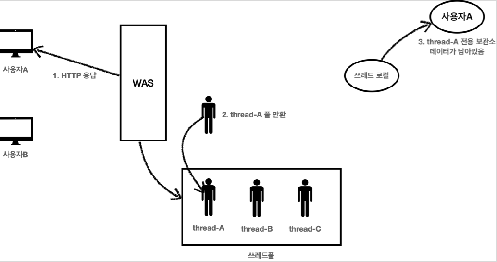
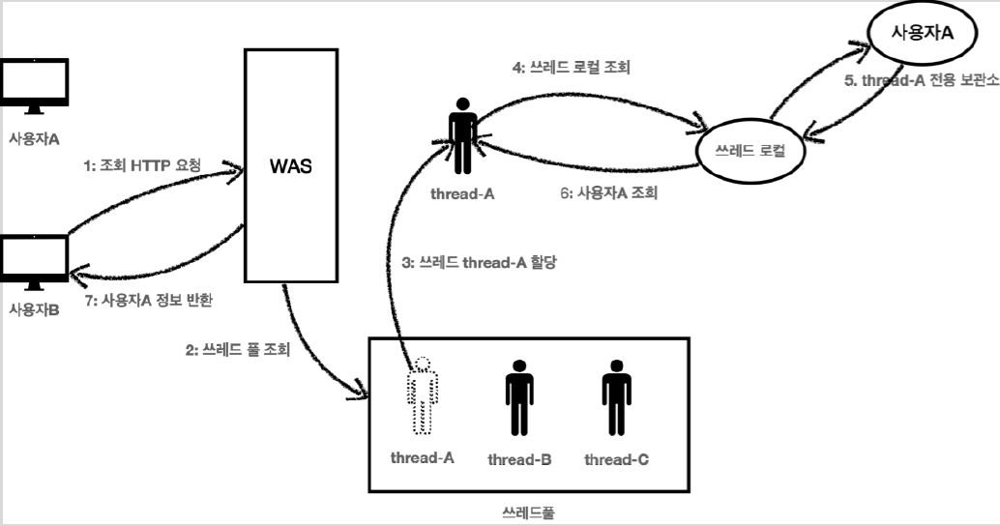

# <a href = "../README.md" target="_blank">스프링 핵심 원리 - 고급편</a>
## Chapter 02. 스레드 로컬 - ThreadLocal
### 2.9 스레드 로컬 - 주의사항
1) 스레드 로컬 사용 후 저장 값 제거를 안 하면, 사용자 정보 유출 위험이 있다.
2) 스레드 로컬 사용 후 반드시 `remove`를 호출 하자.

---

# 2.9 스레드 로컬 - 주의사항

---

## 1) 스레드 로컬 사용 후 저장 값 제거를 안 하면, 사용자 정보 유출 위험이 있다.
스레드 로컬의 값을 사용 후 제거하지 않고 그냥 두면,  
WAS(톰캣)처럼 스레드 풀을 사용하는 경우에 심각한 문제가 발생할 수 있다.

### 1.1 사용자 A의 저장 요청

1. 사용자A가 저장 HTTP를 요청했다.
2. WAS는 스레드 풀에서 쓰레드를 하나 조회한다.
3. 스레드 `thread-A` 가 할당되었다.
4. `thread-A` 는 사용자A 의 데이터를 쓰레드 로컬에 저장한다.
5. 스레드 로컬의 `thread-A` 전용 보관소에 사용자A 데이터를 보관한다.

### 1.2 사용자A 저장 요청 종료 ← remove 안 함

1. 사용자A의 HTTP 응답이 끝난다.
2. WAS는 사용이 끝난 `thread-A` 를 스레드 풀에 반환한다.
   - 스레드를 생성하는 비용은 비싸기 때문에 쓰레드를 제거하지 않고, 보통 스레드 풀을 통해서 스레드를 재사용한다.
3. `thread-A` 는 스레드 풀에 아직 살아있다. 따라서 스레드 로컬의 `thread-A` 전용 보관소에 사용자A
   데이터도 함께 살아있게 된다.

### 1.3 사용자B 조회 요청 → 사용자A의 데이터가 조회됨

1. 사용자B가 조회를 위한 새로운 HTTP 요청을 한다.
2. WAS는 스레드 풀에서 스레드를 하나 조회한다.
3. 스레드 `thread-A` 가 할당되었다. (물론 다른 스레드가 할당될 수 도 있다.)
4. 이번에는 조회하는 요청이다. `thread-A` 는 스레드 로컬에서 데이터를 조회한다.
5. 스레드 로컬은 `thread-A` 전용 보관소에 있는 사용자A 값을 반환한다.
6. 결과적으로 사용자A 값이 반환된다.
7. 사용자B는 사용자A의 정보를 조회하게 된다.

---

## 2) 스레드 로컬 사용 후 반드시 `remove`를 호출 하자.
- 결과적으로 사용자B는 사용자A의 데이터를 확인하게 되는 심각한 문제가 발생하게 된다.
- 그 밖에도, 더는 필요 없는 불필요한 데이터까지 계속 남아 메모리 누수가 발생할 수 있다.
- 이런 문제를 예방하려면 사용자A의 요청이 끝날 때 스레드 로컬의 값을 `ThreadLocal.remove()` 를
통해서 꼭 제거해야 한다.
- 스레드 로컬을 사용할 때는 이 부분을 꼭! 기억하자.

---
