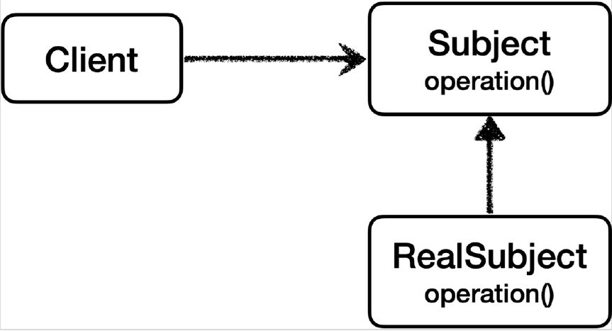

# <a href = "../README.md" target="_blank">스프링 핵심 원리 - 고급편</a>
## Chapter 04. 프록시 패턴과 데코레이터 패턴
### 4.07 프록시 패턴 - 예제 코드1
1) 테스트 환경 준비
2) 예제 코드 : 프록시 패턴 적용 전
3) 실행 및 로그 분석 : 동일한 작업을 세번 반복

---

# 4.07 프록시 패턴 - 예제 코드1

---

## 1) 테스트 환경 준비

### 테스트 코드에 Lombok 적용
```groovy
dependencies {
    ...
    //테스트에서 lombok 사용
    testCompileOnly 'org.projectlombok:lombok'
    testAnnotationProcessor 'org.projectlombok:lombok'
}
```
- 테스트 코드에 Lombok을 사용하려면 `build.gradle` 에 테스트에서 lombok을 사용할 수 있도록
의존관계를 추가해야 한다.
- 이렇게 해야, `@Slf4j`와 같은 어노테이션이 테스트 코드에서 작동된다.

---

## 2) 예제 코드 : 프록시 패턴 적용 전

### 2.1 프록시 패턴 적용 전 클래스 의존 관계

- Client가 Subject 인터페이스를 의존하고 있다.
- RealSubject가 Subject 인터페이스를 구현하고 있다.

### 2.2 프록시 패턴 적용 전 런타임 객체 의존 관계

- 런타임에 RealSubject 클래스 인스턴스가 주입되고 직접 호출된다.

### 2.3 Subject 인터페이스 
```java
public interface Subject {
    String operation();
}
```
예제에서 `Subject` 인터페이스는 단순히 `operation()` 메서드 하나만 가지고 있다.

### 2.4 RealSubject
```java

@Slf4j
public class RealSubject implements Subject {

    @Override
    public String operation() {
        log.info("실제 객체 호출");
        sleep(1000);
        return "data";
    }
}
```
- `RealSubject` 는 `Subject` 인터페이스를 구현했다.
- `operation()` 은 데이터 조회를 시뮬레이션 하기 위해 1초 쉬도록 했다.
- 예를 들어서 데이터를 DB나 외부에서 조회하는데 1초가 걸린다고 생각하면 된다.
호출할 때 마다 시스템에 큰 부하를 주는 데이터 조회라고 가정하자.

### 2.5 ProxyPatternClient
```java
public class ProxyPatternClient {

    private Subject subject;

    public ProxyPatternClient(Subject subject) {
        this.subject = subject;
    }

    public void execute() {
        subject.operation();
    }
}
```
- `Subject` 인터페이스에 의존하고, `Subject` 를 호출하는 클라이언트 코드이다.
- `execute()` 를 실행하면 `subject.operation()` 를 호출한다.

### 2.6 ProxyPatternTest
```java
public class ProxyPatternTest {
    @Test
    void noProxyTest() {
        RealSubject realSubject = new RealSubject();
        ProxyPatternClient client = new ProxyPatternClient(realSubject);
        client.execute();
        client.execute();
        client.execute();
    }
}
```
- 테스트 코드에서는 `client.execute()` 를 3번 호출한다.
- 데이터를 조회하는데 1초가 소모되므로 총 3초의 시간이 걸린다.

---

## 3) 실행 및 로그 분석 : 동일한 작업을 세번 반복

### 3.1 같은 작업을 세번 반복한다.
```java
RealSubject - 실제 객체 호출
RealSubject - 실제 객체 호출
RealSubject - 실제 객체 호출
```
`client.execute()`을 3번 호출하면 다음과 같이 처리된다.

1. `client -> realSubject` 를 호출해서 값을 조회한다. (1초)
2. `client -> realSubject` 를 호출해서 값을 조회한다. (1초)
3. `client -> realSubject` 를 호출해서 값을 조회한다. (1초)

### 3.2 같은 작업을 다시 수행할 때, 캐싱한 데이터를 불러와 빠르게 할 수 있게 한다면?
- 이 데이터가 한번 조회하면 변하지 않는 데이터라면 어딘가에 보관해두고 이미 조회한 데이터를
사용하는 것이 성능상 좋다. 이런 것을 캐시라고 한다.
- 프록시 패턴의 주요 기능은 접근 제어이다. 캐시도 접근 자체를 제어하는 기능 중 하나이다.
- 프록시 패턴을 적용하면, 이미 개발된 로직을 수정하지 않고, 접근 제어, 캐싱을 할 수 있다.

---
