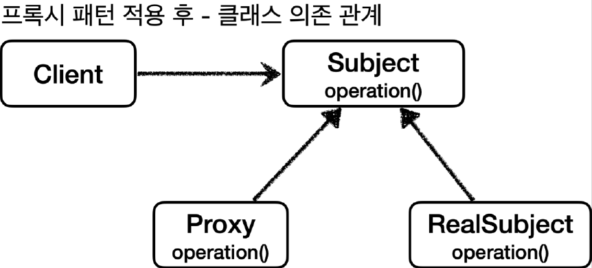
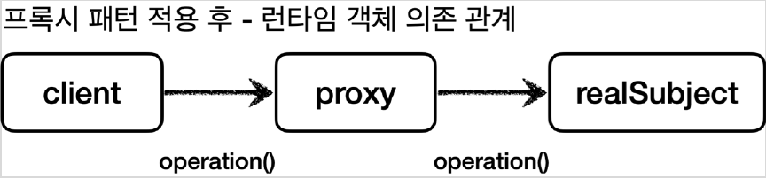

# <a href = "../README.md" target="_blank">스프링 핵심 원리 - 고급편</a>
## Chapter 04. 프록시 패턴과 데코레이터 패턴
### 4.08 프록시 패턴 - 예제 코드2
1) 예제 코드 : 프록시 패턴 적용 후
2) 실행 및 로그 분석 : 프록시의 캐싱을 통한 성능 개선
3) 정리 : 클라이언트와 서버의 코드 변경 없이, 프록시를 도입해서 접근 제어

---

# 4.08 프록시 패턴 - 예제 코드2

---

## 1) 예제 코드 : 프록시 패턴 적용 후

### 1.1 프록시 패턴 적용 후 클래스 의존 관계



### 1.2 프록시 패턴 적용 후 런타임 객체 의존 관계


### 1.3 CacheProxy
```java

@Slf4j
public class CacheProxy implements Subject {

    private Subject target;
    private String cacheValue;

    public CacheProxy(Subject target) {
        this.target = target;
    }

    @Override
    public String operation() {
        log.info("프록시 호출");
        if (cacheValue == null) {
            cacheValue = target.operation();
        }
        return cacheValue;
    }
}
```
- 프록시도 실제 객체와 그 모양이 같아야 하기 때문에 `Subject` 인터페이스를 구현해야한다.
- `private Subject target`
  - 클라이언트가 프록시를 호출하면 프록시가 최종적으로 실제 객체를 호출해야 한다.
  - 따라서 내부에 실제 객체의 참조를 가지고 있어야 한다. 이렇게 프록시가 호출하는 대상을 `target` 이라 한다.
- `operation()`
  - `cacheValue` 에 값이 없을 때 : 실제 객체(`target`)를 호출해서 값을 구한다. 그리고 구한 값을 `cacheValue` 에 저장하고 반환한다.
  - `cacheValue` 에 값이 있을 때 : 실제 객체를 전혀 호출하지 않고, 캐시 값을 그대로 반환한다. 따라서 처음 조회 이후에는 캐시(`cacheValue`)
  에서 매우 빠르게 데이터를 조회할 수 있다.

### 1.4 `ProxyPatternTest.cacheProxyTest()`
```java
    @Test
    void cacheProxyTest() {
        RealSubject realSubject = new RealSubject();
        CacheProxy cacheProxy = new CacheProxy(realSubject);
        ProxyPatternClient client = new ProxyPatternClient(cacheProxy);
        client.execute();
        client.execute();
        client.execute();
    }
```
- `realSubject` 와 `cacheProxy` 를 생성하고 둘을 연결한다.
- 결과적으로 `cacheProxy` 가 `realSubject` 를 참조하는 런타임 객체 의존관계가 완성된다.
- 그리고 마지막으로 `client` 에 `realSubject` 가 아닌 `cacheProxy` 를 주입한다.
- 이 과정을 통해서 `client -> cacheProxy -> realSubject` 런타임 객체 의존 관계가 완성된다.

---

## 2) 실행 및 로그 분석 : 프록시의 캐싱을 통한 성능 개선

### 2.1 실행 흐름
```shell
CacheProxy - 프록시 호출
RealSubject - 실제 객체 호출
CacheProxy - 프록시 호출
CacheProxy - 프록시 호출
```
1. client의 cacheProxy 호출 → cacheProxy에 캐시 값이 없다. → realSubject를 호출, 결과를 캐시에 저장 (1초)
2. client의 cacheProxy 호출 → cacheProxy에 캐시 값이 있다. →cacheProxy에서 즉시 반환 (0초)
3. client의 cacheProxy 호출 → cacheProxy에 캐시 값이 있다. → cacheProxy에서 즉시 반환 (0초)

### 2.2 실제 객체는 단 한번만 호출되고, 캐싱을 통해 성능이 개선됐다.
- 결과적으로 캐시 프록시를 도입하기 전에는 3초가 걸렸지만, 캐시 프록시 도입 이후에는 최초에 한번만 1초가 걸리고, 이후에는 거의 즉시 반환한다.

---

## 3) 정리 : 클라이언트와 서버의 코드 변경 없이, 프록시를 도입해서 접근 제어
- 프록시 패턴의 핵심은 RealSubject 코드와 클라이언트 코드를 전혀 변경하지 않고, 프록시를 도입해서
접근 제어를 했다는 점이다.
- 그리고 클라이언트 코드의 변경 없이 자유롭게 프록시를 넣고 뺄 수 있다.
- 실제 클라이언트 입장에서는 프록시 객체가 주입되었는지, 실제 객체가 주입되었는지 알지 못한다.

---
