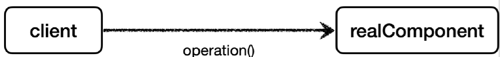

# <a href = "../README.md" target="_blank">스프링 핵심 원리 - 고급편</a>
## Chapter 04. 프록시 패턴과 데코레이터 패턴
### 4.09 데코레이터 패턴 - 예제 코드1
1) 예제 코드 : 데코레이터 패턴 적용 전
2) 실행 확인 : RealComponent가 반환한 원본 값 그대로 받음

---

# 4.09 데코레이터 패턴 - 예제 코드1

---

## 1) 예제 코드 : 데코레이터 패턴 적용 전

### 1.1 데코레이터 패턴 적용 전 클래스 의존 관계


### 1.2 데코레이터 패턴 적용 후 런타임 객체 의존 관계


### 1.3 Component 인터페이스
```java
public interface Component {
    String operation();
}
```
`Component` 인터페이스는 단순히 `String operation()` 메서드를 가진다.

### 1.4 RealComponent
```java
@Slf4j
public class RealComponent implements Component{
    @Override
    public String operation() {
        log.info("RealComponent 실행");
        return "data";
    }
}
```
- `RealComponent` 는 `Component` 인터페이스를 구현한다.
- `operation()` : 단순히 로그를 남기고 "data" 문자를 반환한다.

### 1.5 DecoratorPatternClient
```java
@Slf4j
public class DecoratorPatternClient {

    private Component component;

    public DecoratorPatternClient(Component component) {
        this.component = component;
    }

    public void execute() {
        String result = component.operation();
        log.info("result = {}", result);
    }
}
```
- 클라이언트 코드는 단순히 `Component` 인터페이스를 의존한다.
- `execute()` 를 실행하면 `component.operation()` 을 호출하고, 그 결과를 출력한다.

### 1.6 `DecoratorPatternTest.noDecorator()`
```java
public class DecoratorPatternTest {
    @Test
    void noDecorator() {
        Component realComponent = new RealComponent();
        DecoratorPatternClient client = new DecoratorPatternClient(realComponent);
        client.execute();
    }
}
```
- 테스트 코드는 `client -> realComponent` 의 의존관계를 설정하고, `client.execute()` 를 호출한다.

---

## 2) 실행 확인 : RealComponent가 반환한 원본 값 그대로 받음
```shell
RealComponent - RealComponent 실행
DecoratorPatternClient - result=data
```
여기까지는 앞서 프록시 패턴에서 설명한 내용과 유사하고 단순해서 이해하는데 어려움은 없을 것이다.

---
