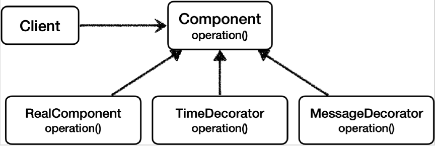
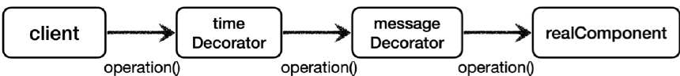

# <a href = "../README.md" target="_blank">스프링 핵심 원리 - 고급편</a>
## Chapter 04. 프록시 패턴과 데코레이터 패턴
### 4.11 데코레이터 패턴 - 예제 코드3
1) 예제 코드 : 실행 시간을 측정하면서, 응답값을 꾸며주는 데코레이터
2) 실행 : 프록시가 다른 프록시를 호출하는 연쇄가 가능

---

# 4.11 데코레이터 패턴 - 예제 코드3

---

## 1) 예제 코드 : 실행 시간을 측정하면서, 응답값을 꾸며주는 데코레이터

### 1.1 클래스 의존 관계

- TimeDecorator 역시 Component 인터페이스를 구현하고 있다.

### 1.2 런타임 객체 의존 관계

- 런타임에 클라이언트는 TimeDecorator가 의존 관계 주입된다.
- TimeDecorator는 MessageDecorator가 의존관계 주입된다.
- MessageDecorator는 RealComponent가 의존관계 주입된다.

### 1.3 TimeDecorator
```java
@Slf4j
public class TimeDecorator implements Component {

    private Component component;

    public TimeDecorator(Component component) {
        this.component = component;
    }

    @Override
    public String operation() {
        log.info("TimeDecorator 실행");
        long startTime = System.currentTimeMillis();

        String result = component.operation();

        long endTime = System.currentTimeMillis();
        long resultTime = endTime - startTime;
        log.info("TimeDecorator 종료 resultTime = {}ms", resultTime);
        return result;
    }
}
```
- `TimeDecorator` 는 실행 시간을 측정하는 부가 기능을 제공한다.
- 대상을 호출하기 전에 시간을 가지고 있다가, 대상의 호출이 끝나면 호출 시간을 로그로 남겨준다.

### 1.4 `DecoratorPatternTest.decorator2()`
```java

    @Test
    void decorator2() {
        Component realComponent = new RealComponent();
        Component messageDecorator = new MessageDecorator(realComponent);
        Component timeDecorator = new TimeDecorator(messageDecorator);
        DecoratorPatternClient client = new DecoratorPatternClient(timeDecorator);
        client.execute();
    }
```
- `client -> timeDecorator -> messageDecorator -> realComponent` 의 객체 의존관계를 설정하고,
실행한다.

---

## 2) 실행 : 프록시가 다른 프록시를 호출하는 연쇄가 가능
```shell
TimeDecorator 실행
MessageDecorator 실행
RealComponent 실행
MessageDecorator 꾸미기 적용 전=data, 적용 후=*****data*****
TimeDecorator 종료 resultTime=7ms
result=*****data*****
```
실행 결과를 보면 `TimeDecorator` 가 `MessageDecorator` 를 실행하고 실행 시간을 측정해서 출력한 것을
확인할 수 있다.

---
