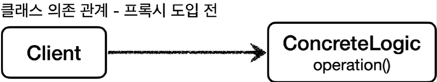
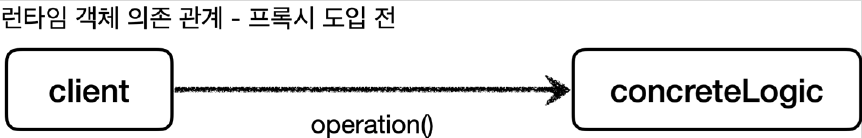

# <a href = "../README.md" target="_blank">스프링 핵심 원리 - 고급편</a>
## Chapter 04. 프록시 패턴과 데코레이터 패턴
### 4.14 구체 클래스 기반 프록시 - 예제1
1) 예제 코드 : 구체 클래스 기반 프록시 적용 전
---

# 4.14 구체 클래스 기반 프록시 - 예제1

---

## 1) 예제 코드 : 구체 클래스 기반 프록시 적용 전
이번에는 구체 클래스에 프록시를 적용하는 방법을 학습해보자.

### 1.1 클래스 의존 관계


### 1.2 런타임 객체 의존 관계


### 1.3 ConcreteLogic
```java
@Slf4j
public class ConcreteLogic {

    public String operation() {
        log.info("ConcreteLogic 실행");
        return "data";
    }
}
```
`ConcreteLogic` 은 인터페이스가 없고, 구체 클래스만 있다. 여기에 프록시를 도입해야 한다.

### 1.4 ConcreteClient
```java
public class ConcreteClient {

    private ConcreteLogic concreteLogic;

    public ConcreteClient(ConcreteLogic concreteLogic) {
        this.concreteLogic = concreteLogic;
    }

    public void execute() {
        concreteLogic.operation();
    }
}
```
- 여기서 `ConcreteLogic` 자리에 `ConcreteLogic` 뿐 아니라 그 하위 클래스들도 올 수 있음을 기억하자.

### 1.5 `ConcreteProxyTest.noProxy()`
```java
public class ConcreteProxyTest {

    @Test
    void noProxy() {
        ConcreteLogic concreteLogic = new ConcreteLogic();
        ConcreteClient client = new ConcreteClient(concreteLogic);
        client.execute();
    }

}
```
- 코드가 단순해서 이해하는데 어려움은 없을 것이다.
- 단순히 테스트 메서드에서, `concreteLogic.execute()`을 직접 호출할 뿐이다.

---
